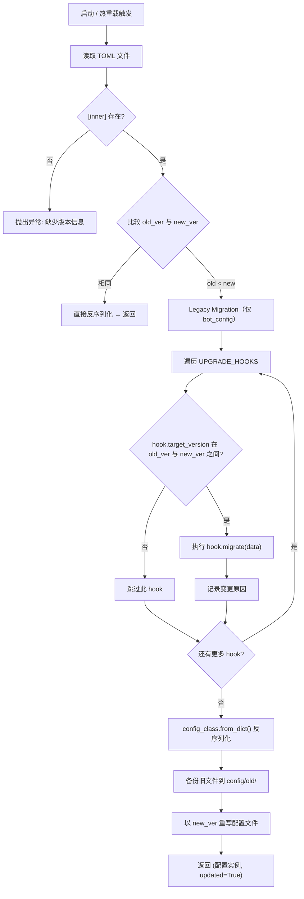
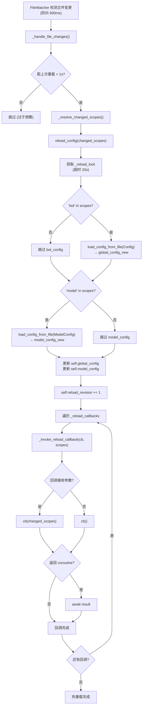

# 配置系统

本文档面向部署运维与高级使用者，讲解 MaiBot 配置系统的内部机制：两份 TOML 文件、版本链与升级钩子、热重载全流程、旧版迁移，以及配置编辑的注意事项。如果你只想了解某个字段的含义，请查阅 [用户手册中的配置说明](/manual/configuration/)。

## 两份 TOML 文件总览

MaiBot 运行时依赖 `config/` 目录下两份独立的 TOML 文件，它们各自由对应的 Pydantic 模型管理：

**bot_config.toml** — 主配置文件，对应 `Config` 模型（位于 `src/config/official_configs.py`）。包含 21 个子配置段：`[bot]`、`[personality]`、`[chat]`、`[experimental]`、`[visual]`、`[expression]`、`[jargon]`、`[a_memorix]`、`[message_receive]`、`[voice]`、`[emoji]`、`[keyword_reaction]`、`[response_post_process]`、`[chinese_typo]`、`[response_splitter]`、`[telemetry]`、`[log]`、`[debug]`、`[maim_message]`、`[webui]`、`[database]`、`[mcp]`、`[plugin]`、`[plugin_runtime]`。

**model_config.toml** — 模型配置文件，对应 `ModelConfig` 模型（位于 `src/config/model_configs.py`）。包含 3 个顶层段：`[[models]]`（模型列表）、`[model_task_config]`（任务-模型绑定）、`[[api_providers]]`（API 提供商列表）。

每份文件的 `[inner]` 表内记录一个 `version` 字段，供启动和热重载时与代码中内置的 `CONFIG_VERSION` / `MODEL_CONFIG_VERSION` 常量比较。版本采用三段式（主版本号.次版本号.修订号）：主版本随 MMC 大版本更新，次版本对应配置内容大更新，修订号对应配置内容小更新。

## BotConfig 与 PersonalityConfig 核心字段

本节只覆盖部署运维需要关注的核心字段，完整字段列表见 [Bot 配置用户文档](/manual/configuration/bot-config)。

### BotConfig（`[bot]`）

**platform** — 主账号所在平台标识（如 `qq`）。决定消息适配器如何解析来源。
**qq_account** — 主账号 QQ 号（字符串）。用来识别哪些消息是 Bot 自己发的。
**nickname** — Bot 显示和自称的名字，默认 `"麦麦"`。
**alias_names** — 别名声列表。用户用这些名字也能触发提及检测。
**platforms** — 多平台账号列表，格式为 `platform:账号`。

### PersonalityConfig（`[personality]`）

**personality** — 人格设定文本。系统提示词的核心，描述 Bot 的身份、性格、行为准则。
**reply_style** — 表达风格描述。叠加在人格设定之后，指导 Bot 说话的语气和篇幅。
**multiple_reply_style** — 备用表达风格列表。以 `multiple_probability` 概率随机注入其中一条，让回复更有多样性。
**multiple_probability** — 临时风格注入概率（0~1）。设为 0 则始终使用主风格。

### 其他关键配置段

**ChatConfig（`[chat]`）** — 控制上下文窗口大小（`max_context_size` / `max_private_context_size`）、回复时机与频率（`reply_timing`）、回复方式（`reply_style`）。详见消息处理流程。

**ExperimentalConfig（`[experimental]`）** — 实验性功能开关：行为学习、情绪特点档位、注意力漂移、Focus 模式。

**MCPConfig（`[mcp]`）** — MCP 服务端配置。详见 [MCP 集成](/develop/mcp-integration)。

**PluginConfig（`[plugin]`）** — 插件加载与管理配置。

## ModelConfig 与 APIProvider

### ModelConfig（对应 `model_config.toml`）

`ModelConfig` 包含三大组件：

**`[[models]]`（数组表）** — 每个模型条目定义 `name`（模型别名）、`model_identifier`（API 实际模型名）、`api_provider`（指向 `api_providers` 中的提供商名称）。

**`[model_task_config]`** — 将各类推理任务绑定到模型。核心子段包括 `planner`、`replyer`、`vlm`、`memory`、`embedding`、`tool_calling`、`topic_judge`、`expression_generation`、`expression_recognition`、`chinese_typo` 等。每个任务段包含 `model_list`（候选模型名列表）和 `temperature` 等采样参数。

**`[[api_providers]]`（数组表）** — API 提供商配置。

### APIProvider 核心字段

`APIProvider` 位于 `src/config/model_configs.py`，定义了与 LLM API 交互的所有连接参数：

**name** — 提供商名称（在 `models` 的 `api_provider` 中引用，可随意命名）。
**base_url** — API 端点基地址。
**api_key** — API 密钥。`auth_type` 设为 `none` 时可不填。
**client_type** — 客户端类型，`openai` 或 `google`（默认 `openai`）。
**max_retry** — 单次 API 调用失败后的最大重试次数（默认 3）。
**timeout** — 单次 API 调用超时，单位秒（默认 60）。
**retry_interval** — 两次重试间隔，单位秒（默认 5）。
**organization** / **project** — OpenAI 官方接口可选的组织与项目标识。

以下三个字段决定请求的鉴权与解析方式：

**auth_type**

— OpenAI 兼容接口的鉴权方式。

  - `bearer` — 标准 Bearer Token（请求头 `Authorization: Bearer <api_key>`），默认值。
  - `header` — 自定义请求头鉴权。需配合 `auth_header_name`（请求头名）和 `auth_header_prefix`（前缀）使用。
  - `query` — 查询参数鉴权。需配合 `auth_query_name`（参数名，默认 `api_key`）使用。
  - `none` — 不鉴权，适用于不需要密钥的本地模型或代理。

**auth_header_name** — `header` 模式下的 HTTP 请求头名称（默认 `Authorization`）。
**auth_header_prefix** — `header` 模式下密钥前缀（默认 `Bearer`，留空表示直接发送原始密钥）。
**auth_query_name** — `query` 模式下的查询参数名（默认 `api_key`）。

**reasoning_parse_mode**

— 控制模型推理内容（thinking / CoT）的解析方式。

  - `auto` — 自动检测。优先使用 native，不可用时回退到 think_tag。
  - `native` — 原生 API 推理字段（如 `reasoning_content`）。
  - `think_tag` — 正则提取 `{think}` 标签内容（适用于部分国产模型）。
  - `none` — 不解析推理内容。

**tool_argument_parse_mode**

— 控制模型工具调用参数的解析策略。

  - `auto` — 自动选择合适的策略，默认值。
  - `strict` — 直接解析 JSON 参数，不额外修复。
  - `repair` — 尝试修复格式错误的 JSON 参数后再解析。
  - `double_decode` — 对参数字符串先 URL-decode 再 JSON 解析（适用于部分模型将参数双重编码的情况）。

**default_headers** — 所有请求默认附加的 HTTP Header 字典。
**default_query** — 所有请求默认附加的查询参数字典。
**model_list_endpoint** — 模型列表探测端点路径（默认 `/models`）。

### ModelConfig 版本比较特别说明

`MODEL_CONFIG_UPGRADE_HOOKS` 当前为空元组，意味着模型配置文件的版本号变化**不会触发任何自动迁移逻辑**。当 `model_config.toml` 的 `[inner].version` 低于 `MODEL_CONFIG_VERSION` 时，系统会执行以下仅有的操作：

- 读取旧版模型配置并反序列化到 `ModelConfig` 实例
- 对比版本号检测到差异后，将旧文件备份到 `config/old/model_config_<时间戳>.toml`
- 以当前版本号重新写出 `model_config.toml`

这种设计源于模型配置的核心字段（模型名、端点 URL、密钥等）在不同版本间几乎没有结构性的 breaking change。升级钩子的为空状态也意味着**如果你自定义了模型配置，升级后不需要手动重填**，但你需要关注版本号更新日志，确认是否有新增字段需要补充。

## 版本链与 Upgrade Hooks

配置文件加载时，系统会比较文件内的 `[inner].version` 与代码中的 `CONFIG_VERSION` / `MODEL_CONFIG_VERSION` 常量。当文件版本低于代码版本时，会按版本顺序依次执行 upgrade hooks，每个 hook 在跨过其 `target_version` 时仅触发一次。

### BOT_CONFIG_UPGRADE_HOOKS 链

`BOT_CONFIG_UPGRADE_HOOKS` 当前包含 7 个钩子，按版本递增排列：

**8.10.11 — 重置群聊 Prompt 为默认值**

旧版群聊 Prompt 较长且不够精确。升级时调用 `_reset_group_chat_prompt_to_default`，将 `chat.reply_style.group_chat_prompt` 重置为当前代码中的默认值。

**8.10.18 — 分离黑话配置**

将原本嵌在 `[expression]` 中的黑话（jargon）相关配置拆分到独立的 `[jargon]` 段。钩子函数 `_split_jargon_config_from_expression` 负责迁移旧结构中的 `jargon_groups`、`jargon_file_path` 等字段。

**8.10.19 — 规范化行为学习字段**

行为学习条目（`behavior_learning_list`）早期版本中 `use`、`learn` 等布尔字段可能以空字符串或其他类型存在。`_normalize_learning_item_fields` 统一将它们转为标准布尔值。

**8.10.20 — 规范化分组条目字段**

对 `focus_groups`、`behavior_groups` 等共享组内的 `targets` 条目做格式统一。`_normalize_group_item_fields` 处理旧版字符串格式的 target 描述。

**8.12.1 — 升级表达学习默认值**

表达学习模块（`[expression].learning_list`）的默认配置结构在 8.12.1 版本有调整。`_upgrade_expression_learning_defaults` 按新结构修正旧配置中的相关字段。

**8.14.13 — 将 WebUI host 统一为列表格式**

早期 `webui.host` 可能是单个字符串。`_normalize_webui_host_to_list` 将其转为列表格式，以支持 WebUI 绑定多个地址。

**8.14.19 — 拆分 Chat 配置段**

将 `[chat]` 下原本扁平的字段拆分为 `reply_timing`（什么时候发言）和 `reply_style`（如何发言）两个子段，并迁移 `group_chat_prompt`、`private_chat_prompts` 等字段到新位置。

### 升级钩子执行流程



## 热重载全流程

MaiBot 启动后，`ConfigManager.start_file_watcher()` 会创建一个 `FileWatcher` 实例，同时监听 `bot_config.toml` 和 `model_config.toml`。文件变更经过 600ms 防抖后触发 `_handle_file_changes()`，由它调用 `reload_config()` 执行实际重载。

### FileWatcher → Reload → 回调 Fanout



热重载的关键保护：
- **频率保护**：两次热重载之间至少间隔 1 秒。
- **超时保护**：单次 `reload_config` 最多执行 20 秒。
- **锁保护**：`asyncio.Lock` 保证同一时刻只有一个重载在进行。
- **回调异常隔离**：单个回调报错不影响其他回调继续执行。

## Legacy Migration（旧版迁移）

MaiBot 在启动时会自动检测并迁移旧版配置。迁移分为两个层面：一次性结构修复（legacy migration）和版本穿越确认（legacy upgrade confirmation）。

### .env 环境变量迁移

旧版 MaiBot 使用 `.env` 文件配置绑定地址，新版已将全部配置统一到 `bot_config.toml` 中。当 `legacy_migration_enabled` 为 `True` 时（即尚未完成过迁移），系统会调用 `migrate_legacy_bind_env_to_bot_config_dict()`：

- `HOST` 环境变量 → `maim_message.ws_server_host`（默认 `127.0.0.1`）
- `PORT` 环境变量 → `maim_message.ws_server_port`（默认 `8000`）
- `WEBUI_HOST` 环境变量 → `webui.host`（默认 `127.0.0.1`）
- `WEBUI_PORT` 环境变量 → `webui.port`（默认 `8001`）

迁移成功后，系统自动删除旧版 `.env` 文件，并将迁移状态写入数据库的 `one_time_maintenance_tasks` 表，后续启动不再重复执行。

### 结构迁移

`try_migrate_legacy_bot_config_dict()` 处理 bot_config.toml 的已知旧结构修复：

- `bot.qq_account` 从整数转为字符串
- `chat.talk_value_rules` 中的旧版字符串 target 格式转为结构化 TargetItem
- `expression.learning_list` / `expression.expression_groups` 旧格式修复
- `keyword_reaction.keyword_rules` / `keyword_reaction.regex_rules` 空值清理

结构迁移是幂等的：只有在检测到实际差异时才执行，不会污染正常配置。

### 0.x → 1.x 升级确认门

当系统检测到配置文件版本跨越 `LEGACY_0X_BOT_CONFIG_BOUNDARY`（8.9.4）或 `LEGACY_0X_MODEL_CONFIG_BOUNDARY`（1.14.1）时，会在启动前要求用户显式确认。检测逻辑包括：

- bot_config.toml / model_config.toml 的 `[inner].version` 低于 1.0.0 边界值
- 数据库中是否存在 0.x 时代的关键表结构（如 `chat_history`、`person_info` 等）

确认提示会列出所有检测到的风险项，要求用户输入 `y` 继续。用户可以通过设置环境变量 `MAIBOT_LEGACY_0X_UPGRADE_CONFIRMED=1` 跳过交互式确认。

## 配置编辑注意事项

### 八条建议（Do）

1. **优先通过 WebUI 修改**。WebUI 的配置管理页面提供字段校验、中文标签和值域提示，避免 TOML 语法错误导致 Bot 无法启动。详见 WebUI 内部机制。

2. **修改前先备份**。直接编辑 `config/` 目录下的 TOML 文件前，复制一份到 `config/old/` 或使用版本控制的 `git stash`。

3. **修改后验证 TOML 语法**。MaiBot 使用 `tomlkit` 解析，对数组表（`[[...]]`）和标准表（`[...]`）的混排顺序敏感。可以用 Python 快速验证：
   ::: code-group

   ```python [Python ~vscode-icons:file-type-python~]
   import tomlkit
   with open("config/bot_config.toml", encoding="utf-8") as f:
       tomlkit.load(f)
   print("语法正确")
   ```

   :::

4. **更新后观察日志**。热重载或重启后，检查日志中是否有 `配置已自动升级`、`配置升级钩子变更` 或 `配置解析失败` 等关键信息。

5. **非空列表不要删为空**。某些配置段（如 `[[models]]`、`[[api_providers]]`）在反序列化时有非空校验，删空会导致启动失败。

6. **API Provider 名称保持唯一**。`name` 字段在 `model_config.toml` 中必须唯一，重复名称会被拒绝。

7. **模型名称保持唯一**。模型别名 `name` 同样必须唯一。

8. **注意字符串与布尔值**。TOML 中 `"true"` 和 `true` 是不同的；行为学习等模块中 `learn = true` 需要无引号布尔值。

### 五条避免（Don't）

1. **不要手动修改 `[inner].version`**。版本号由系统管理，手动篡改会导致 upgrade hooks 跳过或重复执行，造成配置损坏。

2. **不要在 Bot 运行时直接替换整个配置文件**。`FileWatcher` 监听的是文件修改事件；用 `mv` 或新文件覆盖旧文件会导致 inode 变更，可能丢失监听。

3. **不要删除 `config/old/` 目录中的备份**，除非确认当前配置已经稳定运行多个版本。备份文件是版本穿越失败时的唯一回滚手段。

4. **不要在配置中硬编码绝对路径**，除非对应模块明确要求（如插件路径）。优先使用相对路径或在运行时动态解析。

5. **不要用 Markdown 表格编辑配置**。TOML 是结构化格式，需要严格遵循 TOML 语法规范。如果不确定某个字段的写法，参考 `config/` 目录下的默认配置文件。

## register_reload_callback 使用示例

插件或自定义模块可以通过 `ConfigManager.register_reload_callback()` 注册热重载回调，在配置文件变更后自动响应。回调签名支持两种形式：

- 无参回调：`def on_config_reload() -> None`
- 带参回调：`def on_config_reload(changed_scopes: Sequence[str]) -> None`

`changed_scopes` 是 `("bot",)`、`("model",)` 或 `("bot", "model")` 之一，表示本次重载命中了哪些配置文件。

::: code-group

```python [Python ~vscode-icons:file-type-python~]
from collections.abc import Sequence
from src.config.config import global_config_manager as cfg_mgr


def on_bot_config_changed(changed: Sequence[str]) -> None:
    """当 bot_config.toml 热重载后更新运行时参数。"""
    if "bot" not in changed:
        return
    new_chat_config = cfg_mgr.get_global_config().chat
    # 根据新配置调整上下文长度等
    print(f"[plugin] 聊天配置已更新: max_context={new_chat_config.max_context_size}")


def on_any_config_changed() -> None:
    """不关心具体变更范围，每次热重载都刷新。"""
    print("[plugin] 配置热重载完成，刷新缓存...")


# 注册回调
cfg_mgr.register_reload_callback(on_bot_config_changed)
cfg_mgr.register_reload_callback(on_any_config_changed)

# 不再需要时注销
# cfg_mgr.unregister_reload_callback(on_bot_config_changed)
```

:::

注册的回调在 `reload_config()` 中按注册顺序依次调用。每个回调的异常会被捕获并记录，不会打断其他回调。如果需要注销，调用 `unregister_reload_callback()` 并传入同一个函数对象。

回调中的耗时逻辑建议异步化（返回 coroutine），否则会阻塞后续回调的执行。

## 相关文档

- 统计与 I/O 配置 — 服务层中 logging 与 statistics-io 的配置关联
- [MCP 集成架构](/develop/mcp-integration) — MCP 服务端配置的架构背景
- 消息管线 — Chat 配置与消息处理流程的关系
- WebUI 内部机制 — WebUI 如何与配置系统交互
- [Bot 配置用户文档](/manual/configuration/bot-config) — 面向终端用户的字段说明
- [模型配置用户文档](/manual/configuration/model-config) — 模型配置的字段说明与示例
