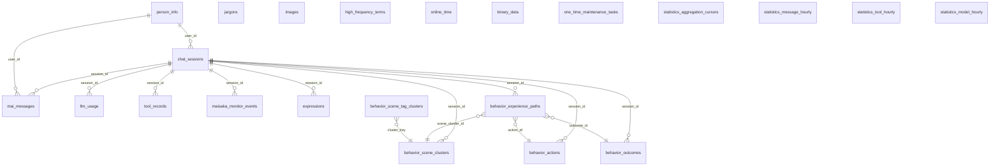

# 数据库

MaiBot 使用 **SQLite** 作为本地数据库，通过 **SQLModel**（SQLAlchemy 之上）定义和管理 22 张表。数据文件位于启动目录下的 `data/trymai.db`。本文面向需要运维、排查问题、做数据归档或分析统计的进阶用户。

::: tip 数据导入导出
如果你需要将统计、消息等数据导出到外部分析系统，请参见 [数据导入导出](/develop/statistics-io)。
:::

## 连接与会话

MaiBot 在创建每个数据库连接时都会设置一组 SQLite PRAGMA，源码位于 `src/common/database/database.py:36-47`。

**`journal_mode=WAL`** — 写前日志模式。SQLite 默认使用 rollback journal，MaiBot 改为 WAL（Write-Ahead Logging）。WAL 下读和写不再互斥，意味着消息写入与 WebUI 查询可以并发进行，不会出现 "database locked" 阻塞。代价是会多一个 `-wal` 文件和 `-shm` 索引文件。

**`cache_size=-64000`** — 页面缓存设 64 MB。负值表示单位为 KB，适合 MaiBot 这种持续运行、频繁小读的场景。

**`busy_timeout=1000`** — 连接遇锁时最多等待 1 秒再超时。WAL 模式下这个值通常足够，但遇到高并发写入时可以调高此值。

**`synchronous=NORMAL`** — 平衡模式。FULL 会在每次事务提交后 fsync 两次（性能代价高），NORMAL 仅在关键时机 fsync，意外断电场景下仍有较好数据一致性。

**`foreign_keys=ON`** — 显式开启外键约束。SQLite 默认不执行外键检查，必须在每次连接时手动打开。

如果你要用外部工具（如 DB Browser for SQLite）直连数据库文件进行运维操作，建议执行同样的 PRAGMA：

::: code-group

```sql [SQL ~vscode-icons:file-type-sql~]
PRAGMA journal_mode=WAL;
PRAGMA foreign_keys=ON;
PRAGMA busy_timeout=5000;
```

:::

## 22 张表总览

MaiBot 目前维护 22 张表，围绕一条主线展开：**以 `chat_sessions.session_id` 为会话轴，连接消息、模型调用、工具调用、学习数据等运行时实体**。以下是 ER 关系图（只显示关键外键关系，不枚举列）：



上图中，`chat_sessions` 处于中心位置，9 张表通过 `session_id` 与之关联。`person_info` 通过 `user_id` 跨接在消息与会话之上，提供统一的身份视角。其余 11 张相对独立的表（`jargons`、`images`、`high_frequency_terms`、`online_time`、`binary_data`、`statistics_*`、`one_time_maintenance_tasks` 等）各自承担专项职责，详见下文各节。

## Chat ↔ Session：会话管理

MaiBot 的"会话"概念承载在 `chat_sessions` 表里，对应 Python 模型 `ChatSession`（`src/common/database/database_model.py:503-527`）。

**`session_id`** — 唯一会话标识，是整库的关联主键。MaiBot 每次建立新的聊天上下文（新群聊、新私聊窗口）都会生成一个 session_id，后续所有消息、模型推理、工具调用都绑定在此 ID 上。

**`user_id` / `group_id` / `platform`** — 会话元数据，标识该会话属于哪个用户或群组、来自哪个平台。

**`account_id` / `scope`** — 多账号路由字段。同一平台如果登了多个账号，用 `account_id` 区分；`scope` 进一步细分同一账号下的不同路由域。

当会话长期不活跃时，`last_active_timestamp` 会自然偏离当前时间。你可以利用这个字段做会话清理或统计活跃度，见 [运维常见查询](#运维常见查询)。

## 5 类学习模型

MaiBot 的"学习"能力横跨 5 类数据模型，存放在 9 张表中。

### 表达方式学习

`expressions` 表记录特定情景下机器人应使用的表达风格。

**`situation` / `style`** — 情景与风格标签。例如 "群友求助 / 安慰"、"冷场 / 活跃气氛"。
**`content_list`** — JSON 格式的表达候选列表（多句备选）。
**`session_id`** — 为 `NULL` 时表示全局表达，有值时仅在该会话内生效。

### 黑话挖掘

`jargons` 表（`src/common/database/database_model.py:431-458`）记录群内新词和内部暗语。

**`content`** — 黑话文本本身。
**`meaning`** — AI 推断的含义（如 "开黑 = 组队打游戏"）。
**`is_jargon`** — 是否为已确认的黑话。为 `False` 时表示仍存疑。
**`is_complete`** — 推断是否已完成（`count > 100` 后不再推断）。
**`session_id_dict`** — 该黑话在哪些会话中出现及其频次，JSON 字典格式。见 [JSON 列约定](#json-列约定)。

### 行为经验学习

这是最复杂的一组学习模型，包含 5 张表，源码覆盖 `database_model.py:321-428`。

**`behavior_experience_paths`** — 核心路径表。记录一条可反馈的行为经验：在某个场景下做出某个动作，得到了什么结果。
**`behavior_scene_clusters`** — 场景簇。用 tag 概率分布描述一类场景（如 "群友求助且语气急促"）。
**`behavior_scene_tag_clusters`** — Tag 簇成员索引，将同义 tag 快速归到同一个簇。
**`behavior_actions`** — 行为动作实体，复用动作文本描述。
**`behavior_outcomes`** — 行为结果实体，复用结果描述。

关联路径：一个 `behavior_experience_paths` 行通过 `scene_cluster_id`、`action_id`、`outcome_id` 分别指向对应的簇、动作和结果实体，形成完整的 "场景 → 动作 → 结果" 经验链。`evidence_list` 字段以 JSON 数组存储支撑这条经验的证据消息引用。

### 人物画像

`person_info` 表（`database_model.py:472-501`）构建对话参与者的长期画像。

**`person_id`** — 跨平台/跨 user_id 的统一身份 ID，是人物画像的锚点。
**`person_name`** — 推断出的真实姓名或称呼。
**`memory_points`** — 记忆要点，JSON 格式，存储 AI 对该人物的印象摘要。

### 高频词库

`high_frequency_terms` 表（`database_model.py:256-276`）按群聊维度统计高频词和词组。

**`chat_id`** — 群聊或私聊标识。
**`rank`** — 在该群内的排名。
**`frequency`** — 词频（出现次数 / 总词数）。

## 统计与遥测

MaiBot 自建了一套按小时聚合的统计体系，包含 3 张聚合表加 1 张游标表：

**`statistics_message_hourly`** — 按小时聚合的消息量，按 `(bucket_time, chat_id)` 去重。
**`statistics_tool_hourly`** — 按小时聚合的工具调用次数，按 `(bucket_time, tool_name)` 去重。
**`statistics_model_hourly`** — 按小时聚合的模型用量，包含 token 数、费用（元）、耗时方差。
**`statistics_aggregation_cursors`** — 增量游标，记录每类统计源上次处理到的最大 `id`，确保从头聚合不丢数。

`llm_usage` 表是原始记录的来源，每条记录包含一次完整的模型请求元数据：prompt tokens、completion tokens、费用（元）、是否命中 prompt cache 等。如果你启用了模型缓存计费，`prompt_cache_hit_tokens` 和 `prompt_cache_miss_tokens` 列可帮你核算缓存节省的费用。

## Person 与身份

`person_info` 并不是简单的 user_id 映射。MaiBot 会在运行时尝试将同一个用户在多个平台、多个群里的 `user_id` 统一到同一个 `person_id` 下，实现跨屏画像。

**`group_cardname`** 字段是一个 JSON 列，格式为 `[{group_id: str, group_cardname: str}]`，存储该人在各个群里的群名片。这也是典型的 JSON 列，见下文须知。

**`first_known_time` / `last_known_time`** 分别记录首次和最后一次互动的时间，结合 `know_counts` 可评估交互频率。

## Maisaka Monitor

`maisaka_monitor_events` 表（`database_model.py:148-165`）是 Maisaka 推理引擎的观察事件账本。每一次规划、回复生成、工具调用决策都会写入一条事件，以 `event_type` 分类，`payload_json` 存放完整的结构化负载。

该表有 4 个复合索引：`(session_id, event_id)` 按会话拉取事件，`(event_type, event_id)` 按类型筛选，`(timestamp)` 和 `(created_at)` 分别支持时间范围查询。

::: tip
WebUI"麦麦观察"面板直接消费此表数据。如果你发现面板加载很慢，检查 `maisaka_monitor_events` 的行数是否过大，必要时按时间范围清理历史事件。
:::

## JSON 列约定

MaiBot 多张表使用 `Text` 列存储 JSON 字符串。这些列由应用层序列化/反序列化，SQLite 层仅存为纯文本。务必注意以下约束：

- **禁止直接 `UPDATE ... SET` JSON 列** — 应用层在读写时依赖特定 JSON 结构。直接改数据库值极易造成结构不匹配，导致运行时解析异常。以下三列是高风险示例：

  **`person_info.group_cardname`** (`database_model.py:488-490`) — 存储格式为 `[{"group_id": "...", "group_cardname": "..."}]`。手工修改时如果 JSON 键名拼错（如 `"group_cardname"` 少一个字母），会导致群名片丢失。

  **`jargons.session_id_dict`** (`database_model.py:444-446`) — 格式为 `{"session_id_1": count, "session_id_2": count}`。手工把 count 值从整数改成字符串，黑话关联逻辑会出错。

  **`behavior_experience_paths.evidence_list`** (`database_model.py:350`) — 证据消息引用数组。内部引用 `message_id` 等字段，手工修改时引用格式错误会导致 WebUI 经验追溯功能断裂。

- **读取 JSON 列时，务必在应用层解析** — 不要在 SQL 中用字符串函数手动拼接 JSON，字段顺序或内部结构随时可能被应用层升级。

- **要改 JSON 内容，通过 MaiBot 的功能路径操作** — 比如改黑话含义应该通过 WebUI 黑话面板，而不是直接铲数据库。

## 迁移系统

MaiBot 的 schema 版本管理使用 SQLite 的 `PRAGMA user_version` 作为版本号存储，配合自建的迁移管理器实现有序升级。

### 启动流程

每次启动时，`initialize_database()`（`src/common/database/database.py:122-154`）按以下顺序执行：

1. **检测 `user_version`** — 通过 `SchemaVersionResolver` 读取当前数据库版本号（空库返回 0）。
2. **版本校验** — 如果数据库版本高于代码内置的 `LATEST_SCHEMA_VERSION`，立即拒绝启动。这是向前不兼容场景的安全闸。
3. **空库直建** — 如果 `user_version == 0`（空数据库），跳过迁移，直接用 `SQLModel.metadata.create_all()` 创建最新结构，同时写入目标版本号。
4. **增量迁移** — 如果版本落后，按注册的迁移步骤逐个执行。迁移完成后执行 `create_all()` 兜底，确保新增模型都已建表。
5. **写入目标版本** — 将 `LATEST_SCHEMA_VERSION` 写入 `PRAGMA user_version`。
6. **运行期性能索引** — 调用 `ensure_runtime_performance_indexes()` 补齐不影响 schema 版本的运行时索引（如 `jargons` 表上的复合索引）。

### 版本升级路径

从 v1（最早旧版 schema）到当前版本，MaiBot 内置了 35 步迁移，源码入口在 `src/common/database/migrations/builtin.py:46-82`。每步迁移为独立的 Python 模块（如 `v22_to_v23.py`），负责一个版本间的表结构变更、数据迁移或旧表清理。

关键节点：
- **v1 → v2** — 从旧版单表模式迁移到 `chat_sessions` + `mai_messages` 双表模式，清理旧表 `chat_streams`、`emoji`、`thinking_back` 等。
- **v21 → v22** — 完成旧版遗留表的最终清理，此后不再向后兼容遗留结构。

::: danger
MaiBot 没有"降级"路径。一旦数据库升级到高版本，**无法**在旧版代码上运行。如果你需要回滚 MaiBot 版本，必须从备份恢复数据库（如果备份的版本号匹配旧版代码）。
:::

### 性能索引

除了 schema 定义的索引，MaiBot 在启动后会补充 3 个运行期性能索引（`database.py:76-92`）：`ix_jargons_status_count_id`、`ix_jargons_global_count_id`、`ix_jargons_complete_count_id`，分别加速 `jargons` 表的状态、全局和完结判定查询。这些索引用 `IF NOT EXISTS` 创建；如果在启动时数据库被其他进程占用，创建失败不会阻止启动，下次启动时自动补建。

## 备份与 VACUUM

### 备份

SQLite 数据库是一个单一文件，最简单的备份方式就是复制 `data/trymai.db`。但直接 `cp` 有风险（可能读到未提交事务的中间状态）。安全做法：

**方案一：SQLite `.backup` 命令**

::: code-group

```sql [SQL ~vscode-icons:file-type-sql~]
sqlite3 data/trymai.db ".backup 'backup.db'"
```

:::

**方案二：`VACUUM INTO`（SQLite 3.27+）**

::: code-group

```sql [SQL ~vscode-icons:file-type-sql~]
VACUUM INTO 'backup.db';
```

:::

两种方法都会在备份时维护事务一致性。MaiBot 默认启用 WAL，数据库实际由 `trymai.db`、`trymai.db-wal`、`trymai.db-shm` 三个文件构成。如果你要手动 `cp` 备份，必须同时复制三个文件，不推荐。

### VACUUM

SQLite 不会自动回收删除行释放的空间，数据库文件只会增长不会缩小。定期 VACUUM 可重建整个数据库文件，回收磁盘空间。消息量大的实例建议每 1-2 个月执行一次。

**执行前务必关闭 MaiBot**，因为 VACUUM 会锁定整库：

::: code-group

```sql [SQL ~vscode-icons:file-type-sql~]
VACUUM;
```

:::

执行后可用 `PRAGMA page_count` 对比前后页数验证效果。注意 VACUUM 需要至少等同于原库大小的额外磁盘空间用于临时文件；空间不足会导致失败，但原库不受影响。

## 运维常见查询

以下 5 个核心示例覆盖日常运维中最常遇到的数据查询场景。所有 SQL 建议在 MaiBot 关闭后使用 `sqlite3` 命令行执行。

### 最近 24 小时的活跃会话

::: code-group

```sql [SQL ~vscode-icons:file-type-sql~]
SELECT session_id, user_nickname, group_name, platform, last_active_timestamp
FROM chat_sessions
WHERE last_active_timestamp > datetime('now', '-1 day')
ORDER BY last_active_timestamp DESC LIMIT 20;
```

:::

### 模型费用统计（按模型汇总）

::: code-group

```sql [SQL ~vscode-icons:file-type-sql~]
SELECT
    model_name, provider_name,
    COUNT(*) AS requests,
    SUM(total_tokens) AS tokens,
    ROUND(SUM(cost), 4) AS cost_yuan,
    ROUND(AVG(time_cost), 2) AS avg_sec
FROM llm_usage
WHERE timestamp > datetime('now', '-7 days')
GROUP BY model_name, provider_name
ORDER BY cost_yuan DESC;
```

:::

### 排查最新消息内容

::: code-group

```sql [SQL ~vscode-icons:file-type-sql~]
SELECT timestamp, platform, user_nickname, processed_plain_text, session_id
FROM mai_messages
ORDER BY id DESC LIMIT 30;
```

:::

::: details raw_content 字段说明
`raw_content` 列存储的是 msgpack 编码的原始消息二进制，无法直接通过 SQL 阅读。`processed_plain_text` 是平面化处理后的纯文本，适合人工排查。
:::

### 查看已学到的黑话

::: code-group

```sql [SQL ~vscode-icons:file-type-sql~]
SELECT content, meaning, count, is_global, created_by, created_timestamp
FROM jargons
WHERE is_jargon = 1
ORDER BY count DESC LIMIT 20;
```

:::

### 查看已认识的人物

::: code-group

```sql [SQL ~vscode-icons:file-type-sql~]
SELECT person_id, person_name, user_nickname, platform,
       know_counts, first_known_time, last_known_time
FROM person_info
WHERE is_known = 1
ORDER BY know_counts DESC LIMIT 20;
```

:::

### 其他实用查询

**查看当前数据库版本号：**

::: code-group

```sql [SQL ~vscode-icons:file-type-sql~]
PRAGMA user_version;
```

:::

**数据库文件大小估算：**

::: code-group

```sql [SQL ~vscode-icons:file-type-sql~]
SELECT page_count * page_size AS file_bytes FROM pragma_page_count, pragma_page_size;
```

:::

**列出所有表名：**

::: code-group

```sql [SQL ~vscode-icons:file-type-sql~]
SELECT name FROM sqlite_master WHERE type='table' ORDER BY name;
```

:::

对于行数统计，建议在 `sqlite3` 命令行下用 `.tables` 配合逐个 `SELECT COUNT(*)` 进行，避免单条 SQL 做全表扫描聚合。

**清理过旧的 Maisaka Monitor 事件（慎用）：**

::: code-group

```sql [SQL ~vscode-icons:file-type-sql~]
DELETE FROM maisaka_monitor_events
WHERE created_at < datetime('now', '-7 days');
```

:::

::: warning
直接 `DELETE` 大表可能触发长事务，建议按日分批执行，以控制事务大小。
:::
