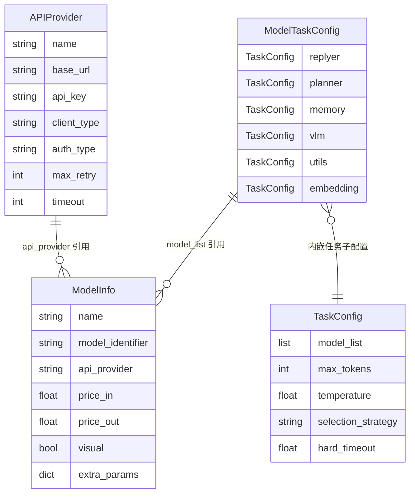
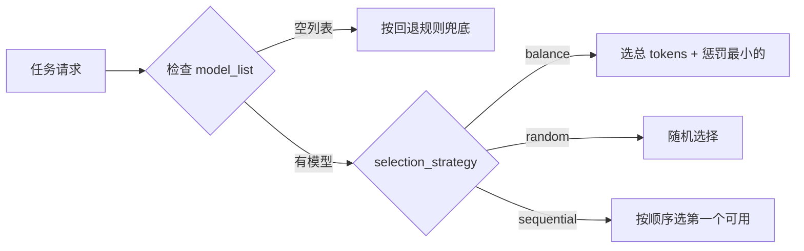

# LLM 模型集成

MaiBot 以配置驱动的方式管理 LLM 接入。三个核心概念构成完整的数据面链路：**APIProvider**（连哪儿）、**ModelInfo**（用哪个模型）、**ModelTaskConfig**（干什么活）。



**APIProvider** 描述"如何连接到 API 端点"：地址、鉴权、超时、重试。**ModelInfo** 描述"一个具体模型"：标识符、计费、能力标记、`extra_params`。**ModelTaskConfig** 把模型按任务角色分发：replyer、planner、vlm、embedding 等，每种任务各挂一个 `TaskConfig`，`TaskConfig.model_list` 填 ModelInfo 的 `name` 字段。

## 内置客户端总览

MaiBot 自带两种 `client_type`，由 `ClientRegistry` 在启动时自动注册：

- **`openai`**（`OpenaiClient`）：适配所有 OpenAI 兼容 API。用 `AsyncOpenAI` SDK 发起调用，支持流式/非流式、工具调用、推理内容解析。绝大多数第三方 API 网关、代理、中转均走这条路径。
- **`gemini`**（`GeminiClient`）：适配 Google Gemini 原生 SDK。通过 `google-genai` 库发起调用，支持 thinking budget 裁剪、语音转录、嵌入。

两种客户端都遵循 `BaseClient` → `AdapterClient` 继承体系。框架通过 `ClientRegistry.get_client_class_instance(api_provider)` 统一获取客户端实例，调用方不感知底层是哪种 SDK。

## 注册 API Provider

要接入一个新的 API 端点，在 `model_config.toml` 的 `[api_providers]` 中声明 Provider，然后在 `[[models]]` 中关联它。

::: code-group

```toml [TOML ~vscode-icons:file-type-toml~]
[api_providers.deepseek]
name = "deepseek"
base_url = "https://api.deepseek.com"
api_key = "sk-..."
client_type = "openai"

[api_providers.gemini-2.5]
name = "gemini-2.5"
base_url = "https://generativelanguage.googleapis.com"
api_key = "AIza..."
client_type = "gemini"

[[models]]
name = "ds-v4-flash"
model_identifier = "deepseek-v4-flash"
api_provider = "deepseek"
visual = false
extra_params = {thinking = {type = "enabled"}}

[[models]]
name = "gemini-2.5-pro"
model_identifier = "gemini-2.5-pro"
api_provider = "gemini-2.5"
visual = true
```

:::

**APIProvider 关键字段：**

- **`name`** — Provider 名称，由 ModelInfo 的 `api_provider` 字段引用，不能为空
- **`base_url`** — API 端点地址。`client_type = "openai"` 时必填；`gemini` 时可选
- **`api_key`** — API 密钥。当 `auth_type = "none"` 时可为空
- **`client_type`** — 客户端类型，取 `"openai"` 或 `"gemini"`。插件注册的自定义类型也在此引用
- **`auth_type`** — OpenAI 兼容接口的鉴权方式。可选 `bearer`（默认，`Authorization: Bearer <key>`）、`header`（自定义头名+前缀）、`query`（URL 查询参数）、`none`（免鉴权）
- **`auth_header_name`** — `auth_type = "header"` 时的请求头名称，默认 `Authorization`
- **`auth_header_prefix`** — `auth_type = "header"` 时的前缀，默认 `Bearer`。留空直接发送原始密钥
- **`auth_query_name`** — `auth_type = "query"` 时的参数名，默认 `api_key`
- **`default_headers`** — 所有请求默认附带的 HTTP 请求头字典
- **`default_query`** — 所有请求默认附带的 URL 查询参数字典
- **`organization`** — OpenAI 官方接口可选的 `organization` 标识
- **`project`** — OpenAI 官方接口可选的 `project` 标识
- **`max_retry`** — 单个模型调用失败后的最大重试次数，默认 3
- **`retry_interval`** — 两次重试之间的等待秒数，默认 5
- **`timeout`** — 单次 API 调用的超时秒数，默认 60
- **`reasoning_parse_mode`** — 推理内容解析模式，见下文
- **`tool_argument_parse_mode`** — 工具参数解析模式，见下文

## ModelTaskConfig 任务分发

`[model_config]` 下按任务角色拆出了 10+ 个 `TaskConfig` 子配置。每个 `TaskConfig` 拥有一组模型列表和一个选择策略：



**`selection_strategy` 取值：**

- **`balance`** — 负载均衡（默认）。每次请求选 `total_tokens + penalty×300 + usage_penalty×1000` 最小的模型，引导请求到历史用量最少的实例
- **`random`** — 随机选择，不关心历史用量
- **`sequential`** — 按 `model_list` 配置顺序优先选第一个可用的模型。首个模型之前请求失败才落到第二个，适合"主力+备用"场景

**`TaskConfig` 关键字段：**

- **`model_list`** — 使用的模型名称列表，每项对应 `ModelInfo.name`
- **`max_tokens`** — 该任务的最大输出 token 数，可由 `ModelInfo.max_tokens` 覆盖
- **`temperature`** — 采样温度，可由 `ModelInfo.temperature` 覆盖
- **`hard_timeout`** — 任务硬超时（秒），到期未返回则取消请求并切换下一个模型，默认 240
- **`slow_threshold`** — 超时警告阈值（秒），默认 15

**任务角色一览：**

- **`replyer`** — 回复模型，决定麦麦的对话表现
- **`planner`** — 规划模型，驱动工具调用和行动决策
- **`memory`** — 记忆模型，负责长期记忆的总结与抽取
- **`mid_memory`** — 聊天回想模型，留空自动回退到 planner
- **`utils`** — 小任务模型（概括、整理等），建议选快速的小模型
- **`learner`** — 学习模型，用于表达方式和黑话学习，留空回退到 utils
- **`expression_use`** — 表达方式使用模型，留空回退到 utils
- **`emoji`** — 表情包发送决策模型
- **`vlm`** — 视觉模型，需要支持识图
- **`voice`** — 语音识别模型
- **`embedding`** — 文本嵌入模型

部分角色有空配置回退链：`expression_use` → `utils`，`learner` → `utils`，`mid_memory` → `planner`。留空不报错，框架自动继承。

## extra_params 透传机制

`ModelInfo.extra_params` 不会整包发送给模型服务商。实际发起请求前，客户端根据 `client_type` 做不同拆分。

### OpenAI 兼容端

对于 `client_type = "openai"` 的 Provider，`split_openai_request_overrides()` 将 `extra_params` 拆分为三层：

- **`headers`** — 提取为请求头，值强制转字符串
- **`query`** — 提取为 URL 查询参数
- **`body`** — 提取并合并到请求体 `extra_body`
- **其他普通键** — 也合并到 `extra_body`（SDK 原生不认的键由 SDK 原样透传）

`model_config.toml` 里的 `temperature` / `max_tokens` 如果写在 `extra_params` 中也生效，但更推荐使用 `ModelInfo` 的同名独立字段。独立字段会被 SDK 以原生参数承载，不会进入 `extra_body`。

::: code-group

```toml [TOML ~vscode-icons:file-type-toml~]
# 自定义请求头 + 请求体 extra_body
[[models]]
name = "custom-proxy"
model_identifier = "qwen-plus"
api_provider = "aliyun"
extra_params = {
  headers = {"X-Custom-Header" = "my-value"},
  body = {enable_search = true},
  top_k = 50,
}
```

:::

上述配置发往阿里云 DashScope 时，实际请求携带 `X-Custom-Header: my-value` 请求头，请求体包含 `enable_search: true` 和 `top_k: 50`。

### Gemini 端

对于 `client_type = "gemini"` 的 Provider，不按上述三层拆分。Gemini 客户端通过 `_filter_generate_content_extra_params()` 筛选：

1. 遍历 `extra_params` 的所有键
2. 跳过 `GENERATE_CONFIG_RESERVED_EXTRA_PARAMS` 中的保留键（如 `temperature`、`max_tokens`，由 SDK 原生参数承载）
3. 只保留 `GenerateContentConfig.model_fields` 中存在的字段
4. 符合条件的字段直接传给 `GenerateContentConfig(**filtered_params)`

Gemini 端常用的 `extra_params` 键：

- **`thinking_budget`** — 思考预算（token 数）。Gemini 客户端内置 `THINKING_BUDGET_LIMITS` 映射表，根据模型 ID 裁剪到允许范围。设为 `-1` 表示自动模式，`-2` 表示禁用（仅当模型支持禁用时才生效）。`clamp_thinking_budget()` 在请求前校验，不合法值会被日志警告后回退
- **`task_type`** — 嵌入任务类型（`embedding` 请求专用），默认 `SEMANTIC_SIMILARITY`

::: code-group

```toml [TOML ~vscode-icons:file-type-toml~]
[[models]]
name = "gemini-2.5-flash-thinking"
model_identifier = "gemini-2.5-flash"
api_provider = "gemini-2.5"
visual = false
extra_params = {thinking_budget = 8192}
```

:::

## reasoning_parse_mode 与 tool_argument_parse_mode

**`reasoning_parse_mode`** 控制模型思考过程的提取方式。部分模型（DeepSeek-R1、Gemini thinking 系列）在响应中携带深层推理，需按约定方式拆分。可选值：

- **`auto`**（默认） — 自动检测。优先尝试 `native`，失败回退到 `think_tag`
- **`native`** — 原生模式。从 SDK 响应对象的 `reasoning_content` 字段直接读取
- **`think_tag`** — 标签模式。用正则从响应文本解析 `<｜end▁of▁thinking｜>现在用的是 `head -229` 截断的文件，269行。需要补齐剩余部分。<｜end▁of▁thinking｜>

<｜｜DSML｜｜tool_calls>
<｜｜DSML｜｜invoke name="read">
<｜｜DSML｜｜parameter name="offset" string="false">265
- **`think_tag`** — 标签模式。用正则从响应文本中的 ` <｜end▁of▁thinking｜>
   ` 标签对提取内容，`  response标签内的部分归入 `reasoning_content`，其余归入 `content`。标签未闭合时，全部视为推理内容
- **`none`** — 不解析，整个响应按 `content` 处理

**`tool_argument_parse_mode`** 控制工具调用参数 JSON 的解析策略。部分模型（尤其是通过 XML 兜底提取的工具调用）可能输出非标准 JSON。可选值：

- **`auto`**（默认） — 自动修复。优先尝试 `json-repair` 库修复；修复后仍是字符串则二次解码
- **`strict`** — 严格模式。直接用 `json.loads()`，解析失败则报错
- **`repair`** — 修复但不二次解码。用 `json-repair` 修复，修复后若是字典直接返回，不再二次解析
- **`double_decode`** — 与 `auto` 相同，始终尝试二次解码

## 多 Provider 复用配置

同一模型可以注册多个 ModelInfo 共用同一个 Provider，通过 `extra_params` 区分行为。典型场景：DeepSeek 一个 Provider，注册思考版和非思考版两个模型；Anthropic 一个 Provider，注册不同模型版本。

::: code-group

```toml [TOML ~vscode-icons:file-type-toml~]
[api_providers.deepseek]
name = "deepseek"
base_url = "https://api.deepseek.com"
api_key = "sk-..."
client_type = "openai"

[api_providers.anthropic]
name = "anthropic"
base_url = "https://api.anthropic.com"
api_key = "sk-ant-..."
client_type = "openai"
auth_header_prefix = ""
auth_header_name = "x-api-key"

[[models]]
name = "deepseek-think"
model_identifier = "deepseek-v4-flash"
api_provider = "deepseek"
extra_params = {thinking = {type = "enabled"}}

[[models]]
name = "deepseek-nothink"
model_identifier = "deepseek-v4-flash"
api_provider = "deepseek"
extra_params = {thinking = {type = "disabled"}}

[[models]]
name = "claude-sonnet-4"
model_identifier = "claude-sonnet-4-20250514"
api_provider = "anthropic"
extra_params = {max_tokens = 8192}
```

:::

Anthropic API 的鉴权方式与标准 OpenAI 不同：它用 `x-api-key` 请求头直接传 API Key，不需要 `Bearer` 前缀。因此需设 `auth_type = "header"`，`auth_header_name = "x-api-key"`，`auth_header_prefix = ""`。

## 插件注入自定义 Provider

插件可以注册自己的 `client_type`（详见 [LLMProvider 组件](/plugin/llmprovider)），与内置 `openai` / `gemini` 并列。注册完成后，只需在 `model_config.toml` 中把 `api_providers[].client_type` 指向插件声明的值即可。

注册生命周期：插件 Manifest 声明 `llm_providers` 列表 → Runner 启动时 `@LLMProvider` 装饰器收集工厂函数 → Runner 通过 IPC 上报 `ClientProviderRegistration` → Host 调用 `ClientRegistry.register_provider()` 写入全局注册表 → `ClientRegistry.validate_plugin_provider_replacement()` 校验冲突（同一 `client_type` 不得被多个插件声明）。

当插件 `client_type` 被注销（插件卸载或重载），`ClientRegistry.unregister_plugin_providers()` 会清理该插件的所有 Provider 并刷新客户端实例缓存。

## 失败请求快照与重试

单次 API 调用失败时，MaiBot 会按以下流程处理：

**重试机制**：`LLMUtils._attempt_request_on_model()` 在单个模型级别执行重试。重试次数由 `APIProvider.max_retry` 控制（默认 3 次），间隔由 `APIProvider.retry_interval` 指定（默认 5 秒）。可重试的错误类型：

- **`EmptyResponseException`** — 模型返回空回复，属于临时问题，记录警告后重试
- **`NetworkConnectionError`** — 网络错误（连接超时、DNS 故障、代理问题等），常见于不稳定网络
- **`RespNotOkException`（5xx / 429）** — 服务端错误或限流，根据状态码判断是否可重试

不可重试的错误（如 4xx 客户端错误、配置错误）会直接抛 `ModelAttemptFailed`，不再重试。

**失败快照**：当重试耗尽仍失败时，`save_failed_request_snapshot()` 将完整请求上下文（Provider 配置、模型信息、请求体、错误详情）序列化为 JSON 快照文件，保存到 `logs/llm_request/` 目录。文件名格式：`时间戳_clientType_请求类型_模型名.json`。每个快照包含 `replay` 字段，提供 `python scripts/replay_llm_request.py <snapshot_path>` 命令用于离线重放调试。

快照数量受 `DEFAULT_LLM_REQUEST_SNAPSHOT_LIMIT` 限制（默认 128），超出后自动清理最旧文件。

**模型级切换**：当前模型所有重试耗尽后，`_select_and_execute()` 将该模型标记为失败，按 `selection_strategy` 选择下一个可用模型继续尝试。当 `model_list` 中所有模型都失败时，任务最终报错。
