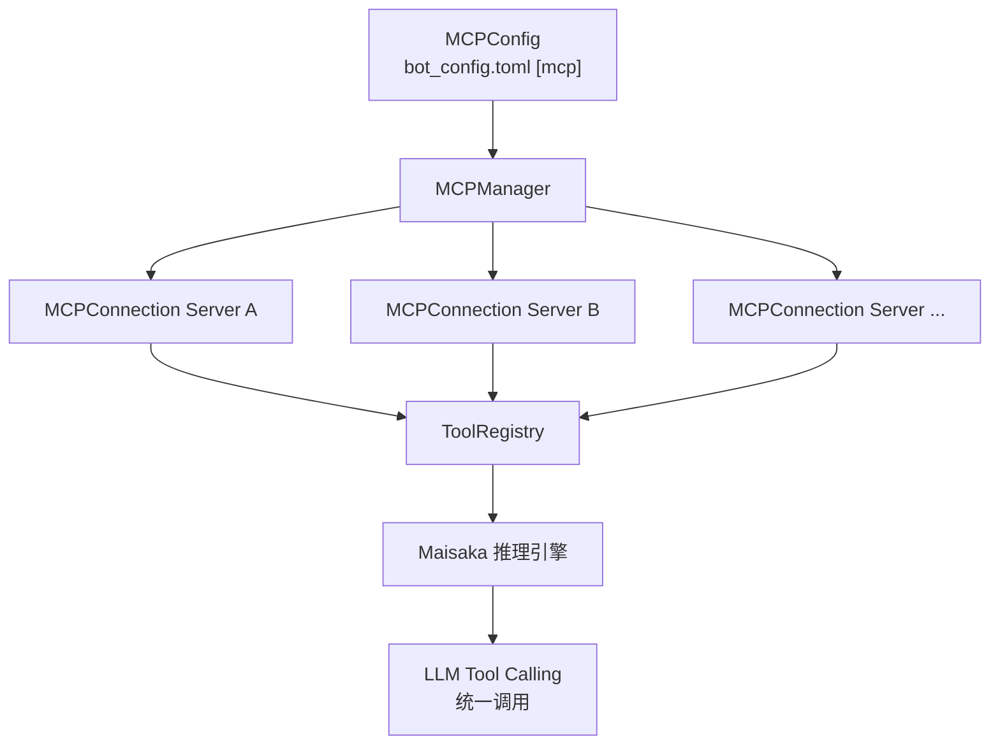

# MCP 集成与外部工具接入

MaiBot 内置了 [Model Context Protocol](https://modelcontextprotocol.io)（MCP）客户端支持，可以将外部 MCP Server 暴露的 Tool、Prompt、Resource 统一接入 Maisaka 推理引擎，让 LLM 在对话中直接调用这批能力。

本文面向部署运维与高级使用者，讲解 MCP 在 MaiBot 中的工作方式、三个 transport 的场景选型、配置写法、命名冲突处理以及调试方法。字段基础含义见 [MCP 配置用户文档](/manual/configuration/mcp-config)。

## MCP 在 MaiBot 中的角色

MaiBot 作为 **MCP Host（客户端）**，启动时拉取 `[mcp]` 段配置，为每个 `servers` 条目创建独立的 `MCPConnection`。每条连接负责与外部 MCP Server 完成 JSON-RPC 握手、能力协商、工具/Prompt/Resource 发现，然后注册进 `ToolRegistry`。

注册后的 MCP 工具与插件工具、内置工具完全平等。Maisaka 推理引擎通过统一的 `ToolProvider` 调用，不感知底层是不是 MCP。



启动时 `MCPManager.from_app_config()` 逐条连接，成功后立即拉取 tools/prompts/resources/resource_templates 四个列表并注册。任何一条连接失败都不会阻止 MaiBot 继续运行，只是该 Server 的工具不可用。

## MCPConfig 字段精解

`[mcp]` 段位于 `bot_config.toml`，对应 `MCPConfig` 模型（归属见 [配置系统](/develop/configuration)）。

### 顶层开关

**`enable`** — 是否启用 MCP。默认 `true`。关闭后整个段被忽略。

### client — 客户端身份

**`client_name`** — 默认 `"MaiBot"`。 **`client_version`** — 默认 `"1.0.0"`。

### client.roots — 文件根目录暴露

**`enable`** — 默认 `false`。 **`items`** — 列表，每项含 `enabled`、`uri`（格式 `file:///path`）、`name`。

### client.sampling — Server 反向请求模型

允许 MCP Server 反过来请求 MaiBot 调用 LLM。

**`enable`** — 默认 `false`。
**`task_name`** — 模型路由任务名，默认 `"planner"`。参见 [模型配置](/manual/configuration/model-config) 的 `model_task_config`。
**`include_context_support`** — 是否允许携带上下文消息，默认 `false`。
**`tool_support`** — 是否允许嵌套工具调用，默认 `false`。开启后 Token 消耗可能急剧增加。

### client.elicitation — Server 请求用户输入

控制 MCP Server 是否可向用户索要信息。

**`enable`** — 默认 `false`。
**`allow_form`** — 允许请求表单，默认 `true`。
**`allow_url`** — 允许请求打开 URL，默认 `false`。

### servers — 服务器列表（核心段）

TOML 数组，每项定义一个 MCP Server：

**`name`**（必填）— 唯一标识，不允许重复。
**`enabled`** — 默认 `true`。
**`transport`** — `"stdio"` / `"streamable_http"` / `"sse"`，默认 `"stdio"`。
**`command`** — stdio 启动命令。 **`args`** — 命令参数列表。 **`env`** — 子进程环境变量。
**`url`** — HTTP/SSE 远程地址。 **`headers`** — 请求头（常用于 Bearer Token）。
**`http_timeout_seconds`** — HTTP 超时，默认 `30.0`。
**`read_timeout_seconds`** — 读取超时，默认 `300.0`。
**`authorization`** — 认证配置，含 `type` 字段。

## 三种 Transport 取舍

### stdio — 本地子进程

通过标准输入/输出与子进程通信。MaiBot 启动 Server 进程，经管道收发 JSON-RPC。

**适合**：Server 是本地可执行程序，需要强隔离。**优点**：零网络开销，延迟最低，无需配置鉴权。**缺点**：子进程占用资源，崩溃后需重启 MaiBot。

### streamable_http — 远程 HTTP 服务

通过 HTTP POST 通信，支持流式响应。

**适合**：Server 部署在独立容器/云函数中，多实例共享。**优点**：客户端与 Server 完全解耦，支持负载均衡。**缺点**：网络延迟，需管理鉴权和 TLS。

### sse — Server-Sent Events

通过 HTTP SSE 长连接接收推送，POST 发送请求。

**适合**：Server 需要主动推送通知。**缺点**：实现较重，部分网关对 SSE 支持不完整。**`sse` 已计划后续逐步废弃，新接入建议优先选 `streamable_http`。**

### 三种 Transport 配置示例

#### stdio（本地 filesystem Server）

::: code-group

```toml [TOML ~vscode-icons:file-type-toml~]
[mcp]
enable = true

[[mcp.servers]]
name = "filesystem"
enabled = true
transport = "stdio"
command = "npx"
args = ["-y", "@modelcontextprotocol/server-filesystem", "/home/user/data"]
```

:::

#### streamable_http（远程 HTTP Server）

::: code-group

```toml [TOML ~vscode-icons:file-type-toml~]
[[mcp.servers]]
name = "remote-tools"
enabled = true
transport = "streamable_http"
url = "https://mcp.example.com/api"
headers = { Authorization = "Bearer sk-xxxx" }
http_timeout_seconds = 60.0
read_timeout_seconds = 600.0
```

:::

#### sse

::: code-group

```toml [TOML ~vscode-icons:file-type-toml~]
[[mcp.servers]]
name = "sse-server"
enabled = true
transport = "sse"
url = "https://sse.example.com/events"
headers = { Authorization = "Bearer sk-xxxx" }
http_timeout_seconds = 60.0
```

:::

## 接入一个 MCP Server

### 示例一：stdio filesystem

以官方的 [filesystem Server](https://github.com/modelcontextprotocol/servers) 为例。前提：Node.js 和 npx 可用。

在 `bot_config.toml` 中追加：

::: code-group

```toml [TOML ~vscode-icons:file-type-toml~]
[[mcp.servers]]
name = "filesystem"
enabled = true
transport = "stdio"
command = "npx"
args = ["-y", "@modelcontextprotocol/server-filesystem", "/home/user/shared"]
```

:::

`args` 的最后一个参数是授权目录。限定到专门的数据目录，不要给 `/` 或 `~`。重启 MaiBot，控制台应出现：

```
✓ MCP 服务器 'filesystem' 已连接 (工具 8 / Prompt 0 / 资源 0 / 模板 0)
```

打开 WebUI 工具列表页面搜索 `read_file` 或 `write_file` 验证。让 LLM 在对话中尝试"帮我读一下 /home/user/shared/readme.txt"来确认端到端可用。

### 示例二：远程 streamable_http

假设有一个监听 `https://tools.yourdomain.com/mcp` 的 Python MCP Server，用 Bearer Token 鉴权。

先在终端确认可达：

::: code-group

```bash [Bash ~vscode-icons:file-type-shell~]
curl -H "Authorization: Bearer sk-xxxx" https://tools.yourdomain.com/mcp
```

:::

再在 `bot_config.toml` 追加：

::: code-group

```toml [TOML ~vscode-icons:file-type-toml~]
[[mcp.servers]]
name = "my-remote-tools"
enabled = true
transport = "streamable_http"
url = "https://tools.yourdomain.com/mcp"
headers = { Authorization = "Bearer sk-xxxx" }
http_timeout_seconds = 45.0
read_timeout_seconds = 300.0
```

:::

`http_timeout_seconds` 调大到 45 秒以应对远程握手延迟。重启后观察控制台日志。连接失败的常见原因：

**TLS 证书问题** — 确认环境能正确验证 Server 的 HTTPS 证书。
**Authorization 格式** — 部分 Server 对 `Bearer` 大小写敏感，参考 Server 文档。
**网络不通** — 检查能否解析域名并建立 TCP 连接。
**http_timeout 太短** — 如果握手慢，继续调大。

## Host Callbacks：Sampling / Logging / Elicitation

MaiBot 通过 `MCPHostCallbacks` 向每个连接注入三类可选回调，由 `[mcp.client]` 段控制。

### Sampling — Server 请求 LLM 生成

`[mcp.client.sampling].enable = true` 时，Server 可请求 MaiBot 调用 LLM。参数由 Server 指定，MaiBot 按 `task_name` 路由到对应模型。`include_context_support` 开启后允许携带上下文消息；`tool_support` 开启后允许嵌套工具调用（Token 消耗高，一般保持关闭）。

### Logging — Server 推送日志

Server 可通过 `logging/setLevel` 和 `notifications/message` 向 MaiBot 推送日志。这些日志走统一管线（文件 JSONL + 控制台 + WebUI），无需额外开关。

### Elicitation — Server 请求用户交互

`enable = true` 后 Server 可要求向用户索要信息。`allow_form`（默认 true）允许表单；`allow_url`（默认 false）控制打开链接。开启前请评估 Server 可信度。

## stdio_filter：处理"不守规矩"的 Server

MCP stdio 规范要求 stdout 只能承载 JSON-RPC，日志应写 stderr。部分第三方 Server 会将启动横幅、版本信息直接打印到 stdout，污染协议流。

MaiBot 内置 `tolerant_stdio_client`（`src/mcp_module/stdio_filter.py`）处理这种情况：

1. 非 `{` 或 `[` 开头的行直接丢弃并记录 warning。
2. JSON-RPC 解析失败的行同样丢弃。
3. 进程生命周期管理与官方 `stdio_client` 完全一致。

控制台看到 `WARNING - Dropped non-JSON line from MCP stdio server` 说明它正在工作，不影响功能。

## 命名冲突行为

MaiBot 注册 MCP 工具时执行两层检查。

### 第一层：内置保留名称

以下 6 个工具名被内核占用，任何 MCP Server 都不能使用，冲突即跳过并打印警告：

**`reply`** — 回复消息
**`no_action`** — 空操作
**`stop`** — 停止执行
**`create_table`** — 创建数据表
**`list_tables`** — 列出数据表
**`view_table`** — 查看数据表

冲突日志示例：`⚠️ MCP 工具 'reply' (来自 my-server) 与内置工具冲突，已跳过`

### 第二层：跨 Server 同名冲突

同名工具出现在两个 Server 时，先注册的生效，后注册的跳过。顺序即 `servers` 列表排列顺序。Prompt 和 Resource 冲突行为相同。

## 调试技巧

### 确认工具已注册

打开 WebUI 工具列表页面，可确认 Server 是否连接成功、工具名是否正确、注册数量与 Server 声明数量是否一致。

### 查看连接日志

启动时观察控制台。成功连接的 Server 打印：
```
✓ MCP 服务器 'filesystem' 已连接 (工具 8 / Prompt 0 / 资源 0 / 模板 0)
```
全部失败时打印：
```
⚠️ 所有 MCP 服务器连接失败
```

### 未安装 mcp SDK

如果提示 `⚠️ 发现 MCP 配置但未安装 mcp SDK`，运行：

::: code-group

```bash [Bash ~vscode-icons:file-type-shell~]
uv add mcp
```

```bash [Bash ~vscode-icons:file-type-shell~]
pip install mcp
```

:::

### 工具数量少于预期

检查剩余工具是否与内置保留名或其它 Server 冲突。对应的 skip 日志在启动阶段打印，上翻控制台即可看到。

## 容器部署用 stdio MCP 注意事项

### Server 运行时依赖

stdio Server 作为子进程启动，容器镜像必须预装其运行时。例如用 `uv run` 的 Python Server：

::: code-group

```toml [TOML ~vscode-icons:file-type-toml~]
[[mcp.servers]]
name = "python-tools"
enabled = true
transport = "stdio"
command = "uv"
args = ["run", "python", "-m", "my_mcp_server"]
```

:::

### 环境变量

用 `env` 字段传入，不要写在 Dockerfile 全局 `ENV` 中。每个 Server 的 `env` 仅影响该子进程：

::: code-group

```toml [TOML ~vscode-icons:file-type-toml~]
[[mcp.servers]]
name = "api-tools"
enabled = true
transport = "stdio"
command = "node"
args = ["/opt/mcp-servers/api-tools/index.js"]
env = { API_KEY = "sk-xxxx", NODE_ENV = "production" }
```

:::

### Filesystem Server 的目录映射

确保宿主机路径已挂载进容器（`docker run -v /host/shared:/container/shared`），然后 TOML 中写容器内路径：

::: code-group

```toml [TOML ~vscode-icons:file-type-toml~]
[[mcp.servers]]
name = "filesystem"
enabled = true
transport = "stdio"
command = "npx"
args = ["-y", "@modelcontextprotocol/server-filesystem", "/container/shared"]
```

:::

### 安全提示

- 不要以 root 运行 MaiBot。
- filesystem Server 路径限制到最小范围。
- 仅接入可信来源的 MCP Server。
- Sampling 和 Elicitation 默认关闭，保持不开启除非明确需要。

## 相关文档

- [MCP 配置用户文档](/manual/configuration/mcp-config)：字段基础含义和 WebUI 配置
- [MCP 工具功能文档](/manual/features/mcp)：用户视角 MCP 工具在对话中的表现
- 工具系统架构：ToolProvider 统一管理工具来源
- [MaiBot 配置系统](/develop/configuration)：`bot_config.toml` 整体结构与热重载
- [MCP 规范](https://modelcontextprotocol.io)：官方协议文档
