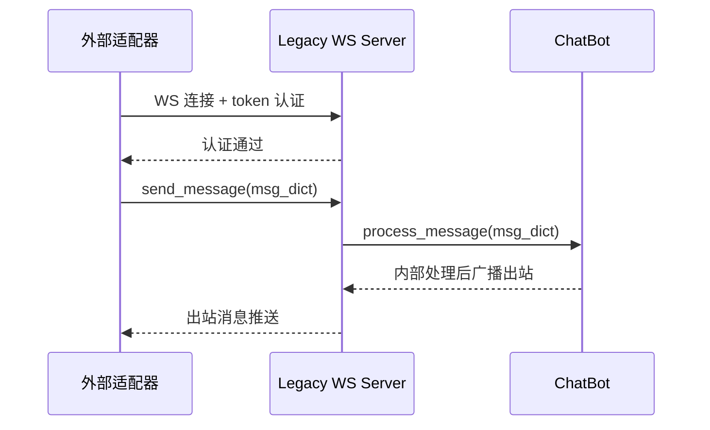
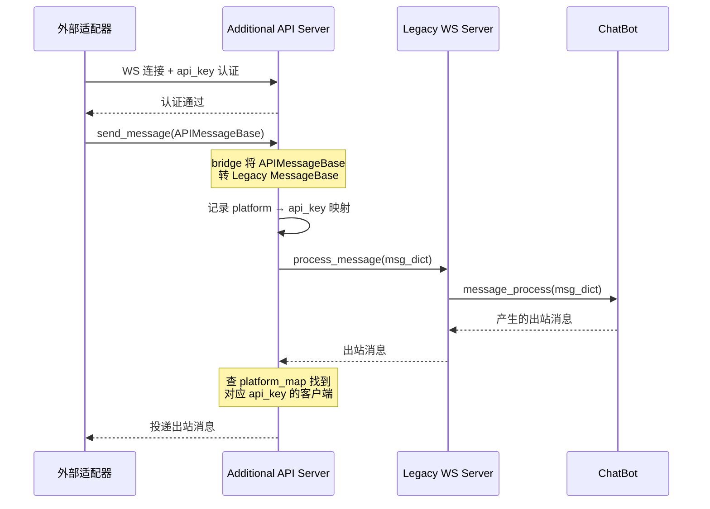
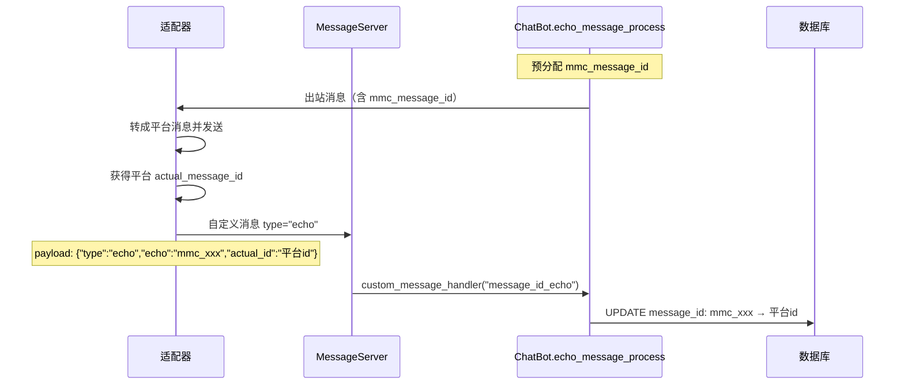

# 消息服务器与适配器对接

MaiBot 通过 `maim_message` 库对外暴露 WebSocket 服务，供外部适配器连接。适配器可以跑在 MaiBot 外部（独立进程、独立机器、甚至独立语言），只要按协议接入即可。本文面向需要部署、运维或自己写适配器的读者，梳理服务器模式、消息流向、认证机制和部署要点。

[[toc]]

## MaiBot 与适配器的关系

MaiBot 本身**不内置任何平台适配器**。NapCat、GoCQ、Discord、Telegram、SnowLuma 等都不是 `src/` 下的库内代码。它们作为独立的外部程序，通过 WebSocket 连接到 MaiBot 的消息服务器，完成三件事：

- **入站**：将平台（QQ、Discord 等）收到的消息转成 `maim_message` 格式发给 MaiBot
- **出站**：接收 MaiBot 发出的 `maim_message` 格式消息，转成平台原生消息发送出去
- **echo**：在成功发送消息后，将平台返回的真实消息 ID 回传给 MaiBot

这套设计把"消息收发协议"和"AI 核心逻辑"解耦，允许同一个 MaiBot 实例对接多个不同平台的适配器。

另外还有一种场景：插件作为适配器。通过 [消息网关组件](../plugin/message-gateway.md) 声明 `route_type="duplex"`，插件可以直接注入入站消息并接收出站投递，由插件运行时内部的 Platform IO 路由接管。插件内适配器的原理与外部适配器一致，只是通信走 Host/Runner 的 msgpack IPC 而非 WebSocket。

## 两种 Server 模式

MaiBot 的消息服务器分两套，由 `MaimMessageConfig` 控制：

**Legacy Server（旧版 WS）**：默认启用，是早期对外统一的 WebSocket 入口。适配器连上后，用 `maim_message` 封装的 `MessageClient` 收发消息。监听地址和端口由 `ws_server_host` / `ws_server_port` 配置，默认 `127.0.0.1:8000`。

**Additional API Server（新版 API）**：可选启用（`enable_api_server = true`），监听独立端口另开一个 WebSocket 服务。它有自己的认证体系（API Key 白名单），并且在消息桥接时自动记录 `platform` 到 API Key 的映射，用于出站路由回派。默认监听 `0.0.0.0:8090`，可选开启 WSS 加密。

两套服务可以并存。Legacy 适合简单场景（一个适配器直接连），Additional API Server 适合多适配器、多账户、需要区分路由的场景。

### Legacy Server（旧版 WS）



### Additional API Server（新版 API）



## 认证与 Token

### Legacy Server 认证

在 `bot_config.toml` 中配置 `auth_token` 列表：

::: code-group

```toml [TOML ~vscode-icons:file-type-toml~]
[maim_message]
auth_token = ["your-secret-token-here"]
```

:::

- 列表为空时不验证，任何 WebSocket 连接都能接入。**生产环境务必配置 Token。**
- 可配多个 Token，不同适配器用不同 Token 连接。
- 适配器侧：`MessageClient` 创建时在 `metadata` 中传入 `{"token": "your-secret-token-here"}`。

### Additional API Server 认证

这套服务有自己的认证逻辑，通过 `api_server_allowed_api_keys` 白名单控制：

::: code-group

```toml [TOML ~vscode-icons:file-type-toml~]
[maim_message]
enable_api_server = true
api_server_allowed_api_keys = ["key-for-napcat", "key-for-discord"]
```

:::

- 白名单为空时允许所有连接。
- 适配器侧：在 WebSocket 连接元数据中传入 `{"api_key": "key-for-napcat"}`。
- 认证失败时连接被拒绝，日志会记录被拒的 API Key。

## RouteKey：多账户路由

`RouteKey` 是 Platform IO 层用于决定"消息该发给谁"的路由键，定义在 `src/platform_io/types.py`：

::: code-group

```python [Python ~vscode-icons:file-type-python~]
@dataclass(frozen=True, slots=True)
class RouteKey:
    platform: str               # 平台名，如 qq、discord
    account_id: Optional[str]   # 账号 ID，区分同平台多账号
    scope: Optional[str]        # 额外路由作用域（租户、通道等）
```

:::

路由匹配按"从最具体到最宽泛"回退。例如 `RouteKey(platform="qq", account_id="bot_001", scope="chan_a")` 会依次尝试精确匹配、仅 account_id 匹配、仅 scope 匹配，最后回退到仅 platform 匹配。

对于 Additional API Server，`platform_map` 自动记录平台到 API Key（或连接 UUID）的映射。当一个 `platform="qq"` 的消息通过某个 API Key 首次到达时，后续所有发给 `qq` 平台的出站消息都会路由回那个连接。

**配置建议**：

- **单账户**：适配器连 MaiBot 时用 `platform="qq"` 即可，无需填 `account_id`
- **多账户**：不同账号用不同 `RouteKey(platform="qq", account_id="bot_001")`，MaiBot 出站时会精确投递给对应适配器

## InboundMessageEnvelope（入站）

入站消息统一封装为 `InboundMessageEnvelope`（定义在 `platform_io/types.py`）：

**`route_key`** — `RouteKey` 路由键，决定消息归属的平台和账号。

**`driver_id`** — 产出该消息的驱动 ID，Legacy 或插件适配器均有唯一标识。

**`driver_kind`** — `DriverKind` 枚举（legacy / plugin）。

**`external_message_id`** — 平台侧消息 ID，用于去重。为空时中间层回退到 `session_message.message_id`。

**`dedupe_key`** — 可选显式去重键。供上游驱动在外部消息没有稳定 message_id 时提供稳定的技术性幂等键。

**`session_message`** — 可选的已完成规范化的 `SessionMessage` 对象。

**`payload`** — 原始字典载荷，供延迟转换或调试使用。

**`metadata`** — 额外入站元数据（连接信息、追踪上下文等）。

## SessionMessage（入站消息模型）

`SessionMessage` 继承自 `MaiMessage`，是入站消息在 MaiBot 内部的标准化模型。核心字段：

**`message_info`** — 消息元信息，包含 `user_info`（发送者）、`group_info`（群/频道）、`platform`、`message_id` 等。

**`raw_message`** — 原始消息组件列表，支持 `Text`、`Image`、`At`、`Reply`、`Emoji`、`Voice`、`File`、`ForwardNode` 等。

**`reply_to`** — 被回复的消息 ID。

**`processed_plain_text`** — 预处理后的纯文本内容。

组件按 `StandardMessageComponents` 联合类型建模，每类组件保留平台原始数据的同时提供标准化访问接口。

## DeliveryReceipt（出站回执）

`DeliveryReceipt` 表示一次出站投递的结果：

**`internal_message_id`** — 内部消息 ID（对应入站时的 `SessionMessage.message_id`）。

**`route_key`** — 投递使用的 `RouteKey`。

**`status`** — `DeliveryStatus` 枚举（SENT / FAILED 等）。

**`driver_id`** — 实际处理该投递的驱动 ID。

**`driver_kind`** — 驱动类型。

**`external_message_id`** — 适配器返回的平台侧消息 ID。

**`error`** — 失败时的错误信息。

**`metadata`** — 额外元数据。

对于广播式出站（一条消息发给多个平台），`DeliveryBatch` 聚合多个 `DeliveryReceipt`，提供 `sent_receipts` / `failed_receipts` / `has_success` 便捷属性。

## message_id_echo 回路

MaiBot 在生成消息时使用**内部预分配的消息 ID**（`mmc_message_id`）。适配器在成功发送到平台后，平台会返回一个**平台侧真实消息 ID**（`actual_message_id`）。适配器需要把这个映射回报给 MaiBot，以便后续引用（如撤回想撤回正确的消息）。

回路流程：



适配器发送 echo 的 payload 格式：

::: code-group

```json [JSON ~vscode-icons:file-type-json~]
{
  "type": "echo",
  "echo": "mmc_message_id_xxx",
  "actual_id": "platform_real_message_id"
}
```

:::

MaiBot 主程序在启动时注册了 `message_id_echo` 的自定义消息处理器，并由 Additional API Server 的 `bridge_message_handler` 桥接到同一个处理函数。

## 最小 Python 外部适配器示例

下面是一个最小可用的 Python 适配器，连 Legacy Server 并收发消息：

::: code-group

```python [Python ~vscode-icons:file-type-python~]
"""最小外部适配器：连 MaiBot Legacy WS Server，收发消息。"""
import asyncio
from maim_message import MessageClient, MessageBase


class MinimalAdapter:
    def __init__(self, host: str, port: int, token: str):
        self.client = MessageClient(
            host=host,
            port=port,
            metadata={"token": token},
        )

    async def on_bot_message(self, msg: dict) -> None:
        """收到 MaiBot 的出站消息，转成平台消息发送。"""
        print(f"[Adapter] 收到出站消息: msg_id={msg.get('message_id')}")
        # 这里对接具体平台（QQ / Discord / Telegram）的发送 API
        # platform_msg_id = await send_to_platform(msg)
        # await self.echo_message(msg["message_id"], platform_msg_id)

    async def inject_inbound(self, text: str, user_id: str, group_id: str) -> None:
        """注入一条入站消息到 MaiBot。"""
        msg = MessageBase(
            message_id="adapter_001",
            platform="qq",
            group_info={"group_id": group_id},
            user_info={"user_id": user_id, "user_nickname": "User"},
            raw_message={"components": [{"type": "text", "text": text}]},
        )
        await self.client.send_message(msg.to_dict())

    async def echo_back(self, mmc_id: str, actual_id: str) -> None:
        """将平台真实消息 ID 回传给 MaiBot。"""
        echo_payload = {
            "type": "echo",
            "echo": mmc_id,
            "actual_id": actual_id,
        }
        await self.client.send_custom_message("message_id_echo", echo_payload)

    async def run(self) -> None:
        """建立连接并开始处理消息。"""
        await self.client.connect()
        # 注册出站消息回调
        self.client.on("message", self.on_bot_message)
        print(f"[Adapter] 已连接 MaiBot Legacy Server")
        # 保持运行
        await asyncio.Event().wait()


if __name__ == "__main__":
    adapter = MinimalAdapter(
        host="127.0.0.1",
        port=8000,
        token="your-secret-token-here",
    )
    asyncio.run(adapter.run())
```

:::

- `MessageClient` 封装了 WebSocket 连接、认证和消息收发。
- `on_bot_message` 是出站回调，MaiBot 有消息要发送时触发。
- `send_message` 注入入站消息。
- `send_custom_message("message_id_echo", ...)` 完成 echo 回路。

## 部署建议

### 网络隔离

- Legacy Server 默认绑定 `127.0.0.1`，仅本机可访问。如果适配器和 MaiBot 在同一台机器，这是最安全的选择。
- Additional API Server 默认绑定 `0.0.0.0`，允许外部访问。如果适配器跑在另一台机器，可以开启并配 TLS。
- 裸奔的公网 WebSocket 极其危险。要么走内网，要么配 TLS + 强认证。

### TLS（WSS）

Additional API Server 支持 WSS：

::: code-group

```toml [TOML ~vscode-icons:file-type-toml~]
[maim_message]
enable_api_server = true
api_server_use_wss = true
api_server_cert_file = "/path/to/cert.pem"
api_server_key_file = "/path/to/key.pem"
```

:::

Legacy Server 本身不内置 WSS，如有需要可在前面架 Nginx / Caddy 做反向代理并终结 TLS。

### 单账户 vs 多账户

**单账户部署**：
- 适配器连 Legacy Server 即可，无需关注路由。
- Additional API Server 不用开。

**多账户 / 多平台部署**：
- 开 Additional API Server，每个适配器获取独立的 API Key。
- 适配器在入站消息的 `platform` 字段里写平台名，MaiBot 自动建立 `platform → api_key` 映射。
- 也可以通过 `RouteKey.account_id` 区分同平台的多个账号。
- 如果多个适配器共享同一个 `platform`，最后一个通过 `bridge_message_handler` 建立的映射会覆盖之前的，需要注意管理。

### 认证检查清单

- [ ] Legacy `auth_token` 不为空
- [ ] Additional API Server 的 `api_server_allowed_api_keys` 不为空（如果启用）
- [ ] 每个适配器持有独立 Token / API Key，不要共用
- [ ] Token 和 API Key 不在日志中明文输出

## 相关文档

- [插件消息网关](../plugin/message-gateway.md)：插件内适配器开发（`@MessageGateway` 装饰器）
- [插件 Hook 处理器](../plugin/hooks.md)：通过 Hook 拦截和改写消息流
- [消息管线](../manual/features/message-pipeline.md)：入站消息在 MaiBot 内部的处理全流程
- [开发指南](./index.md)：技术栈、项目结构和平行 IO 层设计
