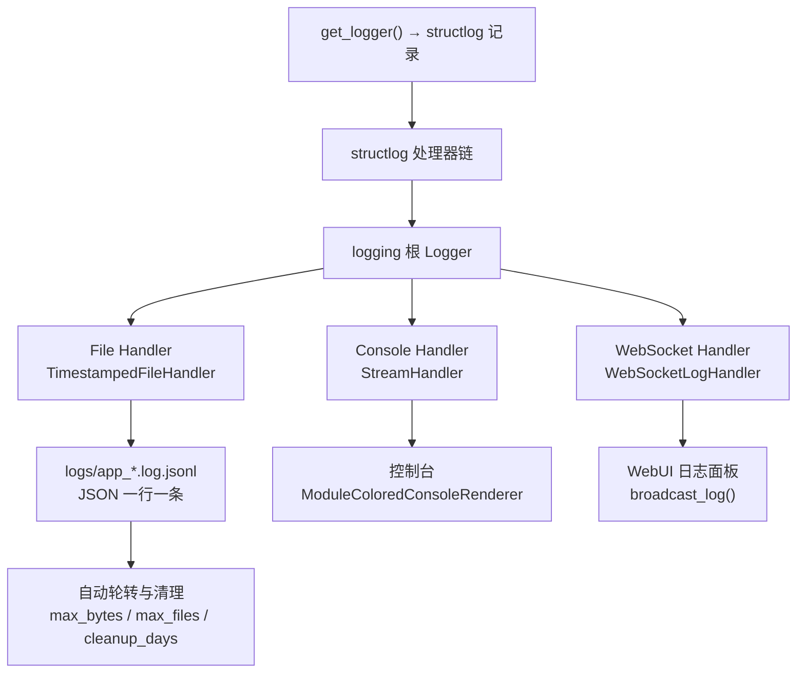

# 日志与可观测性

MaiBot 的日志系统基于 structlog + Python logging 构建，将所有日志同时路由到三条并行的输出通道：文件（JSONL 格式）、控制台（带颜色）和 WebUI（WebSocket 实时推送）。本文面向部署运维和进阶使用者，覆盖日志配置调优、第三方库降噪、LLM 请求失败快照抓取、WebSocket 日志订阅和线上排查流程。

## 日志记录 → Handler 路由



三条 Handler 在日志模块导入时即注册到根 Logger。所有 structlog 日志经过统一的处理器链（上下文合并、调用点信息注入、路径转模块名、时间戳和堆栈格式化），再由各 Handler 的 Formatter 决定最终输出格式。

## 三条 Handler

### File JSONL Handler — 持久化与回查

File Handler 将日志以 JSONL 格式写入 `logs/app_<时间戳>.log.jsonl`，每行一条完整的 JSON 记录，包含以下字段：

**`timestamp`** — ISO 格式时间戳
**`level`** — 日志级别（debug / info / warning / error / critical）
**`logger_name`** — 产生日志的模块名（如 `maisaka.planner`、`chat.heartflow`）
**`event`** — 日志正文
**`module`** — 源码相对路径（如 `maisaka.planner`）
**`lineno`** — 行号（方便溯源）
**`exception`** — 若出现异常，包含完整堆栈

JSONL 行内字段可随上下文扩展（如额外记录 `response_time`、`tool_name`），方便后续用 `jq`、`grep` 等工具做精确检索和统计。

**文件轮转与清理**由三个 LogConfig 字段控制：

**`log_file_max_bytes`** — 单文件超过此大小后触发轮转，默认 `5MB`
**`max_log_files`** — 最多保留多少个主日志文件，默认 `30`
**`log_cleanup_days`** — 超过该天数的日志文件由后台线程（每 24h 执行）自动清理

### Console Handler — 开发实时观察

Console Handler 将格式化的日志直接输出到控制台（stdout）。`ModuleColoredConsoleRenderer` 负责为不同模块标记不同颜色，颜色的范围和强度由下文 `color_text` 字段控制。

控制台输出受 `console_log_level` 和 `log_level_style` 两个字段影响：
- 级别：默认 `INFO`，开发排查时可临时改为 `DEBUG`
- 样式：`lite`（仅着色时间戳）、`compact`（显示级别首字母）、`full`（显示完整级别）

### WebSocket Handler — 实时推送到 WebUI

WebSocket Handler 将每条日志以 JSON 消息的形式实时推送到所有连接了 `/ws/logs` 的 WebUI 客户端。消息格式包含 `id`、`timestamp`、`level`、`module`、`message` 五个字段，并附带模块对应颜色，前端日志面板会在连接建立后先收到最近 100 条历史日志作为上下文回溯。

WebSocket 日志推送在 `bot.py:478` 调用 `initialize_ws_handler()` 时完成初始化。Handler 本身注册在 `DEBUG` 级别，确保无论 LogConfig 设为何值，WebSocket 都能收到所有级别的日志。

## LogConfig 配置详解

LogConfig 位于 `config/bot_config.toml` 的 `[log]` 段。以下是运维常用的重点字段：

### 日志级别三件套

**`log_level`** — 全局默认级别，作为 `console_log_level` 和 `file_log_level` 的兜底。取值 `DEBUG` / `INFO` / `WARNING` / `ERROR` / `CRITICAL`，默认 `INFO`。

**`console_log_level`** — 控制台输出级别，默认 `INFO`。如果你在终端里实时盯着日志看，这个值是你实际看到的过滤阈值。

**`file_log_level`** — 文件输出级别，默认 `DEBUG`。文件日志最详细，出问题时翻文件通常能找到控制台上看不到的细节。

**典型搭配**：`console_log_level="INFO"` + `file_log_level="DEBUG"`，平时控制台清爽，出问题时去文件翻 DEBUG。

### 控制台外观

**`color_text`** — 控制台着色范围，取 `"none"` / `"title"`（仅模块名着色）/ `"full"`（模块名 + 级别 + 正文全着色）。默认 `full`，建议保留以便快速区分模块。

**`log_level_style`** — 级别文本展示样式，取 `"lite"`（仅着色时间戳，不显示级别）、`"compact"`（显示级别首字母，如 `[I]`）、`"full"`（显示完整级别，如 `[   INFO]`）。默认 `lite`。

**`date_style`** — 时间戳格式模板，如 `"m-d H:i:s"` 显示为 `07-18 14:30:05`，支持 `Y`（年）、`m`（月）、`d`（日）、`H`（时）、`i`（分）、`s`（秒）。

### 快照与回放

**`llm_request_snapshot_limit`** — 失败模型请求快照最多保留份数，默认 `128`。当 LLM 调用失败时，系统会把完整的请求上下文（消息列表、模型参数、API Provider 配置、错误信息）序列化到 `logs/llm_request/*.json` 并自动裁剪超量文件。详见下文"LLM 请求失败快照"节。

**`maisaka_prompt_preview_limit`** — 每个聊天最多保留多少组 Prompt 预览，默认 `256`。预览内容可在 WebUI 对话详情中查看。

**`maisaka_reply_effect_limit`** — 每个聊天最多保留多少条回复效果记录，默认 `256`（需 Debug 配置中开启 `enable_reply_effect_tracking`）。

## library_log_levels：精准调噪

第三方库的日志容易淹没关键信息，`library_log_levels` 字段让你按库名精确控制日志级别，而不是一刀切全部屏蔽。

### 默认配置

MaiBot 默认将以下库设置为 `WARNING` 级别以减少噪音：

**`aiohttp`** — `WARNING`。HTTP 请求库，`INFO` 级会刷屏每次连接的详细信息。
**`PIL`** — `WARNING`。图像处理库，会输出大量格式识别细节。

### 调噪实战举例

你可以在此字段中新增任意库名和级别的键值对。以下是一些场景和对应的配置建议：

**场景一：调试数据库查询**

::: code-group

```toml [TOML ~vscode-icons:file-type-toml~]
[log.library_log_levels]
aiohttp = "WARNING"
PIL = "WARNING"
sqlalchemy = "DEBUG"
```

:::

临时打开 SQLAlchemy 的 `DEBUG` 级别能看到每条生成的 SQL 语句，排查 ORM 性能问题时很有用。排查完后记得改回 `WARNING`。

**场景二：排查 HTTP 请求超时**

::: code-group

```toml [TOML ~vscode-icons:file-type-toml~]
[log.library_log_levels]
httpx = "DEBUG"
```

:::

如果怀疑是模型 API 调用层面的问题，临时打开 `httpx`（或 `openai`）的 `DEBUG` 可以看到完整的请求/响应详情。

**场景三：WebSocket 连接异常**

::: code-group

```toml [TOML ~vscode-icons:file-type-toml~]
[log.library_log_levels]
websockets = "INFO"
```

:::

默认 `websockets` 库在 `suppress_libraries` 中被完全屏蔽，改为 `INFO` 后可以看到 WebSocket 建立/断开/重连的完整生命周期日志。

**场景四：极端调试模式**

把所有你知道的噪声库逐一调到阈值，只保留业务代码日志：

::: code-group

```toml [TOML ~vscode-icons:file-type-toml~]
[log.library_log_levels]
aiohttp = "ERROR"
sqlalchemy = "WARNING"
httpx = "ERROR"
openai = "WARNING"
websockets = "ERROR"
urllib3 = "ERROR"
```

:::

### 完全屏蔽

如果你压根不想看到某个库的任何输出，把它加入 `suppress_libraries` 列表即可。被屏蔽的库不产生任何日志（等价于将该库的 logger 级别设为比 `CRITICAL` 还高），且配置了 `propagate=False` 阻止日志向上传递。

**`suppress_libraries`** 默认为 `["faiss", "httpx", "urllib3", "asyncio", "websockets", "httpcore", "requests", "sqlalchemy", "openai", "uvicorn", "jieba"]`。如果你需要看到其中某个库的日志，将它从该列表中移除，然后用 `library_log_levels` 设置合适的级别即可。

## LLM 请求失败快照

当 LLM 模型调用失败（如超时、认证失败、上游返回错误），MaiBot 会自动将失败请求的完整上下文保存为快照文件，存放在 `logs/llm_request/` 目录下。

### 快照内容

每份快照 JSON 文件包含以下信息：

**`api_provider`** — API Provider 配置（不含认证密钥等敏感信息）
**`client_type`** — 客户端类型（`openai` / `gemini` 等）
**`error`** — 错误详情，包含错误类型、状态码、消息文本，以及尽量提取的上游 response body
**`model_info`** — 模型信息（名称、标识符、temperature 等参数）
**`internal_request`** — 内部请求结构（消息列表、工具调用、response_format 等完整上下文）
**`provider_request`** — 已按 API Provider 格式转换后的实际请求体
**`replay`** — 回放信息，包含一条可直接执行的 `uv run python` 命令，用该快照文件重新发起调用
**`created_at`** — 快照创建时间

### 管理快照

**`llm_request_snapshot_limit`** 控制快照保留上限（默认 `128`）。当快照文件数超过此阈值，系统自动删除最早的文件。

快照文件名格式为 `<时间戳>_<客户端>_<请求类型>_<模型名>.json`，方便按时间或模型名快速定位。

### 回放失败请求

快照文件的 `replay.command` 字段提供了完整的回放命令，可以直接复制到终端执行：

::: code-group

```bash [Bash ~vscode-icons:file-type-shell~]
uv run python scripts/replay_llm_request.py "logs/llm_request/20260718_143005_openai_response_gpt-4o.json"
```

:::

这会用快照中的参数重新调用 LLM，用于验证问题是偶发还是持续存在。

## Telemetry 遥测开关

遥测系统（Telemetry）定期向服务端发送匿名运行统计。它**不会收集聊天内容或个人信息**，仅包含系统类型、Python 版本、MaiBot 版本和部署时间。

**`telemetry.enable`** — 是否启用遥测，默认 `true`。

关闭遥测不影响任何功能。如果你不希望 MaiBot 与外部通信，在 `bot_config.toml` 中设置：

::: code-group

```toml [TOML ~vscode-icons:file-type-toml~]
[telemetry]
enable = false
```

:::

遥测包含两个独立任务：`TelemetryHeartBeatTask`（每 10 分钟心跳）和 `TelemetryStatsUploadTask`（约 3 小时一次统计上报）。两者都受 `enable` 控制，关闭后不会发起任何网络请求。

## Debug 配置项

Debug 配置位于 `[debug]` 段，`__ui_parent__` 为 `log`，在 WebUI 中与日志配置在同一区域。以下五项在调试和性能分析时常用：

**`show_maisaka_thinking`** — 是否在日志中显示麦麦的思考过程（Planner 规划细节、工具调用的推理链条），默认 `true`。如果你想压日志长度，可以关闭此开关。

**`enable_reply_effect_tracking`** — 是否记录回复效果评分，默认 `false`。开启后系统会为每条回复计算效果指标并写入数据库，配合 `maisaka_reply_effect_limit` 限制每聊天的记录数。适合调优 Prompt 或对比模型表现时使用。

**`keep_prompt_preview_json_base64`** — 是否在 Prompt 预览中保留图片的 base64 数据，默认 `false`。开启后可在预览中看到发送给模型的完整图片内容，方便排查视觉模型输出异常，但会占用较多磁盘空间。

**`record_tool_structured_content`** — 是否保存工具返回的结构化内容（如 JSON schema、API 响应体），默认 `false`。开启后能帮助你在对话记录中复现工具调用链路，但会增大数据库体积。

**`enable_llm_cache_stats`** — 是否记录模型 prompt cache 命中统计，默认 `false`。开启后在日志中追加缓存相关指标，用于性能调优和模型 API 成本分析。

## WebSocket 日志订阅

WebUI 的日志面板通过 WebSocket 协议实现实时日志推送。

**端点**：`/ws/logs`
**认证方式**：query 参数 `?token=<ws-token>`（通过 `/api/webui/ws-token` 获取临时 token）或 Cookie `maibot_session`
**连接流程**：

客户端连接后，服务端先推送最近 100 条历史日志（从 `logs/` 目录最新文件读取），然后持续推送新产生的日志。连接期间支持 `ping`/`pong` 心跳。

日志消息的 JSON 结构：

::: code-group

```json [JSON ~vscode-icons:file-type-json~]
{
  "id": "1712345678000_42",
  "timestamp": "2026-07-18 14:30:05",
  "level": "WARNING",
  "module": "maisaka.planner",
  "message": "工具调用超时: search_memory",
  "moduleColor": "#....",
  "moduleBold": true
}
```

:::

**`moduleColor`** 和 **`moduleBold`** 字段由 `_resolve_module_style()` 根据模块名匹配预设的终端颜色表，前端据此渲染带颜色的模块标签。

WebSocket Handler 将每条日志以 **非阻塞** 方式广播（`call_soon_threadsafe`），WebSocket 推送失败不会影响主日志系统。

## 线上排查三步

当你发现 MaiBot 突然不回复了，按以下流程定位：

### Step 1 — 看控制台最后输出

首先检查终端里最近的日志。留意以下信号：

- `ERROR` / `CRITICAL` 级别的报错，展开看堆栈信息
- 是否出现大量 `WARNING`（如模型调用重试、心跳失败）——积少成多可能指向网络或 API 凭证问题
- 日志是否完全卡住无输出——可能是进程阻塞，打 `Ctrl+C` 看是否有 KeyboardInterrupt 响应

如果控制台 `console_log_level` 默认 `INFO` 看不到够细的信息，**直接在终端环境变量临时覆盖**无需改配置文件，重启即失效：

::: code-group

```bash [Bash ~vscode-icons:file-type-shell~]
# 临时开 DEBUG，重启后恢复
export MAIBOT_CONSOLE_LOG_LEVEL=DEBUG
uv run python bot.py
```
:::

### Step 2 — 翻文件日志

文件日志默认 `DEBUG` 级别，记录了比控制台更全面的信息。从最新的日志文件切入：

::: code-group

```bash [Bash ~vscode-icons:file-type-shell~]
# 查看最近 50 条日志
tail -50 logs/$(ls -t logs/app_*.log.jsonl | head -1)

# 搜索 ERROR 和异常
grep -i '"level": "ERROR"' logs/app_*.log.jsonl | tail -20

# 搜索特定模块
grep '"logger_name": "maisaka"' logs/app_*.log.jsonl | tail -30
```

:::

用 `jq` 可以更精确地过滤和格式化：

::: code-group

```bash [Bash ~vscode-icons:file-type-shell~]
# 取最近 20 条 ERROR 的 event 正文
tail -2000 logs/app_*.log.jsonl | jq 'select(.level == "ERROR") | {ts: .timestamp, msg: .event}' | tail -20
```

:::

### Step 3 — 切 DEBUG + 抓 LLM 快照复现

如果前两步没能定位到根因，把 `file_log_level` 改为 `DEBUG`（通常情况下已经是）确保最详细的日志写入文件。同时检查 `logs/llm_request/` 下的快照文件：

- 如果快照文件在问题时间点附近有大量生成（如批量超时），用快照中 `replay.command` 手动重放，把重放结果和控制台输出在社区中求助
- 如果没生成快照，说明问题不在模型调用层——排查消息管线、适配器连接和 WebSocket 状态
- 临时把相关库的 `library_log_levels` 降为 `DEBUG`（见上文调噪实战），重新触发问题后检查输出

完成后**务必恢复**临时改动的配置和库日志级别，避免磁盘被 DEBUG 日志撑满。

## 在线时间统计简介

MaiBot 在 WebUI 的「聊天统计」页面中展示**在线时长**指标。该指标由运行时的启动时间戳和当前时间计算得出，记录机器人的实际运行时长。

统计数据通过遥测系统以时间窗口（cursor 机制）上报，包含 Token 用量、模型调用频率和费用等聚合指标。如果你需要深入了解统计系统的内部实现（数据聚合逻辑、上报周期、cursor 游标策略），请参阅 [统计与 I/O 数据链路](./statistics-io.md)。

**在线时间相关快速信息**：

**`deploy_time`** — 部署时间戳，存储在本地存储中，用于遥测 UUID 注册和统计窗口的基准时间
**`process_start_at`** — 当前进程启动时间，用于划定统计窗口的起点
**遥测统计上报间隔** — 约 191 分钟（`11451` 秒），每次上报一个时间窗口的聚合数据
