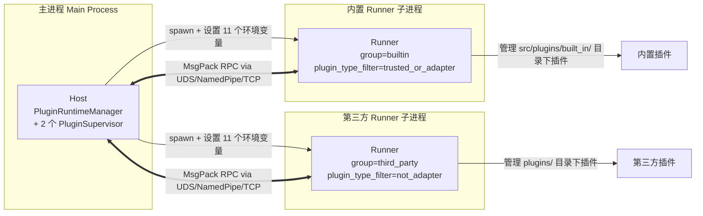

# 插件运行时内部架构

本文档面向需要部署、运维或排查插件异常的读者，剖析 MaiBot 插件运行时的内部设计。如果你打算写插件（而非运维），请先看 [插件开发文档](/plugin/) 了解 Manifest、组件注册、生命周期回调等面向开发者的用法。本文只讨论 Host 与 Runner 之间发生了什么，不涉及 `@Tool` / `@Command` / `@Hook` 等装饰器签名。

[[toc]]

## 整体架构：Host / Runner 双进程模型

MaiBot 的插件体系由**三个角色**构成：

**Host** 运行在主进程内，由 `PluginRuntimeManager` 单例统管。它持有两个 `PluginSupervisor` 实例，分别负责内置与第三方插件。

**Runner** 是 Host 用 `asyncio.create_subprocess_exec` 拉起的独立子进程，入口为 `python -m src.plugin_runtime.runner.runner_main`。每个 Supervisor 对应一个 Runner，因此整个系统最多有两个 Runner 子进程同时运行。

**插件** 本身是普通的 Python 包或目录，放在 `src/plugins/built_in/` 或 `plugins/` 下，由 Runner 扫描、加载、激活。插件从不直接与 Host 通信，一切 RPC 都通过 Runner 中转。

### 为什么拆两个子进程

MaiBot 定义了三类插件类型（Manifest `plugin_type` 字段）：

- **`extension`** — 普通扩展插件
- **`adapter`** — 平台适配器插件（如 NapCat 桥接层）
- **`trusted`** — 可信插件（手动标记，走内置通道）

`PluginRuntimeManager` 启动时会创建两个 Supervisor：

1. **`builtin` Supervisor** — `plugin_type_filter="trusted_or_adapter"`，管理 `src/plugins/built_in/` 目录，同时可加载第三方目录中的 `adapter` / `trusted` 插件
2. **`third_party` Supervisor** — `plugin_type_filter="not_adapter"`，管理 `plugins/` 目录，负责 `extension` 类型的第三方插件

这个拆分把"平台级适配器"与"普通扩展"隔离到不同进程中。如果一个第三方插件挂了，它只可能拖垮第三方 Runner，不会直接影响适配器链路。

## 传输层：UDS / NamedPipe / TCP

Host 与 Runner 之间通过 MsgPack 编码的 RPC 帧通信。传输层在 `src/plugin_runtime/transport/` 中实现，工厂函数根据平台自动选择：

**`plugin_runtime.transport.factory.create_transport_server()`** — Host 侧创建服务端：

- **Linux / macOS** — Unix Domain Socket（`UDSTransportServer`）
- **Windows** — Named Pipe（`NamedPipeTransportServer`）

**`plugin_runtime.transport.factory.create_transport_client()`** — Runner 侧按地址格式自动判断：

- 地址以 `\\.\pipe\` 开头 → Named Pipe
- 地址含 `/` 或以 `.sock` 结尾 → UDS
- 地址含 `:` → TCP（`TCPTransportClient`）

自定义 IPC 路径通过 `plugin_runtime.ipc_socket_path` 配置项指定。Supervisor 会追加 `-builtin` / `-third_party` 后缀来区分两个 Runner 的接入点。

## 启动流程与 11 个环境变量

### 启动序列

1. `PluginRuntimeManager.start()` 创建两个 `PluginSupervisor`
2. 每个 Supervisor 调用 `_build_runner_environment()` 构造环境变量字典
3. 通过 `asyncio.create_subprocess_exec` 拉起 Runner 子进程，注入所有环境变量
4. Runner 启动后读取环境变量，主动向 Host 的 IPC 地址发起 TCP/UDS 连接
5. Runner 发送 `runner.hello` 握手请求，Host 校验 `session_token` 和 SDK 版本
6. 握手成功后 Runner 安装 IPC 日志 Handler，加载插件并注册到 Host
7. Runner 发送 `runner.ready` 通知 Host 插件初始化完成

### 环境变量全列表

下面 11 个环境变量由 `src/plugin_runtime/__init__.py` 定义常量，Supervisor 在 `_build_runner_environment()` 中设置。Runner 启动时在 `_async_main()` 中读取。

**`MAIBOT_IPC_ADDRESS`** — IPC 传输层监听地址（UDS socket 路径或 TCP `host:port`）。Runner 用此地址连接 Host。

**`MAIBOT_SESSION_TOKEN`** — 本次会话的认证令牌。Host 每次 spawn / reload 都会重新生成，Runner 必须在 `runner.hello` 握手时回传。此项同时从 `os.environ` 中 `pop` 掉，防止泄露。

**`MAIBOT_PLUGIN_DIRS`** — Runner 需要扫描的插件目录列表，用 `os.pathsep` 分隔。

**`MAIBOT_PLUGIN_TYPE_FILTER`** — Runner 对插件 manifest `plugin_type` 的过滤模式。`builtin` Supervisor 设置为 `trusted_or_adapter`，`third_party` Supervisor 设置为 `not_adapter`。

**`MAIBOT_TRUSTED_PLUGIN_DIRS`** — 过滤模式中始终信任的插件根目录，用 `os.pathsep` 分隔。`builtin` Supervisor 将 `src/plugins/built_in/` 设为此值。

**`MAIBOT_HOST_VERSION`** — Host 应用版本号，Runner 用于 manifest 兼容性校验。

**`MAIBOT_EXTERNAL_PLUGIN_IDS`** — JSON 对象，告知 Runner 哪些"外部"插件已由另一个 Supervisor 加载，可视为依赖已满足。例如 `{"some-plugin-id": "1.2.0"}`。

**`MAIBOT_BLOCKED_PLUGIN_REASONS`** — JSON 对象，告知 Runner 哪些插件被依赖流水线阻止加载及原因。例如 `{"blocked-plugin": "依赖缺失: pkg-name"}`。

**`MAIBOT_RUNNER_GROUP`** — Runner 所属运行时分组名称。`builtin` 或 `third_party`，用于诊断日志中区分两个子进程。

**`MAIBOT_GLOBAL_CONFIG_SNAPSHOT`** — 预留字段。当前版本已定义常量但尚未在启动流程中实际注入 Runner，供未来全局配置快照下发使用。

**`MAIBOT_PLUGIN_SDK_PATH`** — 本地 `maibot-plugin-sdk` 仓库路径。若设置，Runner 通过 `PYTHONPATH` 优先从该路径导入 SDK，无需从 PyPI 安装。适用于 SDK 联调场景。

## Envelope 协议

所有 Host ↔ Runner 消息均封装为统一的 `Envelope` 结构（定义于 `src/plugin_runtime/protocol/envelope.py`），序列化链路为 `Envelope → .model_dump() → MsgPack encode`。

Envelope 字段一览（Pydantic `BaseModel`）：

**`protocol_version`** — 协议版本，固定 `1.0.0`。用于向前兼容。

**`request_id`** — 单调递增 int64 请求 ID，由 `RequestIdGenerator` 生成。同一 request 的 request/response 共用此 ID。

**`message_type`** — 消息类型枚举。取值：`request`（请求）、`response`（响应）、`broadcast`（广播）。

**`method`** — RPC 方法名字符串，如 `plugin.health`、`cap.call`。

**`plugin_id`** — 目标插件 ID。用于将请求路由到正确的 Runner 内插件实例。

**`timestamp_ms`** — 发送时间戳（Unix epoch 毫秒）。

**`timeout_ms`** — 相对超时（毫秒），默认 30000。

**`payload`** — 业务数据字典。根据方法不同承载各自的结构化 payload（如 `InvokePayload`、`ConfigUpdatedPayload`）。

**`error`** — 错误信息字典（仅 response 消息）。包含 `code`（错误码）、`message`（错误描述）、`details`（详细信息）。错误码枚举定义在 `src/plugin_runtime/protocol/errors.py` 的 `ErrorCode` 中。

Envelope 提供三个便利方法：`is_request()`、`is_response()`、`is_broadcast()`，以及 `make_response()` / `make_error_response()` 用于从请求构造对应的响应信封。

## RPC 方法清单

### Host → Runner（17 个）

以下方法由 Host 向 Runner 发起，在 `PluginRunner._register_handlers()` 中注册（源码行号 1232-1247）：

1. **`plugin.invoke_command`** — 调用插件注册的命令组件
2. **`plugin.invoke_action`** — 调用插件注册的动作组件
3. **`plugin.invoke_api`** — 调用插件注册的 API 组件
4. **`plugin.invoke_tool`** — 调用插件注册的工具组件
5. **`plugin.invoke_message_gateway`** — 调用插件的消息网关组件
6. **`plugin.invoke_llm_provider`** — 调用插件的 LLM Provider
7. **`plugin.emit_event`** — 向插件分发事件
8. **`plugin.invoke_hook`** — 调用插件注册的命名 Hook
9. **`plugin.health`** — 询问 Runner 健康状态
10. **`plugin.prepare_shutdown`** — 通知 Runner 准备关停（排空缓冲）
11. **`plugin.shutdown`** — 通知 Runner 立即关停
12. **`plugin.config_updated`** — 推送插件配置更新
13. **`plugin.inspect_config`** — 请求 Runner 解析插件配置元数据（默认配置、schema、归一化结果）
14. **`plugin.validate_config`** — 请求 Runner 校验插件配置
15. **`plugin.reload`** — 请求 Runner 热重载单个插件
16. **`plugin.reload_batch`** — 请求 Runner 批量热重载插件
17. **`plugin.unload_batch`** — 按依赖安全顺序批量卸载指定插件，并返回每个插件的卸载结果

### Runner → Host（简要）

Runner 也向 Host 发起请求，在 Supervisor 的 `_register_internal_methods()` 中注册：

- **`plugin.bootstrap`** — Runner 上报已加载但尚未激活的插件，请求 Host 进行二次初始化
- **`plugin.register_components` / `plugin.register_plugin`** — Runner 向 Host 注册插件的组件列表（兼容旧命名）
- **`plugin.unregister`** — Runner 向 Host 注销插件
- **`runner.hello`** — 握手请求（由 `RPCServer._handle_handshake` 处理）
- **`runner.ready`** — Runner 通知 Host 所有插件初始化完成
- **`runner.log_batch`** — Runner 批量推送日志到 Host 的 `RunnerLogBridge`

此外还有 `cap.call`（能力调用）、`host.route_message`（消息网关路由入站）、`host.update_message_gateway_state`（消息网关状态更新）等由 Runner 通过 `_PLUGIN_ALLOWED_RAW_HOST_METHODS` 白名单透传的能力调用方法。

## Manifest v2 关键字段

插件通过 `_manifest.json` 声明自身元数据。`PluginManifest` 模型定义在 `src/plugin_runtime/runner/manifest_validator.py`，它强制执行 v2 协议（`manifest_version: Literal[2]`）并对关键字段做严格校验。以下是运维需要关注的字段：

**`id`** — 插件稳定 ID，格式为字母/数字/下划线，以点号或横线分隔，如 `github.author.plugin`。**不得与任何其他插件的 ID 重复**，否则启动时拒绝加载。

**`manifest_version`** — 固定为 `2`。低于 v2 的 Manifest 将被拒绝。

**`version`** — 插件版本号，**必须为严格三段式语义版本**（如 `1.0.0`）。

**`name`** — 插件展示名称。不可为空。

**`description`** — 插件描述。不可为空。

**`author`** — 作者信息（子对象：`name`、`email`、`url`）。

**`license`** — 插件协议标识（如 `MIT`、`Apache-2.0`）。不可为空。

**`urls`** — 插件相关链接（子对象：`homepage`、`repository`、`documentation`）。

**`host_application`** — Host 兼容版本区间（`min` / `max` / `allow_prerelease`）。Runner 对比自身 `MAIBOT_HOST_VERSION` 决定是否加载。

**`sdk`** — SDK 兼容版本区间（同上格式）。Runner 对比 SDK 版本决定是否加载。

**`dependencies`** — 依赖声明列表。每条声明可为 `type=plugin`（依赖另一个插件 ID + 版本区间）或 `type=python_package`（依赖 PyPI 包）。Runner 在加载前检查所有依赖是否已满足。

**`llm_providers`** — 插件静态声明的 LLM Provider 列表。每个 Provider 指定 `client_type`（对应模型配置中的 `api_providers[].client_type`）。

**`capabilities`** — 插件声明的能力请求列表（字符串数组）。见下一节"能力体系"。

**`i18n`** — 国际化配置（子对象：`default_locale`、`supported_locales`）。

**`plugin_type`** — 插件类型：`extension`、`adapter`、`trusted`。决定由哪个 Supervisor 接管。

**`display`** — 可选展示元信息（子对象：`icon`、`color`、`category`）。

**`changelog`** — 可选更新日志地址。可为 HTTP(S) URL 或插件目录内的 `.md` 相对路径。

## 能力体系：60+ capabilities 分类

插件通过 Manifest 的 `capabilities` 字段声明自己需要调用哪些 Host 侧能力。Host 在 `register_capability_impls()` 中向每个 Supervisor 的 `CapabilityService` 注册 70+ 个能力实现（定义于 `src/plugin_runtime/capabilities/registry.py`）。PluginRunner 自动验证插件声明的能力是否都在 Host 侧注册表中，缺少任何一项即拒绝激活。

下面是按命名空间分类的全量能力清单：

### send — 消息发送（7 个）

- **`send.text`** — 发送文本消息
- **`send.emoji`** — 发送表情
- **`send.image`** — 发送图片
- **`send.forward`** — 发送转发消息
- **`send.hybrid`** — 发送混合消息
- **`send.command`** — 发送指令消息
- **`send.custom`** — 发送自定义消息

### llm — 大模型调用（5 个）

- **`llm.generate`** — 调用 LLM 生成回复
- **`llm.generate_with_tools`** — 调用 LLM 生成回复（带工具调用）
- **`llm.embed`** — 文本 Embedding
- **`llm.transcribe_audio`** — 音频转文字
- **`llm.get_available_models`** — 获取可用模型列表

### config — 配置访问（3 个）

- **`config.get`** — 读取全局配置项
- **`config.get_plugin`** — 读取指定插件的配置
- **`config.get_all`** — 读取全部配置

### database — 数据持久化（5 个）

- **`database.query`** — 自定义查询
- **`database.save`** — 保存记录
- **`database.get`** — 获取记录
- **`database.delete`** — 删除记录
- **`database.count`** — 统计记录数

### chat — 会话管理（6 个）

- **`chat.get_all_streams`** — 获取全部消息流
- **`chat.get_group_streams`** — 获取群聊消息流
- **`chat.get_private_streams`** — 获取私聊消息流
- **`chat.open_session`** — 打开会话
- **`chat.get_stream_by_group_id`** — 按群 ID 获取消息流
- **`chat.get_stream_by_user_id`** — 按用户 ID 获取消息流

### message — 消息检索（6 个）

- **`message.get_by_time`** — 按时间范围查询消息
- **`message.get_by_time_in_chat`** — 按时间范围在指定聊天中查询消息
- **`message.get_by_id`** — 按消息 ID 查询
- **`message.get_recent`** — 获取最近消息
- **`message.count_new`** — 统计新消息数
- **`message.build_readable`** — 构建可读消息文本

### person — 人格系统（3 个）

- **`person.get_id`** — 获取当前人格 ID
- **`person.get_value`** — 获取指定人格的设定值
- **`person.get_id_by_name`** — 按名称查找人格 ID

### emoji — 表情管理（8 个）

- **`emoji.get_by_description`** — 按描述查找表情
- **`emoji.get_random`** — 随机获取表情
- **`emoji.get_count`** — 获取表情总数
- **`emoji.get_emotions`** — 获取情绪关联表情
- **`emoji.get_all`** — 获取全部表情
- **`emoji.get_info`** — 获取表情信息
- **`emoji.register`** — 注册新表情
- **`emoji.delete`** — 删除表情

### frequency — 发言频率控制（3 个）

- **`frequency.get_current_talk_value`** — 获取当前发言频率系数
- **`frequency.set_adjust`** — 设置频率调节
- **`frequency.get_adjust`** — 获取频率调节

### api — HTTP API 调用（4 个）

- **`api.call`** — 调用外部 API
- **`api.get`** — 获取 API 定义
- **`api.list`** — 列出可用 API
- **`api.replace_dynamic`** — 替换 API 动态参数

### component — 插件组件管理（11 个）

- **`component.get_all_plugins`** — 获取全部插件信息
- **`component.get_plugin_info`** — 获取指定插件信息
- **`component.get_plugin_config_schema`** — 获取插件配置 Schema
- **`component.update_plugin_config`** — 更新插件配置
- **`component.list_loaded_plugins`** — 列出已加载插件
- **`component.list_registered_plugins`** — 列出已注册插件
- **`component.enable`** — 启用插件
- **`component.disable`** — 禁用插件
- **`component.load_plugin`** — 加载插件
- **`component.unload_plugin`** — 卸载插件
- **`component.reload_plugin`** — 重载插件

### maisaka — Maisaka 推理系统（2 个）

- **`maisaka.context.append`** — 向推理上下文追加内容
- **`maisaka.proactive.trigger`** — 触发主动发言

### statistics — 统计数据（7 个）

- **`statistics.local.models`** — 本地模型使用统计
- **`statistics.local.model_trend`** — 模型使用趋势
- **`statistics.local.token_trend`** — Token 消耗趋势
- **`statistics.local.token_distribution`** — Token 分布
- **`statistics.local.message_trend`** — 消息数趋势
- **`statistics.local.tool_trend`** — 工具调用趋势
- **`statistics.local.online_time_trend`** — 在线时长趋势

### render — 渲染（1 个）

- **`render.html2png`** — HTML 渲染为 PNG 图片

### 其他

- **`knowledge.search`** — 知识库搜索
- **`tool.get_definitions`** — 获取工具定义

> 以上合计 73 个能力。如果插件 manifest 的 `capabilities` 中声明了上述以外的能力名，Runner 激活时将拒绝该插件。

## 生命周期：ON_LOAD / ON_UNLOAD / CONFIG_UPDATED

插件在 Runner 内的生命周期由三个关键阶段构成，均通过插件实例的方法调用实现（不是 Host 侧的概念）：

### ON_LOAD — 加载与激活

Runner 在 `run()` 方法中完成插件扫描 → 实例化 → 依赖检查 → `_activate_plugin()` 流程：

1. `PluginLoader.discover_and_load()` 扫描 `MAIBOT_PLUGIN_DIRS` 下所有合法目录，解析 manifest，实例化插件类
2. Runner 按依赖拓扑序依次调用 `_activate_plugin(meta)`
3. 激活过程：注入 `PluginContext` 运行时上下文 → 注入插件的配置 → 调用 `on_load()` 生命周期钩子
4. 激活成功后，Runner 通过 `plugin.register_components` 把组件列表发送给 Host
5. 若激活失败，Runner 在 `runner.ready` 的 `failed_plugins` / `failed_plugin_reasons` 字段中上报

### ON_UNLOAD — 卸载与关停

Runner 收到 `plugin.unregister` 请求后：调用插件实例的 `on_unload()` 钩子 → 从内部注册表中移除 → 通知 Host 注销组件。全局关停时，Host 先发 `plugin.prepare_shutdown`（排空缓冲），再发 `plugin.shutdown`，Runner 依次卸载所有插件后退出。

### CONFIG_UPDATED — 配置热更新

Host 通过 `plugin.config_updated` 推送配置变更。Runner 收到后：调用插件实例的 `set_plugin_config()` 注入新配置 → 如果插件实现了 `on_config_updated()` 回调则触发。配置范围由 `ConfigReloadScope` 枚举控制：`self`（仅当前插件）、`bot`（Bot 级配置）、`model`（模型配置）。

## 热重载机制

MaiBot 支持不重启进程而重新加载插件代码。热重载的入口是 `PluginRuntimeManager.reload_plugins_globally()`。

### 防并发重入

Runner 内部维护 `_reload_lock: asyncio.Lock`。任何重载请求进入 `_handle_reload_plugin` 或 `_handle_reload_plugins` 时，首先获取此锁。如果另一个重载正在进行中，新请求将被拒绝。`reload_lock` 保证在单个 Runner 内，同一时刻只有一个重载流程在执行。

### 全局重载流程

1. `reload_plugins_globally()` 接收插件 ID 列表
2. 过滤掉被依赖流水线阻止加载的插件（`_blocked_plugin_reasons` 中的）
3. 按 Supervisor 分组（已注册的插件归原 Supervisor，未注册的按目录扫描定位）
4. 每个 Supervisor 通过 `plugin.reload_batch` RPC 触发 Runner 内重载
5. 如果某个已注册插件存在跨 Supervisor 的依赖方，仅记录警告，不联动重载

### 依赖联动

在单个 Runner 内，如果重载插件 X 时发现插件 Y 依赖 X，Y 也会被自动纳入本次重载（联动重载）。重载完成后 Runner 统一报告结果（哪些成功 / 哪些失败 / 哪些变为未激活）。

## 文件监听与自动热重载

MaiBot 启动时会创建 `FileWatcher` 实例（`integration.py:1345`），监控所有插件目录的变化：

- **源码订阅**（`_handle_plugin_source_changes`）— 监听插件目录内 `.py` 文件的新增 / 修改 / 删除事件。当检测到变化时，触发对应的插件热重载。
- **配置订阅**（`_refresh_plugin_config_watch_subscriptions`）— 为每个已注册插件单独订阅其 `config.toml` 配置文件。配置变更时推送 `plugin.config_updated`。

Watcher 的参数：

- **`debounce_ms=600`** — 600ms 防抖，避免连续写入触发多次重载
- **`callback_timeout_s=15.0`** — 单次回调超时 15 秒
- **`callback_failure_threshold=3`** — 连续 3 次失败后进入冷却
- **`callback_cooldown_s=30.0`** — 冷却时长 30 秒

整个 Runner 关停或重启时，Watcher 的订阅也会被清理。

## 插件死了如何重启

### Runner 级别重启

Supervisor 内置 `_health_check_loop()`，以 `health_check_interval_sec` 间隔（默认 30 秒）向 Runner 发送 `plugin.health` 请求。触发重启的场景：

- **Runner 进程退出** — `_health_check_loop` 检测到 `process.returncode is not None`，触发 `_restart_runner(reason="runner_process_exited")`
- **健康检查失败** — `plugin.health` 返回 `healthy=False`，触发 `_restart_runner(reason="health_check_unhealthy")`
- **健康检查异常** — RPC 调用抛出异常，触发 `_restart_runner(reason="health_check_failed")`

### 重启次数限制

`_restart_runner()` 里维护 `_restart_count` 计数器。每次重启成功会重置计数，每次失败会递增。当 `_restart_count >= max_restart_attempts`（默认 3）时，Supervisor 停止尝试并记录错误日志。此值可通过 `plugin_runtime.max_restart_attempts` 配置。

### 重启流程

1. `_shutdown_runner` — 尝试向 Runner 发 `plugin.prepare_shutdown` + `plugin.shutdown`，若 RPC 不可达则直接 terminate，5 秒超时后 kill
2. `_spawn_runner` — 重新拉起子进程，注入相同的 11 个环境变量
3. `_wait_for_runner_connection` — 等待 Runner 连上 IPC（最多 `runner_spawn_timeout_sec` 秒，默认 30 秒）
4. `_wait_for_runner_ready` — 等待 Runner 初始化所有插件并发出 `runner.ready`

## 排查指南

### 如何区分内置 Runner 和第三方 Runner

看 `MAIBOT_RUNNER_GROUP` 环境变量：

- 值为 `builtin` → 内置 Supervisor 的 Runner，管理 `src/plugins/built_in/` 目录
- 值为 `third_party` → 第三方 Supervisor 的 Runner，管理 `plugins/` 目录

在日志中搜索这些关键词也能快速定位：

- `"plugin_runtime.runner.main"` — Runner 进程主流程日志
- `"plugin_runtime.host.runner_manager"` — Host 侧 Supervisor 日志
- `"plugin_runtime.integration"` — `PluginRuntimeManager` 层日志

### Runner 启动失败的排查

**Runner 进程根本没有起来**：检查 Python 环境中是否安装了 `maibot-plugin-sdk`（或正确设置了 `MAIBOT_PLUGIN_SDK_PATH`）。Runner 启动时会先执行 `activate_local_sdk_import_path()` 以挂载本地 SDK。

**握手失败**：Runner 日志中搜索 `runner.hello`。常见原因：`MAIBOT_SESSION_TOKEN` 不匹配（Host 已重启但 Runner 还在用旧 token）、SDK 版本不在 Host 允许范围内（Host 拒绝并返回 `reason` 字段）、已有活跃连接占用通道。

**插件加载失败**：搜索日志中的 `"插件初始化失败"` 或 `"依赖未满足"`。Runner 在 `runner.ready` payload 中上报 `failed_plugins`、`failed_plugin_reasons`、`inactive_plugins` 三个列表。若要排查某插件为何不工作，先确认它在哪个 Runner 组里（`MAIBOT_RUNNER_GROUP`），再检查对应 Runner 日志。

### 插件热重载没生效

1. 确认 Watcher 在运行：日志中搜索 `"已启动插件文件监视器"` 或 `FileWatcher`
2. 确认文件变更被检测到：搜索 `_handle_plugin_source_changes`
3. 确认重载锁没被占用：搜索 `reload_lock`
4. 确认插件不是被阻止加载的：搜索 `MAIBOT_BLOCKED_PLUGIN_REASONS` 对应的 reason

### 诊断文件

`_RUNNER_DEBUG_FILE_PATH` 指向 `logs/plugin_runtime_debug/runner_rpc_debug.jsonl`（项目根目录下）。该文件记录了 Host 和 Runner 两侧的 RPC 事件（握手、重载、健康检查失败等），每行一条 JSON 记录，包含 `event`、`timestamp`、`pid`、`supervisor_group` 等字段。排查 IPC 通信问题时，这是第一手资料。

> 如需了解插件开发（Manifest 编写、组件注册、生命周期钩子实现等），请参阅 [插件开发文档](/plugin/)。
