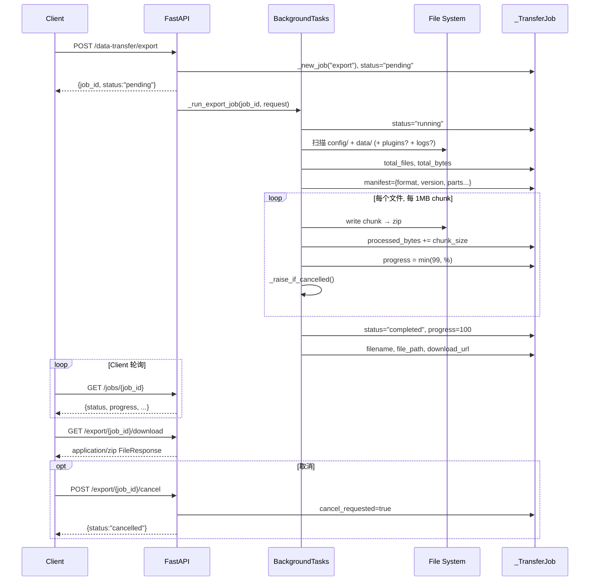

# 统计与数据导入导出

MaiBot 在运行时持续产生消息、模型调用、工具执行和在线时长等数据。这些数据有三条消费路径：**实时仪表盘**通过 HTTP API 直接查询原始表、**小时粒度聚合**由后台 service 定期写入汇总表供 SQL 直读、**异步导出**通过 WebUI data-transfer 端点将文件打成 zip 包。三条路径各自独立，面向不同的运维场景。

本文假设你已读过 [数据库](./database.md)（了解表结构）和 [数据 & 记忆 API](./webui-api/data-and-memory-api.md)（了解 data-transfer 的用户侧 curl 写法）。下面从后端视角拆解每条路径的原理、数据可用性边界和典型运维命令。

## 小时粒度聚合表

MaiBot 维护四张以 `statistics_*` 前缀命名的小时桶聚合表，由一个独立的**增量聚合 service** 定期写入。这四张表与 [数据库](./database.md#22-张表总览) 的 ER 图中其余核心表独立，不参与 `session_id` 关联主线。

**`statistics_message_hourly`** — 按 `(bucket_time, chat_id)` 唯一聚合每小时消息量。`bucket_time` 为整点时间，`latest_timestamp` 记录该桶内最新消息的真实时间戳。聊天类型区分 `group` 和 `private`。

**`statistics_tool_hourly`** — 按 `(bucket_time, tool_name)` 唯一聚合每小时工具调用次数。`tool_name` 为 `NULL` 时写作 `"unknown"`。

**`statistics_model_hourly`** — 按 `(bucket_time, request_type, model_name, provider_name)` 四元组唯一聚合。除了 `request_count`，还累加 `prompt_tokens` / `completion_tokens` / `total_tokens`、`cost`（人民币元）、`time_cost_sum` 和 `time_cost_sq_sum`（可用于计算响应时间均值和方差）。

**`statistics_aggregation_cursors`** — 增量游标表，以 `source_name` 为主键（值为 `"messages"`、`"tool_records"`、`"model_usage"`），`last_processed_id` 记录该源表上次聚合到的最大 `id`。聚合 service 每次运行时只扫描 `id > last_processed_id` 的行，保证不丢不重。

> 四张聚合表的 schema 定义见 `src/common/database/database_model.py:193-271`。不在此处枚举全部字段以免与数据库页重复。

## 聚合 Service 原理

聚合入口函数 `refresh_statistics_aggregates()`（`src/services/statistics_aggregation_service.py:12`）在一次数据库会话内依次调用三个子聚合函数，最后统一 `commit`。

每条子聚合函数的核心逻辑相同：

1. **读游标** — 从 `statistics_aggregation_cursors` 读出对应 `source_name` 的 `last_processed_id`。
2. **扫描增量** — 用 `id > :last_id` 过滤源表（`mai_messages` / `tool_records` / `llm_usage`），对 `timestamp` 做 `strftime('%Y-%m-%d %H:00:00')` 截断到整点。
3. **分组写入** — `GROUP BY bucket_time, ...` 后，用 `INSERT ... ON CONFLICT DO UPDATE SET` 做 Upsert：新桶插入，已有桶则把计数和 token 等指标累加到现有行上。
4. **推进游标** — 取源表 `MAX(id)` 写回 `statistics_aggregation_cursors`。

以消息聚合为例，SQL 骨架如下（省略 `latest_message` 子查询中的 chat_name 补全逻辑）：

::: code-group

```sql [SQL ~vscode-icons:file-type-sql~]
INSERT INTO statistics_message_hourly (bucket_time, chat_id, chat_name, chat_type, message_count, latest_timestamp)
SELECT
    datetime(strftime('%Y-%m-%d %H:00:00', timestamp)) AS bucket_time,
    CASE WHEN group_id IS NOT NULL AND group_id != '' THEN 'g' || group_id
         ELSE 'u' || user_id END AS chat_id,
    ...,
    COUNT(*) AS message_count,
    MAX(timestamp) AS latest_timestamp
FROM mai_messages
WHERE id > :last_id AND timestamp IS NOT NULL
GROUP BY bucket_time, chat_id
ON CONFLICT(bucket_time, chat_id) DO UPDATE SET
    message_count = statistics_message_hourly.message_count + excluded.message_count,
    latest_timestamp = MAX(statistics_message_hourly.latest_timestamp, excluded.latest_timestamp);
```

:::

聚合 service 不会在 MaiBot 启动时自动触发，需要外部调度（cron、WebUI 后台任务等）周期性调用 `refresh_statistics_aggregates()`。没有调度时，四张聚合表始终为空。

## 拉数据的两种途径

### 途径一：SQL 直读聚合表

聚合表结构固定，适合外部 BI 工具（Metabase、Grafana、自定义脚本）通过只读连接直接查询。这是成本最低的路径，因为数据已经预聚合，不需要联表。

::: code-group

```sql [SQL ~vscode-icons:file-type-sql~]
-- 过去 30 天每日模型费用趋势
SELECT
    date(bucket_time) AS day,
    COALESCE(model_name, 'unknown') AS model,
    SUM(cost) AS total_cost,
    SUM(total_tokens) AS total_tokens
FROM statistics_model_hourly
WHERE bucket_time >= datetime('now', '-30 days')
GROUP BY day, model
ORDER BY day DESC, total_cost DESC;
```

:::

如果 MaiBot 正在运行，连接数据库文件时务必设置 WAL 模式和 `busy_timeout`，避免锁冲突。详见 [数据库 / 连接与会话](./database.md#连接与会话)。

### 途径二：Statistics HTTP Endpoint

`statistics_service.py` 中的函数从原始表（`llm_usage`、`mai_messages`、`online_time`、`tool_records`）直接实时聚合，返回数据结构化的 JSON。WebUI 前端通过三个端点消费这些数据。

**`GET /api/webui/statistics/dashboard?hours=24`** — 一次返回 `summary`、`model_stats`、`hourly_data`、`daily_data`、`recent_activity` 五组数据。内置 20 分钟本地缓存，后续请求在缓存有效期内不查库。

**`GET /api/webui/statistics/summary?hours=24`** — 仅返回摘要：总请求数、总费用、总 token、在线时长、消息数、回复数、平均响应时间、每小时费用和每小时 token。

**`GET /api/webui/statistics/models?hours=24`** — 仅返回 Top 10 模型统计：每模型的请求数、费用、token、平均响应时间。

全部端点要求认证（Cookie 或 Bearer token）。以下是三组 curl 示例：

::: code-group

```bash [curl Dashboard ~vscode-icons:file-type-http~]
curl -X GET "http://127.0.0.1:8001/api/webui/statistics/dashboard?hours=168" \
  -H "Cookie: maibot_session=你的Token"
```

```bash [curl Summary ~vscode-icons:file-type-http~]
curl -X GET "http://127.0.0.1:8001/api/webui/statistics/summary?hours=24" \
  -H "Cookie: maibot_session=你的Token"
```

```bash [curl Model Stats ~vscode-icons:file-type-http~]
curl -X GET "http://127.0.0.1:8001/api/webui/statistics/models?hours=720" \
  -H "Cookie: maibot_session=你的Token"
```

:::

`hours` 参数可传入 24（最近一天）、168（最近一周）、720（最近 30 天）等任意正整数。缓存按 `hours` 值分桶，不同参数独立缓存。

## Data-Transfer 导出导入：后端 Job 流程

`data_transfer.py`（474 行）实现了一套完整的异步 job 系统。前端视角的 curl 操作见 [数据 & 记忆 API](./webui-api/data-and-memory-api.md#data-transfer-导出导入)，这里展开后端执行细节。

### Job 生命周期

所有 job 由内存字典 `_jobs: dict[str, _TransferJob]` 管理，不持久化。MaiBot 重启后所有进行中的 job 丢失。

一个 export job 的状态机为 `pending → running → completed | failed | cancelled`。import job 只有 `pending → running → completed | failed`，不支持中途取消。

### Export Job 执行流程

`_run_export_job()` 作为 FastAPI `BackgroundTasks` 异步执行，主线程不阻塞 HTTP 响应。流程如下：

1. **确定范围** — `config` 和 `data` 固定包含；`plugins` 和 `logs` 由请求参数 `include_plugins` / `include_logs` 决定。
2. **扫描文件** — `_iter_export_files()` 遍历每个目录，跳过 symlink、跳过无权限文件。每读一个文件前调用 `_raise_if_cancelled()` 检查取消标记。
3. **生成 manifest** — `_build_manifest()` 产生包含 `format`、`format_version`、`created_at`、`maibot_version`、`included` 和 `parts` 统计的 JSON。
4. **写入压缩包** — 以 1 MB chunk 为单位流式写入 zip。每处理一个 chunk 更新 `processed_bytes`，刷新 `progress` 百分比。达到 100% 之前 progress 最高显示 99%。
5. **完成或清理** — 正常完成时 `status="completed"`、`progress=100`。取消时清理已生成的临时 zip。异常时记录 `error` 字段。

`_raise_if_cancelled()` 检查 `job.cancel_requested` 标志，该标志由 `POST /export/{job_id}/cancel` 端点设置。由于 zip 写入是单线程的，取消并非即时生效，而是等当前 chunk 写完后下一次检查才触发。

### Import Job 安全校验

`_run_import_job()` 在写入文件系统之前执行三层防护：

- **Manifest 验证** — 检查 `format == "maibot-data-archive"` 且 `format_version == 1`。
- **路径安全** — `_safe_zip_member_path()` 拒绝绝对路径、`..` 穿越、不在白名单中的顶层目录（`{config, data, plugins, logs}`）。`_validate_archive_members()` 额外拒绝符号链接。
- **白名单过滤** — 即使 zip 包含某目录，如果用户在请求中未勾选 `import_plugins=true`，对应的 zip member 也不会被写入磁盘。

### Mermaid 时序：Export Job



### Data-Transfer Curl 深度示例

以下 4 段 curl 聚焦后端视角的关键细节，与 [数据 & 记忆 API](./webui-api/data-and-memory-api.md) 中用户侧示例互补。

**1. 创建导出任务（指定范围）**

::: code-group

```bash [curl 创建导出 ~vscode-icons:file-type-http~]
curl -s -X POST http://127.0.0.1:8001/api/webui/data-transfer/export \
  -H "Content-Type: application/json" \
  -H "Cookie: maibot_session=你的Token" \
  -d '{"include_plugins": true, "include_logs": false}' | python3 -m json.tool
```

:::

返回中 `progress` 为 0、`status` 为 `"pending"` 表示已入队但尚未开始。`total_files` 和 `total_bytes` 在 `status` 变为 `"running"` 后才有值。

**2. 轮询 job 进度直到完成**

::: code-group

```bash [curl 轮询状态 ~vscode-icons:file-type-http~]
JOB_ID="你的job_id"
while true; do
  STATUS=$(curl -s http://127.0.0.1:8001/api/webui/data-transfer/jobs/$JOB_ID \
    -H "Cookie: maibot_session=你的Token" | python3 -c "import sys,json; print(json.load(sys.stdin)['status'])")
  echo "status=$STATUS"
  case "$STATUS" in completed|failed|cancelled) break ;; esac
  sleep 2
done
```

:::

**3. 下载导出结果（校验文件大小）**

::: code-group

```bash [curl 下载并校验 ~vscode-icons:file-type-http~]
curl -s -o maibot-data.zip \
  http://127.0.0.1:8001/api/webui/data-transfer/export/$JOB_ID/download \
  -H "Cookie: maibot_session=你的Token"
# 校验 zip 完整性
unzip -t maibot-data.zip && echo "OK: zip 完整"
```

:::

**4. 取消正在执行的导出**

::: code-group

```bash [curl 取消导出 ~vscode-icons:file-type-http~]
curl -s -X POST http://127.0.0.1:8001/api/webui/data-transfer/export/$JOB_ID/cancel \
  -H "Cookie: maibot_session=你的Token" | python3 -m json.tool
```

:::

取消后后端自动清理临时 zip 文件，`status` 变为 `"cancelled"`、`progress` 归零。已完成的 job 不可取消（返回当前状态，无变化）。导入任务不支持取消。

## 麦麦观察事件表

`maisaka_monitor_events` 表（模型定义：`MaisakaMonitorEventRecord`，`src/common/database/database_model.py:148-166`）是 Maisaka 推理引擎的**运行时事件账本**。推理过程中各阶段状态（session 启动、消息注入、planner 聚合结果等）通过 `record_monitor_event()` 函数（`src/maisaka/monitor/event_store.py:32`）写入该表，同时通过 WebSocket 实时广播到前端监控面板。

表结构要点：

- **`event_type`** — 事件类型（如 `"session.start"`、`"message.ingested"`、`"planner.finalized"`、`"llm.error"`）。
- **`session_id`** — 关联的 `chat_sessions.session_id`，空字符串表示全局事件。
- **`payload_json`** — 清洗后的 JSON 事件载荷。原始 `data_url` 字段已在写入前被 `sanitize_monitor_payload()` 剥离，避免重复存储二进制数据。
- **`schema_version`** — 事件格式版本，当前为 1。

保留策略硬编码在 `event_store.py`：

- **最大记录数** — 10,000 条（`MAX_MONITOR_EVENT_RECORDS`），超出时删除最旧记录。
- **最大保留时间** — 72 小时（`MAX_MONITOR_EVENT_AGE_HOURS`）。
- **清理触发** — 每写入 200 条或距上次清理超过 60 秒时自动执行。

### 重放事件

`replay_monitor_events()` 提供按 `event_id` 游标分页的重放接口。WebUI 前端在建立 WebSocket 连接后调用它以补全断连期间遗漏的事件：

- **`since_event_id=0`** — 最近最多 1,000 条，倒序取再反转。
- **`since_event_id > 0`** — 从指定 ID 之后正序取，上限 1,000 条。

返回格式为 `{"event": "<type>", "data": {...}}`，`data` 中自动注入 `event_id` 和 `schema_version`。代码路径：`event_store.py:65-86`。

## 覆盖与延迟

理解哪些指标是**实时**的、哪些是**小时级滞后**的，是运维排障的关键。

**实时（rt）指标** — `statistics_service.py` 中 `get_dashboard_statistics()` / `get_summary_statistics()` / `get_model_statistics()` 直接从原始表聚合，落到 WebUI 仪表盘和 `/api/webui/statistics/*` HTTP 端点。新产生的消息、模型调用、工具记录在写入源表后**立即可见**。缓存机制（20 分钟本地快照）可能造成短暂延迟，但不影响数据本身的新鲜度。

**小时粒度（end-of-hour）指标** — `statistics_aggregation_service.py` 中的聚合只在被外部调度调用时才执行。聚合表中的数据延迟取决于调度频率。即使每分钟调度一次，当前小时的数据也不会入库，因为整点截断逻辑要求该小时结束后 `strftime('%Y-%m-%d %H:00:00')` 才会产出正确的 bucket。这意味着：

- 上午 10:30 时，`statistics_message_hourly` 中 10:00 桶的数据可能为空或落后于真实值。
- 上午 11:01 时（上一小时结束 + 调度触发），10:00 桶的数据才完整。

如果你需要实时趋势，用途径二（HTTP API）；如果需要长期归档或与外部 BI 集成，用途径一（SQL 直读聚合表）。

**Maisaka Monitor 事件** — 写入与广播是同步的（写入 `maisaka_monitor_events` 和 WebSocket 推送在同一函数调用中完成）。因此前端监控面板几乎无延迟。重放接口 `replay_monitor_events()` 覆盖断连期间的遗漏，数据完整性取决于保留策略（最多 10,000 条 / 72 小时）。

**Data-Transfer** — export job 的延迟主要来自文件系统扫描和 zip 压缩。100 MB 数据包通常在 10-30 秒内完成。import job 因为涉及解包 + 路径校验 + 写磁盘，耗时与 export 相近。两者都是异步作业，不会阻塞 MaiBot 主业务。
