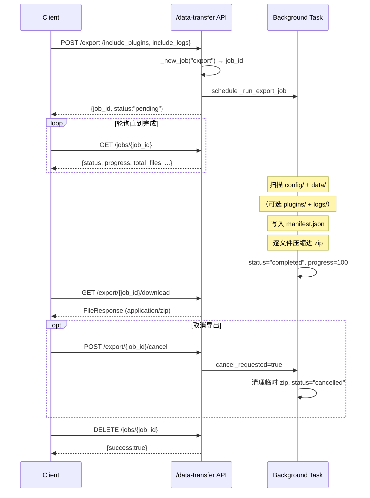

# 数据 & 记忆 API

本篇覆盖 MaiBot WebUI 中与数据管理和长期记忆相关的所有 HTTP 端点。这包括 TO 配置文件读写、Prompt 模板编辑与版本化、人物/行为/表情等实体 CRUD、Amemorix 记忆图谱操作，以及异步数据导出导入。

所有端点均需认证（除 `/health` 外），常见认证方式见 [WebUI HTTP API 入口](./index.md#认证模型三种方式)。

## 配置浏览与编辑

配置相关端点分布在两个路由器中：主路由 `router(prefix="/config")`（路径以 `/api/webui/config` 起头）和兼容路由 `compat_router(prefix="/api/config")`。两者都挂载在 `require_auth` 依赖下。

### 配置 Schema

- **`GET /api/webui/config/schema/bot`** — 获取 `bot_config.toml` 全部约 20 个配置节的完整 JSON Schema
- **`GET /api/webui/config/schema/model`** — 获取 `model_config.toml`（API providers + 模型任务映射）的 JSON Schema
- **`GET /api/webui/config/schema/section/{section_name}`** — 获取单个配置节（如 `bot`、`webui`、`personality`）的 Schema

兼容路由 `GET /api/config/schema` 和 `GET /api/config/schema/bot` 分别转发到 Schema 端点，供旧版前端使用。

### 主程序配置（bot_config.toml）

- **`GET /api/webui/config/bot`** — 返回 `bot_config.toml` 完整结构化内容（保留注释和格式的 tomlkit 对象）
- **`POST /api/webui/config/bot`** — 全量写入 `bot_config.toml`（先验证 Schema，再保留格式落盘）
- **`POST /api/webui/config/bot/section/{section_name}`** — 局部更新指定配置节（合并模式，保留原有注释）
- **`GET /api/webui/config/bot/raw`** — 获取原始 TOML 文本字符串
- **`POST /api/webui/config/bot/raw`** — 直接写入原始 TOML 文本（会先解析验证再保存）

::: code-group

```bash [curl 读取全量配置 ~vscode-icons:file-type-http~]
curl -X GET http://127.0.0.1:8001/api/webui/config/bot \
  -H "Cookie: maibot_session=你的Token"
```

:::

### 模型配置与版本管理

- **`GET /api/webui/config/model`** — 获取 `model_config.toml` 完整内容
- **`POST /api/webui/config/model`** — 全量更新模型配置
- **`POST /api/webui/config/model/section/{section_name}`** — 局部更新模型配置节
- **`GET /api/webui/config/model/versions`** — 列出模型配置的存档副本及当前激活版本
- **`POST /api/webui/config/model/versions`** — 将当前配置保存为新副本（可选标签）
- **`POST /api/webui/config/model/versions/{version_id}/activate`** — 切换激活指定副本
- **`DELETE /api/webui/config/model/versions/{version_id}`** — 删除未激活副本

### 适配器配置

提供 NapCat / GoCQ 等适配器 `.toml` 文件的外部管理能力：

- **`GET /api/webui/config/adapter-config/path`** — 读取 `data/webui.json` 中保存的适配器配置文件路径
- **`POST /api/webui/config/adapter-config/path`** — 设置/更新路径偏好（白名单校验）
- **`GET /api/webui/config/adapter-config`** — 从已保存路径读取适配器配置
- **`POST /api/webui/config/adapter-config`** — 写入适配器配置（先校验 TOML 再落盘）

### 兼容路由 `/api/config`

两个独立注册的兼容端点给旧脚本提供平滑迁移窗口：

- **`GET /api/config/raw`** — 等同 `GET /api/webui/config/bot/raw`
- **`POST /api/config/raw`** — 等同 `POST /api/webui/config/bot/raw`

新脚本推荐使用 `/api/webui/config/*` 路径。

## Prompt 编辑系统

Prompt 文件位于项目 `prompts/` 目录下，按语言子目录组织（如 `zh-CN/main.prompt`）。WebUI 提供完整的版本化编辑工作流。

### 核心端点

- **`GET /api/webui/config/prompts`** — 列出所有语言及 `.prompt` 文件，返回是否被覆盖、版本数量、展示名称等元信息
- **`GET /api/webui/config/prompts/{language}/{filename}`** — 读取 Prompt 文件内容（优先返回用户自定义覆盖）及校验结果
- **`GET /api/webui/config/prompts/{language}/{filename}/default`** — 只读内置 Prompt 模板（忽略自定义覆盖），供对比恢复使用
- **`PUT /api/webui/config/prompts/{language}/{filename}`** — 保存 Prompt 内容（自动创建版本快照，校验 placeholder 完整性）
- **`DELETE /api/webui/config/prompts/{language}/{filename}`** — 删除自定义覆盖，回退到内置模板

::: code-group

```bash [curl 读取 Prompt 文件 ~vscode-icons:file-type-http~]
curl -X GET http://127.0.0.1:8001/api/webui/config/prompts/zh-CN/main.prompt \
  -H "Cookie: maibot_session=你的Token"
```

:::

### 版本化机制

每次 `PUT` 保存 Prompt 时，旧版本自动归档到 `data/custom_prompts/` 目录。版本管理端点：

- **`GET /api/webui/config/prompts/{language}/{filename}/versions`** — 列出所有自定义版本（含当前激活版本标识）
- **`GET /api/webui/config/prompts/{language}/{filename}/versions/{version_id}`** — 读取指定版本完整内容及校验结果
- **`POST /api/webui/config/prompts/{language}/{filename}/versions/{version_id}/activate`** — 激活指定版本为当前使用版本

版本 ID 需满足 `^[A-Za-z0-9_.-]+$` 格式。`legacy-current` 为保留 ID，指代升级前的旧版自定义内容。

### 人设生成器

- **`POST /api/webui/config/prompt-generator/generate`** — 用 LLM 将任意文段（角色卡、人设描述等）解析为结构化配置片段
- **`POST /api/webui/config/prompt-generator/apply`** — 将生成的配置块写入 `bot_config.toml`（仅允许写入 persona/chat 相关字段）

## 实体端点群

以下六个路由模块覆盖 MaiBot 的各类可编辑数据实体，全部挂载在 `/api/webui/` 下。每个模块遵循统一的 CRUD + 批量操作 + 统计/导出模式。

### person — 人物信息

**`prefix="/person"`** — 管理 Bot 认识的群友和私聊对象。底层对应 `PersonInfo` 数据库表，支持按平台/已认识状态/关键词组合筛选。

- **`GET /api/webui/person/list`** — 分页列出，支持搜索、已认识状态和平台筛选
- **`GET /api/webui/person/{person_id}`** — 详情（昵称、群昵称、记忆点、认识时间等）
- **`PATCH /api/webui/person/{person_id}`** — 增量更新人物属性
- **`DELETE /api/webui/person/{person_id}`** — 删除记录
- **`POST /api/webui/person/batch/delete`** — 批量删除
- **`GET /api/webui/person/stats/summary`** — 统计：总数、已认识/未认识分计数、按平台分布

::: code-group

```bash [curl 分页查询人物 ~vscode-icons:file-type-http~]
curl -X GET "http://127.0.0.1:8001/api/webui/person/list?page=1&page_size=20&is_known=true" \
  -H "Cookie: maibot_session=你的Token"
```

:::

### avatar — 头像缓存

**`prefix="/avatar"`** — 唯一的 GET 端点，提供带缓存的 WebUI 头像代理。

- **`GET /api/webui/avatar`** — 按 `platform` + `user_id` 或 `group_id` 获取头像。缓存 24h，支持 `qq`/`napcat`/`qqguild` 平台自动从 QQ 头像服务器下载。

### behavior — 行为学习图谱

**`prefix="/behavior"`** — 浏览和调试行为经验路径与场景簇网络。

- **`GET /api/webui/behavior/chats`** — 列出存在行为经验路径的聊天流
- **`GET /api/webui/behavior/paths`** — 分页列出经验路径（场景→动作→结果），支持按 actor/learning 类型筛选
- **`GET /api/webui/behavior/clusters`** — 分页列出场景簇及 tag 概率分布
- **`GET /api/webui/behavior/graph-data`** — 返回场景簇网络 + tag 网络的节点/边数据
- **`GET /api/webui/behavior/paths/{path_id}`** — 单条路径详情含证据链
- **`POST /api/webui/behavior/retrieval-debug`** — 用任意场景文本模拟一次检索，调试行为学习效果

### expression — 表达方式

**`prefix="/expression"`** — 实现表达方式的全生命周期管理，包括旧版升级导入。

- **`GET /api/webui/expression/list`** — 分页列出（情境→风格），支持聊天流/审核状态筛选
- **`POST /api/webui/expression/`** — 创建
- **`PATCH /api/webui/expression/{id}`** — 增量更新
- **`DELETE /api/webui/expression/{id}`** — 删除
- **`POST /api/webui/expression/export`** — 按聊天流导出为 JSON
- **`POST /api/webui/expression/import`** — 导入 JSON 到指定聊天流
- **`GET /api/webui/expression/clusters`** — 获取表达向量聚类摘要
- **`GET /api/webui/expression/clusters/{cluster_id}/members`** — 查看聚类成员列表

### jargon — 黑话/俚语

**`prefix="/jargon"`** — 管理 Bot 学到的黑话（内容→含义映射），支持手动添加和 AI 自动学习。

- **`GET /api/webui/jargon/list`** — 分页列出，按 confirmed_jargon/confirmed_not_jargon/pending/manual_jargon 状态筛选
- **`POST /api/webui/jargon/`** — 手动创建（自动替换同作用域 AI 黑话）
- **`PATCH /api/webui/jargon/{id}`** — 增量更新
- **`DELETE /api/webui/jargon/{id}`** — 删除
- **`POST /api/webui/jargon/batch/delete`** — 批量删除
- **`POST /api/webui/jargon/batch/set-jargon`** — 批量设置黑话状态
- **`POST /api/webui/jargon/export`** — 导出（可选携带 platform/id/type 聊天目标信息）
- **`POST /api/webui/jargon/import`** — 导入到指定聊天流

### emoji — 表情包

**`prefix="/emoji"`** — 表情包上传、审核注册（adopted/discarded/known/unknown 状态流转）、缩略图缓存管理。

- **`GET /api/webui/emoji/list`** — 分页列出，支持状态/格式/使用频次筛选
- **`POST /api/webui/emoji/upload`** — 上传并注册（支持 JPEG/PNG/GIF/WebP）
- **`POST /api/webui/emoji/batch/upload`** — 批量上传
- **`PATCH /api/webui/emoji/{emoji_id}`** — 更新描述/注册/封禁状态
- **`POST /api/webui/emoji/{emoji_id}/register`** — 注册（含内容审核）
- **`POST /api/webui/emoji/{emoji_id}/ban`** — 禁用
- **`DELETE /api/webui/emoji/{emoji_id}`** — 删除文件和记录
- **`GET /api/webui/emoji/{emoji_id}/thumbnail`** — 获取缩略图（自动生成 WebP，3s 缓存）
- **`GET /api/webui/emoji/thumbnail-cache/stats`** — 缩略图缓存统计

## Memory 记忆端点群

Memory 端点群是子目录最大的端点集合（共 173 个端点），覆盖 Amemorix 记忆图谱的全部操作。它们分布在两个路由器中：

- **`router(prefix="/memory")`** — 主路由，路径以 `/api/webui/memory` 起头
- **`compat_router(prefix="/api")`** — 兼容路由，路径以 `/api` 起头（不走 `/api/webui` 前缀）

以下按场景精选 15 个高频端点。完整端点清单见 [`memory.py` 源码](https://github.com/MaiM-with-u/MaiBot/blob/main/src/webui/routers/memory.py)。

### 高频端点速览

- **`GET /api/webui/memory/graph`** — 知识图谱查询，返回节点和边，支持 limit 参数控制规模
- **`GET /api/webui/memory/graph/search`** — 按关键词搜索图谱，返回匹配节点及关联边
- **`GET /api/webui/memory/episodes`** — 分页列出记忆片段，支持 query/source/person_id/时间范围筛选
- **`GET /api/webui/memory/episodes/status`** — 获取片段处理状态摘要（pending/processed/failed 计数）
- **`POST /api/webui/memory/episodes/rebuild`** — 按来源或全量重建片段（异步），传入 `source`/`sources`/`all` 参数
- **`GET /api/webui/memory/timeline`** — 按聊天流获取记忆时间线，支持时间范围及类型过滤
- **`GET /api/webui/memory/sources`** — 列出所有记忆来源（文件、聊天流等），含条目数和最后更新时间
- **`GET /api/webui/memory/profiles/query`** — 按 person_id/keyword/platform/user_id 查询人物画像
- **`POST /api/webui/memory/profiles/override`** — 手动覆盖人物画像文本
- **`POST /api/webui/memory/profiles/{person_id}/evidence/correct`** — 对画像证据进行纠正并刷新画像
- **`GET /api/webui/memory/v5/status`** — V5 记忆模块状态查询
- **`POST /api/webui/memory/v5/reinforce`** — 强化指定记忆条目
- **`POST /api/webui/memory/corrections/preview`** — 预览记忆修正计划
- **`POST /api/webui/memory/import/raw-scan`** — 触发原始文件夹扫描导入
- **`GET /api/webui/memory/retrieval_tuning/tasks`** — 列出检索调优任务及当前激活的调优配置

以下是几条常见操作的 curl 示例：

::: code-group

```bash [curl 查询记忆图谱 ~vscode-icons:file-type-http~]
curl -X GET "http://127.0.0.1:8001/api/webui/memory/graph?limit=50" \
  -H "Cookie: maibot_session=你的Token"
```

```bash [curl 覆盖人物画像 ~vscode-icons:file-type-http~]
curl -X POST http://127.0.0.1:8001/api/webui/memory/profiles/override \
  -H "Content-Type: application/json" \
  -H "Cookie: maibot_session=你的Token" \
  -d '{"person_id": "qq:123456", "override_text": "用户喜欢猫，每周去猫咖。"}'
```

```bash [curl 预览记忆修正 ~vscode-icons:file-type-http~]
curl -X POST http://127.0.0.1:8001/api/webui/memory/corrections/preview \
  -H "Content-Type: application/json" \
  -H "Cookie: maibot_session=你的Token" \
  -d '{"query": "用户最近搬家了", "limit": 10}'
```

:::

**人物画像闭环：** profile 系统采用「证据驱动 + 手动覆盖」的双层模型。`GET /profiles/{person_id}/evidence` 列出从对话中提取的证据段落；`POST /evidence/correct` 允许纠正错误证据并触发画像刷新；`POST /profiles/override` 则直接注入自定义画像文本，优先级高于证据推导的自动画像。

**V5 API：** V5 系列端点（`/api/webui/memory/v5/*`）提供更细粒度的记忆条目生命周期管理——强化/弱化/永久记住/遗忘/恢复——适合需要精细调控记忆权重的运维场景。V5 端点仅存在于主路由，兼容路由不包含。

其余端点（config/runtime 配置读写、delete 操作、fuzzy-modify、import 多源导入类型 LPMM/Temporal/Migration、retrieval_tuning 任务详情等）请直接查阅源码中的 endpoint 定义或记忆模块架构文档。

## Data-Transfer 异步导出/导入

数据导出导入采用异步 Job 模型，支持进度轮询和取消操作。后端状态保存在内存字典中（进程重启后丢失）。

### 导出任务生命周期



**导出固定包含** `config` + `data` 目录，可选 `plugins` 和 `logs`。压缩包内含 `manifest.json`（记录导出时间、MaiBot 版本、各部分文件统计）。

### 4 段 Data-Transfer Curl 示例

**1. 创建导出任务**

::: code-group

```bash [curl 创建导出 ~vscode-icons:file-type-http~]
curl -X POST http://127.0.0.1:8001/api/webui/data-transfer/export \
  -H "Content-Type: application/json" \
  -H "Cookie: maibot_session=你的Token" \
  -d '{"include_plugins": true, "include_logs": false}'
```

:::

返回示例：

::: code-group

```json [JSON ~vscode-icons:file-type-json~]
{"job_id":"a1b2c3d4e5f6","kind":"export","status":"pending","progress":0,...}
```

:::

**2. 轮询任务状态**

::: code-group

```bash [curl 查询任务状态 ~vscode-icons:file-type-http~]
curl -X GET http://127.0.0.1:8001/api/webui/data-transfer/jobs/a1b2c3d4e5f6 \
  -H "Cookie: maibot_session=你的Token"
```

:::

当 `status` 变为 `"completed"` 且 `progress` 为 100 后即可下载。

**3. 下载导出结果**

::: code-group

```bash [curl 下载导出 ~vscode-icons:file-type-http~]
curl -X GET http://127.0.0.1:8001/api/webui/data-transfer/export/a1b2c3d4e5f6/download \
  -H "Cookie: maibot_session=你的Token" \
  -o maibot-data.zip
```

:::

**4. 创建导入任务**

::: code-group

```bash [curl 导入数据 ~vscode-icons:file-type-http~]
curl -X POST http://127.0.0.1:8001/api/webui/data-transfer/import \
  -H "Cookie: maibot_session=你的Token" \
  -F "file=@maibot-data.zip" \
  -F "import_config=true" \
  -F "import_data=true" \
  -F "import_plugins=false" \
  -F "import_logs=false"
```

:::

返回 `{job_id: "...", status: "pending"}`，后续同样通过 `GET /jobs/{job_id}` 轮询直到 `status` 变成 `"completed"`。导入完成后后端自动清理上传的临时 zip。

**Manifest 结构：** 导出 zip 根目录的 `manifest.json` 记录如下信息，导入时后端会验证 `format == "maibot-data-archive"` 和 `format_version == 1`：

- **`format`** — `"maibot-data-archive"`
- **`format_version`** — `1`
- **`created_at`** — ISO 8601 导出时间
- **`maibot_version`** — 导出时的 MaiBot 版本号
- **`included`** — 实际包含的目录列表（如 `["config", "data", "plugins"]`）
- **`parts`** — 每部分文件计数和总字节数统计

**导入安全措施：** 后端在解包前会做多层防护——拒绝符号链接、拒绝 `..` 路径穿越、拒绝不在 `{config,data,plugins,logs}` 白名单中的顶层目录。

> 导入导入底层流程（zip 成员校验、路径安全防护、manifest 验证等）详见 [statistics-io.md](../statistics-io.md) 中 data-transfer 后端详细流程。

## Compt 路由取舍：`/api/memory` vs `/memory`

Memory 端点群同时支持两条路径前缀，原因如下：

**`/api/webui/memory/*`（主路由）** — 推荐使用。与 WebUI 主路由体系一致，享受统一的认证中间件、版本调度和未来可能的限流/审计层。所有 173 个记忆端点均在此前缀下可用。

**`/api/*`（兼容路由）** — 为旧版前端和外部集成保留。`memory.py` 中 `compat_router` 的 `prefix="/api"` 使得端点路径形如 `/api/graph`、`/api/episodes` 等。

两条路由的核心差异：

- **覆盖范围不同** — 主路由包含全部端点；兼容路由覆盖了 graph / episodes / profiles / import / retrieval_tuning / sources / timeline / query 等高频场景，但 **不包含** `/v5/*`（V5 内存 API）、`/corrections/*`（修正计划）、`/delete/*`（删除操作）、`/fuzzy-modify/*`（模糊修改）等较新模块
- **路径风格差异** — 主路由使用 kebab-case（如 `/retrieval_tuning` 写为 `/retrieval-tuning`），兼容路由保留 snake_case（如 `/retrieval_tuning`、`/raw_scan`）
- **前后端耦合范围** — 新版 WebUI 前端完全走主路由；只有旧版前端、第三方插件或手动脚本可能引用 `/api/*` 路径

**取舍建议：**

- 新脚本/新集成：使用 `/api/webui/memory/*`
- 已有脚本依赖 `/api/` 路径且暂时无法修改：可继续使用兼容路由，但注意 V5 API 和 corrections 等模块需要切换到主路由
- 长期维护：计划将兼容路由逐步标记为 deprecated，最终仅在主路由上迭代新端点
