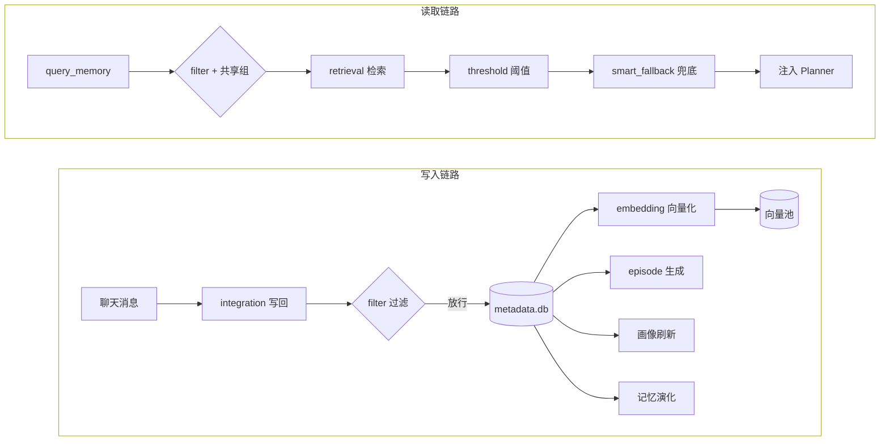

# A_Memorix 记忆系统配置

这页解决两个问题：**A_Memorix 的每个配置段落管什么**，以及**改动某个选项之后会发生什么**。A_Memorix 的配置项超过一百个，盲目调参最常见的后果是：记忆"突然查不到了"、别的群的记忆串进当前聊天、或者模型调用开销暴涨。先把下面的"修改前必读"看完，再动手。

配置全部写在 `config/bot_config.toml` 的 `[a_memorix]` 段落下（TOML 段名区分大小写，必须小写），也可以在 WebUI「配置管理」中可视化修改。旧版 `[memory]` 段落和独立文件 `config/a_memorix.toml` 已被取代，迁移方式见[从旧版迁移](#从旧版迁移)。

## 修改前必读

**生效方式**：WebUI 保存或直接编辑 `bot_config.toml` 后配置会热加载，大多数选项无需重启即可生效。但少数选项改动的是"存量数据的解释方式"，热加载救不回来，见下面的高危清单。

**改动风险分三档**：

1. **高危——改错会让已有记忆不可用**：`storage.data_dir`、`embedding.model_name`、`embedding.dimension`、`embedding.dimension_request_mode`。它们决定已有向量如何被解读，改动后向量通道会被一致性检查禁用，需要手动重建（详见[记忆向量化](#记忆向量化)）
2. **影响行为与隐私——改错可能串数据或丢记忆**：根级共享开关、`filter` 聊天过滤、`integration` 里的启发式拉起与记忆修正、`memory` 记忆演化
3. **质量与性能调参——改错只是效果变差或变慢**：`retrieval`、`threshold`、`episode`、`person_profile`、`web` 等。这些可以放心小步调整、观察效果

**一个统一的判断方法**：问自己"这个改动影响的是新数据，还是已入库的旧数据？"只影响新数据的选项随时可改；影响旧数据解读方式的选项（模型、维度、存储位置）必须想清楚再动。

## 记忆数据怎么流动

看懂这张图，就知道每个配置段落管的是哪一段：



写入和读取是两条独立链路。比如 `[a_memorix.filter]` 同时卡在两条链路上，而 `[a_memorix.retrieval]` 只影响读取——理解了这一点，很多"为什么改了没用"的问题就有答案了。

## 配置结构总览

::: code-group

```toml [bot_config.toml ~vscode-icons:file-type-toml~]
[a_memorix]                    # 根级：跨聊天流共享
[a_memorix.plugin]             # 记忆系统总开关
[a_memorix.storage]            # 数据存储位置
[a_memorix.integration]        # 记忆在聊天中的使用（写回/注入/纠错）
[a_memorix.embedding]          # 记忆向量化（含回退与回填）
[a_memorix.retrieval]          # 记忆检索（含融合/向量池/稀疏检索）
[a_memorix.threshold]          # 检索结果阈值过滤
[a_memorix.filter]             # 聊天过滤（含跨聊天流分类型过滤）
[a_memorix.episode]            # Episode 情景记忆生成
[a_memorix.person_profile]     # 人物画像
[a_memorix.memory]             # 记忆演化（衰减与遗忘）
[a_memorix.advanced]           # 高级运行时
[a_memorix.web]                # Web 运维（导入中心/调优中心）
```

:::

**没写进配置文件的字段一律使用默认值**。最小可用配置只有两行（见[配置示例](#配置示例)），建议从最小配置开始，遇到具体问题再回来调对应段落。


## 总开关

记忆系统的总开关，默认关闭。

::: code-group

```toml [bot_config.toml ~vscode-icons:file-type-toml~]
[a_memorix.plugin]
enabled = false   # 是否启用长期记忆系统
```

:::

**改动影响**：从 `false` 改为 `true` 后，记忆系统从空库开始积累，前几天检索效果差是正常现象（向量池未训练、关系图稀疏）。改回 `false` 不会删除任何数据，只是所有记忆读写入口停用，随时可以再开回来。

::: tip 启用前置条件
启用前先在 WebUI 或 `model_config.toml` 中配置好 embedding 模型，否则记忆系统启动即进入降级模式（只有稀疏检索可用），详见[记忆向量化](#记忆向量化)。
:::


## 存储

::: code-group

```toml [bot_config.toml ~vscode-icons:file-type-toml~]
[a_memorix.storage]
data_dir = "data/a-memorix"   # 数据目录
```

:::

目录里实际存放：SQLite 主库 `metadata/metadata.db`（段落、关系、Episode、画像、事实账本、各类后台队列）、向量文件与 faiss 索引快照 `vectors/`、关系图快照 `graph/`、导入与调优产物等。

::: danger 修改 data_dir 不会迁移旧数据
把 `data_dir` 改到新路径后，MaiBot 会在新目录**从空库重新开始**，旧数据原样留在旧目录，不会被拷贝或合并。需要保留旧记忆时，先停止 MaiBot，手动把整个旧目录内容复制到新目录，再修改配置启动。
:::


## 跨聊天流共享

默认情况下，每个聊天流（每个群、每个私聊）只能检索到自己产生的记忆——这是隐私保护的基本边界。根级的两个选项可以打破这个边界，改之前务必想清楚。

::: code-group

```toml [bot_config.toml ~vscode-icons:file-type-toml~]
[a_memorix]
# 是否让普通记忆查询在所有聊天流范围内检索
global_memory_sharing_enabled = false

# 把需要互相参考长期记忆的群聊或私聊放到同一组
[[a_memorix.shared_memory_groups]]
targets = [
  { platform = "qq", item_id = "群号A", rule_type = "group" },
  { platform = "qq", item_id = "群号B", rule_type = "group" },
]
```

:::

- **`global_memory_sharing_enabled`** — 是否让普通记忆查询在**所有**聊天流范围内检索。默认关闭
- **`shared_memory_groups`** — 共享组列表，组内的聊天流互相共享记忆。默认为空

**改动影响**：

- 打开 `global_memory_sharing_enabled` 是**全局放行**：任何群、任何私聊的查询都能命中所有聊天流的记忆。A 群里聊过的私事可能在 B 群被麦麦说出来。除非你就是想要一个全知机器人，否则不要开
- `shared_memory_groups` 是可控的折中方案：只有同组内的聊天流互相可见，组外仍然隔离。适合"同一个人的多个群"这类场景
- 这两个选项只影响**检索范围**，写入仍然按消息来源归属各自的聊天流
- `targets` 中的 `item_id` 填群号或用户 QQ 号，`rule_type` 对应 `group`（群聊）或 `private`（私聊）；`item_id = "*"` 表示该平台下任意聊天流


## 聊天过滤

`[a_memorix.filter]` 决定哪些聊天流参与记忆系统，**写入和读取同时生效**。

::: code-group

```toml [bot_config.toml ~vscode-icons:file-type-toml~]
[a_memorix.filter]
enabled = true          # 是否启用聊天过滤
mode = "blacklist"      # 过滤模式：blacklist 黑名单 / whitelist 白名单
chats = []              # 聊天流列表
```

:::

`chats` 条目支持的格式：`stream:<聊天流ID>`、`group:<群号>`、`user:<用户QQ>`、`private:<用户QQ>`，或是不带前缀的裸 ID（与聊天流/群/用户任一匹配即命中）。推荐在 WebUI 里从聊天流列表选择，会自动生成 `stream:` 前缀的条目。

**改动影响**：

- 被过滤的聊天流：摘要写回和人物事实写回被跳过、查询返回空、Episode 也因此不会生成——等于这个聊天在记忆系统里"不存在"
- **人物画像注入不受过滤影响**（画像是按"人"维护而不是按"聊天"），但被过滤聊天长期不产生新事实，对应人物的画像会逐渐过时
- 把过滤掉很久的聊天流移出名单后，**历史消息不会补录**，只有之后的新消息会进入记忆

::: warning 空列表在两个模式下含义相反
`blacklist` + 空 `chats` = 全部放行（默认状态）；`whitelist` + 空 `chats` = **全部拒绝**。如果你切到白名单模式却忘了填列表，表现就是"记忆系统完全不工作但没有任何报错"。
:::

### 跨聊天流检索结果过滤

`[a_memorix.filter.retrieval]` 下的三个子段落（`chat_stream`、`chat_summary`、`episode`）是更精细的过滤器：只在**跨聊天流检索**时（开启了上文的共享之后）按记忆类型过滤结果，不影响本聊天流读取自己的记忆，也不影响写入和后台生成。

::: code-group

```toml [bot_config.toml ~vscode-icons:file-type-toml~]
# chat_summary 和 episode 子段落结构相同
[a_memorix.filter.retrieval.chat_stream]
enabled = false         # 是否启用该类型的跨聊天流过滤
mode = "blacklist"      # 过滤模式
chats = []              # 聊天流列表，格式同上
```

:::

典型用法：开了全局共享，但不希望某个群里的私密话题摘要被其他群检索到，就把它加进 `chat_summary` 的黑名单。来源与当前聊天同源（同群、同一人的私聊）的结果永远豁免此过滤。


## 记忆集成

`[a_memorix.integration]` 控制麦麦在聊天中如何使用长期记忆，是选项最多、对日常行为影响最直接的段落。

### 查询与注入

::: code-group

```toml [bot_config.toml ~vscode-icons:file-type-toml~]
[a_memorix.integration]
enable_memory_query_tool = true          # 是否允许麦麦在聊天时查询长期记忆
memory_query_default_limit = 5           # 每次默认从长期记忆中取回多少条结果
enable_person_profile_query_tool = true  # 是否允许麦麦查询人物画像记忆
enable_person_profile_injection = true   # 是否在 Planner 调用前自动注入当前对象的人物画像
person_profile_injection_max_profiles = 3  # 每轮自动注入的人物画像数量上限
```

:::

**改动影响**：

- 关闭 `enable_memory_query_tool` 后麦麦失去"主动回忆"能力，但画像注入、启发式拉起等被动通道仍然工作——如果感觉记忆干扰回复质量，优先关主动查询而不是整个记忆系统
- `memory_query_default_limit`（范围 `1-20`）调大能提升召回，但检索结果原样进 prompt，调太大带来 token 开销和噪声；一般不超过 10
- `person_profile_injection_max_profiles`（范围 `1-5`）在群聊人多时调高有用，但每个画像都占 prompt 篇幅

### 写回

::: code-group

```toml [bot_config.toml ~vscode-icons:file-type-toml~]
[a_memorix.integration]
person_fact_writeback_enabled = true   # 发送回复后自动提取并写回人物事实
chat_summary_writeback_enabled = true  # 按消息窗口自动写回聊天摘要
chat_summary_writeback_message_threshold = 36  # 自上次写回后累计新增消息达到此数才写回
chat_summary_writeback_context_length = 36     # 单次写回回看的消息条数上限
```

:::

**改动影响**：

- `chat_summary_writeback_message_threshold` 是"自上次写回后累计新增 N 条消息触发一次"。调小 → 摘要更频繁更细致，但每次都有一次 LLM 调用；调太大 → 长时间不 summarize，近期聊天在记忆里是空白
- `chat_summary_writeback_context_length` 实际生效值是 `min(配置值, 本轮新增消息数)`，摘要只覆盖新增消息、不会重复总结旧窗口。把它调到大于 threshold 没有意义
- 关闭 `person_fact_writeback_enabled` 后人物画像会因缺少事实来源而逐渐过时（画像刷新主要消费人物事实账本），不建议关闭

### 启发式拉起

默认关闭的高级功能：不等麦麦主动调用查询工具，而是每个 Planner 轮次根据最近聊天内容生成"印象"，自动检索并注入相关记忆（以"【启发式记忆-内部参考】"的形式进入 Planner prompt）。

::: code-group

```toml [bot_config.toml ~vscode-icons:file-type-toml~]
[a_memorix.integration]
heuristic_memory_recall_enabled = false            # 是否根据当前聊天印象自然拉起长期记忆
heuristic_memory_cross_chat_enabled = false        # 是否允许从其他聊天流召回候选
heuristic_memory_recall_window_size = 20           # 生成聊天印象时使用的最近消息数量
heuristic_memory_recall_limit = 3                  # 每轮自然拉起的记忆数量上限
heuristic_memory_recall_max_chars = 900            # 注入文本的最大字符数
heuristic_memory_recall_min_interval_seconds = 180 # 同一聊天流两次拉起的最小间隔
heuristic_memory_recall_min_new_messages = 60      # 两次拉起之间至少新增的消息数
heuristic_memory_recall_cache_ttl_seconds = 300    # 拉起结果的运行时缓存时间
heuristic_memory_group_to_private_enabled = false  # 私聊中是否允许拉起群聊记忆
heuristic_memory_private_to_group_enabled = false  # 群聊中是否允许拉起私聊记忆
```

:::

**改动影响**：

- 开启后主开关带来的开销是**每个 Planner 轮次可能多一次 LLM 调用**（生成聊天印象）加一次检索；`min_interval_seconds` 和 `min_new_messages` 是节流阀，调低任一都会明显增加模型开销
- `window_size` 调小会让"印象"基于很少的上下文，容易拉出无关记忆；`max_chars` 控制注入体积，超过部分直接截断

::: danger cross_chat 的隐私边界
`heuristic_memory_cross_chat_enabled = true` 会把检索范围扩大到全局，并且**绕过 `[a_memorix.filter]` 黑名单和检索结果过滤**。之后只剩一层本地兜底：群→私、私→群两个方向分别由 `group_to_private` / `private_to_group` 控制（默认都关），但**群↔群、私聊↔私聊之间直接放行**。也就是说开了 cross_chat，别的群的记忆随时可能被拉进当前群。除非你明确接受这一点，否则保持关闭。
:::

### 自然语言记忆修正

WebUI「记忆检修」和记忆修正命令背后的配置。让你在 WebUI 里用自然语言（如"XX 不喜欢吃辣"）修正已有记忆，流程是"生成修正方案 → 确认 → 执行 → 可回滚"。

::: code-group

```toml [bot_config.toml ~vscode-icons:file-type-toml~]
[a_memorix.integration]
fuzzy_modify_enabled = true                # 是否启用记忆修正的后台接口
fuzzy_modify_auto_execute_enabled = false  # 高置信修正是否跳过人工确认自动执行
fuzzy_modify_confirm_threshold = 0.85      # 进入自动确认判定的置信度阈值
fuzzy_modify_candidate_limit = 20          # 每次交给 LLM 的候选记忆上限
fuzzy_modify_max_targets = 5               # 单个修正计划允许标记失效的旧记忆上限
fuzzy_modify_allow_global_scope = false    # 未指定聊天流时是否允许全局范围修正
```

:::

**改动影响**：

- `auto_execute_enabled` 默认关闭，即无论置信度多高都必须人工确认——这是推荐状态。开启后，置信度 ≥ `confirm_threshold` 的修正方案会**不经确认直接改记忆**；threshold 调低会显著放大"AI 改错记忆"的风险
- `max_targets` 限制单次修正最多让几条旧记忆失效，是个安全阀，不建议调大
- `fuzzy_modify_allow_global_scope = true` 允许不指定聊天流做全局修正，此时候选检索覆盖所有群和私聊，且**不受 `[a_memorix.filter]` 黑名单约束**——一次修正可以触达全部记忆，谨慎开启

### 反馈纠错

默认全部关闭的实验性功能：麦麦用 `query_memory` 回答之后，系统观察接下来一段时间用户的反应（"不对""记错了"之类），尝试自动纠正旧记忆，并联动刷新画像、重建 Episode。

::: code-group

```toml [bot_config.toml ~vscode-icons:file-type-toml~]
[a_memorix.integration]
feedback_correction_enabled = false                  # 总开关
feedback_correction_window_hours = 12.0              # 反馈窗口时长（小时），以查询执行时间为起点
feedback_correction_check_interval_minutes = 30      # 定时任务轮询间隔（分钟）
feedback_correction_batch_size = 20                  # 每轮最大处理任务数
feedback_correction_auto_apply_threshold = 0.85      # 自动应用纠错动作的最低置信度
feedback_correction_max_feedback_messages = 30       # 每个任务最多使用的反馈消息数
feedback_correction_prefilter_enabled = true         # 前置预筛，减少不必要的模型调用
feedback_correction_paragraph_mark_enabled = true    # 为受影响段落写入"已纠正"标记
feedback_correction_paragraph_hard_filter_enabled = true  # 查询时硬过滤带 stale 标记的段落
feedback_correction_profile_refresh_enabled = true   # 纠错后刷新受影响人物画像
feedback_correction_profile_force_refresh_on_read = true  # 画像在脏队列时读取强制刷新
feedback_correction_episode_rebuild_enabled = true   # 纠错后将受影响来源加入 Episode 重建队列
feedback_correction_episode_query_block_enabled = true    # 重建期间屏蔽该来源的查询结果
feedback_correction_reconcile_interval_minutes = 5   # 二阶段一致性协调任务轮询间隔
feedback_correction_reconcile_batch_size = 20        # 协调任务每轮批大小
```

:::

**改动影响**：

- 开启总开关后，每次 `query_memory` 都会留下一个延迟纠错任务，窗口期内的对话可能触发额外 LLM 调用。记忆量小、对话不密集时收益很低
- `auto_apply_threshold` 调低（如 0.7）= 更多纠错不经人工直接落库，错误记忆被"自动改掉"的概率随之上升；保持 0.85 以上更安全
- `paragraph_hard_filter_enabled` 关闭后，已被纠正的旧段落仍可能出现在查询结果里，纠错效果打折
- `episode_query_block_enabled` 关闭后，正在重建的 Episode 期间用户可能查到旧版本内容
- 后面那一串 `*_enabled` 子开关都是纠错链路的联动环节，关掉任何一个都会让"纠错→画像→Episode"的一致性链条断一环，没有明确理由就保持默认


## 记忆向量化

向量化是记忆检索的地基，也是**全配置中改动风险最高的段落**。

::: code-group

```toml [bot_config.toml ~vscode-icons:file-type-toml~]
[a_memorix.embedding]
model_name = "auto"              # 向量化模型，auto 表示从已配置的模型中自动选择
dimension = 1024                 # 记忆向量维度，需要与模型输出一致
dimension_request_mode = "explicit"  # 是否在请求中携带维度参数
batch_size = 32                  # 每次向量化请求处理的条数
max_concurrent = 5               # 同时进行的向量化请求数
enable_cache = false             # 是否缓存向量化结果
runtime_train_threshold = 256    # 触发 SQ8 后台训练所需的最少向量数
quantization_type = "int8"       # 向量压缩方式，当前仅支持 int8 (SQ8)
```

:::

### 改动 model_name 或 dimension 之前

系统会为"模型 + 提供商 + 维度 + 维度请求模式"计算一个**指纹**存在向量元数据里。启动或运行时发现指纹不匹配，向量通道会被禁用（检索退化为稀疏检索，日志出现 `vector_rebuild_required`）；维度对不上则直接报维度不匹配。**已有向量不会被自动重嵌**——新旧模型的向量空间不兼容，混在一起检索结果就是垃圾。

正确姿势：

1. 如果只是改错了想回退：把配置改回原值即可，旧向量仍然有效
2. 如果确实要换模型：修改配置后，到 WebUI 记忆管理的运维入口执行**向量重建**（或运行 `scripts/release_vnext_migrate.py`），系统会用新模型把所有段落重新编码。重建期间检索保持降级状态，数据本身不丢

`dimension_request_mode` 三个值的选择：

- **`explicit`（默认）** — 仅显式指定时携带维度参数，启动探测走模型的自然输出维度。绝大多数情况用这个
- **`never`** — 你的网关/模型收到维度参数就报错时改用这个
- **`always`** — 明确要用模型支持的"裁维度"能力（如部分 OpenAI/Gemini 模型）时使用；探测失败会自动降级为不带参探测

### SQ8 量化与训练阈值

向量池有两种工作状态，切换完全自动：

- **未训练**（向量数 < `runtime_train_threshold`）：走精确的暴力检索，结果最准但占内存、数据量大后变慢
- **已训练**（达到阈值后后台自动训练并落盘）：切换为 SQ8 量化近似检索，内存和速度大幅优化，代价是分数有轻微量化误差

`runtime_train_threshold` 调大 = 更久停留在精确模式（内存占用高）；调小 = 更早进入量化模式。注意它不是唯一触发条件——启动时向量数 ≥ 40 就会尝试训练，所以小规模部署重启后通常直接进入量化模式。

`batch_size` / `max_concurrent` 只影响向量化吞吐：embedding 服务限流严格就调低，自建服务充裕可以调高。`enable_cache` 缓存的是文本→向量的映射，记忆内容重复度高（大量相似段落）时可以开启省额度。

### Embedding 回退

主力 embedding 服务挂掉时的降级策略：

::: code-group

```toml [bot_config.toml ~vscode-icons:file-type-toml~]
[a_memorix.embedding.fallback]
enabled = true                    # 是否启用回退机制
probe_interval_seconds = 180      # 探测间隔秒数，定期检测主力服务是否恢复
allow_metadata_only_write = true  # 回退期间是否允许仅写入元数据（跳过向量化）
```

:::

**回退期间系统的真实状态**：读取端自动退化为稀疏检索（能查但没有语义召回，质量明显下降）；写入端段落和关系照常入库，只是向量被跳过、进入回填队列排队。

- `allow_metadata_only_write = false` 会让降级期间的写入**直接失败**（记忆既不存也不排队），除非你想让故障"响亮地暴露"，否则保持 `true`
- 服务恢复后（`probe_interval_seconds` 探测到）会自动退出降级并立刻触发一轮回填，把欠下的向量补上。回填失败会把系统重新打回降级

### 段落向量回填

::: code-group

```toml [bot_config.toml ~vscode-icons:file-type-toml~]
[a_memorix.embedding.paragraph_vector_backfill]
enabled = true        # 是否启用回填任务
interval_seconds = 60 # 回填轮询间隔
batch_size = 64       # 单批回填数量
max_retry = 5         # 最大重试次数
```

:::

负责给"因降级、导入等原因缺向量"的段落异步补向量。`batch_size` 调大加快补课速度但也加大 embedding 服务压力；`max_retry` 用尽后该段落放弃回填，需要排查为什么这条内容反复编码失败（通常是内容过长或服务限制）。


## 检索

`[a_memorix.retrieval]` 是调参空间最大的段落。先理解管线顺序，参数才不会调反：

```
候选召回(向量+稀疏) → 融合排序 → 段落/关系加权(alpha) → PPR 图加权 → 阈值过滤 → 图谱兜底 → 截断 top_k_final
```

### 基础检索配置

::: code-group

```toml [bot_config.toml ~vscode-icons:file-type-toml~]
[a_memorix.retrieval]
top_k_paragraphs = 20        # 段落候选数
top_k_relations = 10         # 关系候选数
top_k_final = 10             # 最终返回条数
alpha = 0.5                  # 段落 vs 关系的融合权重
enable_ppr = true            # 是否启用 PPR 图计算
ppr_alpha = 0.85             # PPR 阻尼系数
ppr_timeout_seconds = 1.5    # PPR 超时秒数
ppr_concurrency_limit = 4    # PPR 并发限制
enable_parallel = true       # 候选收集是否放到线程执行（避免阻塞事件循环）
```

:::

**改动影响**：

- `top_k_final` 是整个管线**最后**的截断，也是每次查询进 prompt 的最大条数。调大提升召回但增加 token 开销；一般与 `memory_query_default_limit` 一起考虑
- `top_k_paragraphs` / `top_k_relations` **只在 `vector_pools.mode = "single"` 时生效**；默认的 `dual` 模式下段落候选数由 `vector_pools.paragraph_top_k` 控制。改了没效果先检查你在哪个池模式
- `alpha`（0~1）是**段落分 × α、关系分 × (1−α)** 的加权，与下面的 `fusion` 融合方法无关。调高偏向叙事段落，调低偏向实体关系；关系意图的查询会自动用 0.35 覆盖它
- PPR 给"与图中实体相关"的段落一个额外加分。它不是必需链路：**超时或出错只会退回原排序，不会报错**。图很大时如果检索偶发卡顿，可以调低 `ppr_timeout_seconds` 而不是关掉它
- `enable_parallel` 的唯一作用是把候选收集放到线程里避免阻塞事件循环，保持开启即可

### 检索融合

只作用于"向量召回 vs 稀疏召回"两路**段落**候选的合并：

::: code-group

```toml [bot_config.toml ~vscode-icons:file-type-toml~]
[a_memorix.retrieval.fusion]
method = "weighted_rrf"  # 融合方法：weighted_rrf / alpha_legacy
rrf_k = 60               # RRF 平滑常数
vector_weight = 0.7      # 向量检索权重（与 bm25_weight 会被归一化到和为 1）
bm25_weight = 0.3        # BM25 稀疏检索权重
```

:::

- `weighted_rrf`（默认）按**名次**计分 `w × 1/(rrf_k + rank)`，对两路原始分数不可比的情况天然鲁棒。`rrf_k` 越大，头部和腰部的得分差距越平
- `alpha_legacy` 是历史遗留的简易合并：两路各自归一化后直接拼接排序。弱稀疏列表的头部可能与强向量列表头部同分竞争，引入噪声。**不建议使用**
- `vector_weight` / `bm25_weight` 不需要手动凑和为 1，系统会强制归一化。中文记忆多、关键词命中可靠时适当抬高 `bm25_weight` 有效

### 双向量池

默认 `dual` 模式使用两个向量池：**paragraph 池**存段落向量；**graph 池**存实体和关系的向量，命中后展开回支撑段落作为证据。

::: code-group

```toml [bot_config.toml ~vscode-icons:file-type-toml~]
[a_memorix.retrieval.vector_pools]
mode = "dual"                    # 向量池模式：single / dual
paragraph_top_k = 20             # 段落向量池候选数
graph_top_k = 40                 # 图谱向量池候选数
graph_expand_paragraph_k = 80    # 图谱证据展开的段落全局上限
relation_expand_per_hit = 5      # 每个关系命中最多展开的段落数
entity_expand_per_hit = 8        # 每个实体命中最多展开的段落数
relation_evidence_weight = 1.0   # 关系证据分权重
entity_evidence_weight = 0.55    # 实体证据分权重
semantic_weight = 0.65           # 段落语义分权重
sparse_weight = 0.2              # 稀疏检索分权重
graph_weight = 0.15              # 图谱证据分权重

[a_memorix.retrieval.vector_pools.relation_intent]
graph_top_k = 80                 # 关系意图命中时的图谱池候选数
semantic_weight = 0.45           # 关系意图时的语义权重
sparse_weight = 0.15             # 关系意图时的稀疏权重
graph_weight = 0.4               # 关系意图时的图谱权重
return_relation_items = false    # 关系意图命中时是否返回独立关系结果
```

:::

**改动影响**：

- 三个主权重（semantic / sparse / graph）决定候选的最终合成分。想更"按字面意思找"就抬 `sparse_weight`，想更"按语义找"就抬 `semantic_weight`
- `graph_weight` 不是线性生效的：系统会根据图的可信度自动给它打折，释放出的权重按比例还给另外两个通道。调它之后观察一阵再下结论
- `relation_intent` 子段落只在查询被判定为"问关系"（如"A 和 B 什么关系"）时整体接管权重，并把图谱候选扩到 80
- `mode = "single"` 退回旧的单库混合检索，此时上面的池参数不生效、改回用 `retrieval.top_k_paragraphs`。没有兼容性需求不要切

### 稀疏检索

基于全文检索（FTS5）的关键词召回，是向量检索的补充和兜底：

::: code-group

```toml [bot_config.toml ~vscode-icons:file-type-toml~]
[a_memorix.retrieval.sparse]
enabled = true            # 是否启用稀疏检索
backend = "fts5"          # 稀疏检索后端
mode = "auto"             # auto / fallback_only / hybrid
tokenizer_mode = "jieba"  # jieba / mixed / char_2gram
candidate_k = 80          # 段落候选数下限
relation_candidate_k = 60 # 关系候选数下限
```

:::

`mode` 的精确语义：

- **`auto`（默认）** — 仅在 embedding 失败、向量无结果、或向量最高分 < 0.45 时才启用稀疏检索。日常开销最小
- **`hybrid`** — 每次查询都做 BM25 并与向量结果按 `fusion` 合并。召回率最高，代价是每次查询多一路计算
- **`fallback_only`** — 整个检索退化为纯稀疏模式（跳过向量路径）。注意 embedding 进入降级状态时系统会**强制**按此模式运行，不需要你手动改

`tokenizer_mode` 对中文检索的影响：`jieba`（默认）词典分词质量最好；`char_2gram` 不依赖词典、对新词/黑话鲁棒但容易误命中；`mixed` 两者并集，召回最高噪声也最多。jieba 未安装时会自动退化为 `char_2gram`。

`candidate_k` 是稀疏召回规模的**下限**（实际取它与 top_k 推导值的较大者），只影响喂给融合层的候选池厚度，不影响最终返回条数。

### 智能兜底

::: code-group

```toml [bot_config.toml ~vscode-icons:file-type-toml~]
[a_memorix.retrieval.search.smart_fallback]
enabled = true   # 是否启用智能兜底检索
```

:::

当阈值过滤后最高分仍低于 0.6 时，从查询涉及的实体出发沿关系图找路径（最深 3 层、最多 5 条），把找到的关系结果**插到结果列表最前面**。注意它发生在阈值过滤**之后**——即使阈值把所有结果都砍掉了，兜底仍可能补回内容。关闭它的唯一理由是图谱质量太差、兜底结果经常帮倒忙。

### 关系向量化

::: code-group

```toml [bot_config.toml ~vscode-icons:file-type-toml~]
[a_memorix.retrieval.relation_vectorization]
enabled = false           # 是否启用关系向量化
backfill_enabled = false  # 是否启用历史关系向量回填
write_on_import = true    # 导入时是否写入关系向量
```

:::

默认状态下**关系向量不在用**：graph 池里只有实体向量，关系召回由稀疏检索和图遍历承担，对多数部署已经够用。

开启的正确顺序是 `enabled = true` + `backfill_enabled = true`：只开前者，历史关系永远没有向量（只有新写入的才有），新旧不一致；`write_on_import` 在 `enabled = false` 时无效。回填会消耗 embedding 额度，关系量大时留意。开启的收益主要体现在"问关系"类查询的召回质量。


## 阈值过滤

`[a_memorix.threshold]` 决定什么样的检索结果算"够格"返回。它是自适应算法，四个数值只是边界条件：

::: code-group

```toml [bot_config.toml ~vscode-icons:file-type-toml~]
[a_memorix.threshold]
min_threshold = 0.29  # 动态阈值下限
max_threshold = 0.95  # 动态阈值上限
percentile = 75       # 动态阈值百分位输入
min_results = 4       # 最小保留条数
```

:::

**实际语义**（与直觉有出入，调之前务必读完）：

- 动态阈值由本批次结果的分数分布算出：`percentile` 百分位值、均值减 1.5 倍标准差、分数跳变点三者取中位，**再被夹到 `[min_threshold, max_threshold]` 区间**
- 调大 `percentile` = 分布上更严格；但真正的硬边界是 `min_threshold`——分布再平，低于它的结果也一定被砍
- `max_threshold` **不是**"高于它会被丢弃"，恰恰相反：阈值被夹在上限处，分数 ≥ 上限的结果必然保留。它只是防止分布太集中时阈值高到全灭
- `min_results` 是兜底：过滤后不足此数时按分数降序强行保留前 N 条。即无论如何查询都会返回至少 4 条（前提是有候选），所以它间接决定了"宁可噪声也不空手"的程度

**常见调法**：检索结果太杂 → 抬 `min_threshold`（如 0.35）；总是查不到 → 降 `min_threshold` 或确认是不是 [embedding 指纹问题](#记忆向量化)。每次只动一个数、幅度 0.05 以内。


## Episode

Episode 是对一段对话的自动分段与总结，在后台异步生成。

::: code-group

```toml [bot_config.toml ~vscode-icons:file-type-toml~]
[a_memorix.episode]
enabled = true                     # 是否启用 Episode
generation_enabled = true          # 是否启用自动生成
source_poll_interval_seconds = 1.0 # 任务轮询间隔秒数
source_batch_size = 20             # 单轮领取的任务数
source_max_retry = 3               # 每个来源版本的最大尝试次数（含首次）
source_lease_seconds = 1800.0      # 任务租约时长秒数
source_max_wait_seconds = 60.0     # 持续写入时的最大防抖等待秒数
max_paragraphs_per_call = 20       # 单次 LLM 调用的最大段落数
max_chars_per_call = 6000          # 单次 LLM 调用的最大字符数
source_time_window_hours = 24.0    # 时间窗口小时数
segmentation_model = "auto"        # 分段模型，auto 自动选择
disabled_source_types = ["person_fact"]  # 自动生成时跳过的来源类型
```

:::

**改动影响**：

- 先按 `source_time_window_hours` 把段落按时间连通性分组，再受 `max_paragraphs_per_call` / `max_chars_per_call` 限制切块送给 LLM 分段。调大这两个值 = 单次调用看到更完整的上下文、分段更连贯，但 token 消耗按块数线性增长
- `segmentation_model = "auto"` 按 memory → utils → replyer → planner → tool_use 的优先顺序挑已配置的文本任务；显式填的名字无效时会警告并回退 auto，没有可用模型时退化为确定性规则分段（不花 token 但质量差）
- `disabled_source_types` 默认跳过 `person_fact`，因为人物事实是画像管线的专用结构化数据，为它生成情景记忆只会浪费 LLM 调用
- **修改分段相关配置会使受影响来源的 Episode 整体重建**（配置参与生成指纹），重建期间该来源的查询可能被短暂屏蔽——改之前知道这一点就不会慌
- `source_lease_seconds` 是崩溃恢复机制：生成线程挂了之后租约到期，任务会被其他轮次接管。调太小可能导致慢 LLM 调用被误判死亡、重复执行；`source_max_wait_seconds` 防止聊天持续刷屏时 Episode 被无限推迟


## 人物画像

人物画像为每个聊天对象维护一份摘要档案，由**两套互补机制**驱动：周期刷新（兜底）+ 写入触发队列（及时）。

::: code-group

```toml [bot_config.toml ~vscode-icons:file-type-toml~]
[a_memorix.person_profile]
enabled = true                          # 是否启用画像
refresh_interval_minutes = 30           # 周期刷新间隔分钟数
active_window_hours = 72.0              # 活跃窗口小时数
max_refresh_per_cycle = 50              # 周期刷新单轮最大人数
refresh_debounce_seconds = 120          # 写入触发刷新前的静默等待秒数
refresh_queue_interval_seconds = 60     # 刷新队列扫描间隔秒数
refresh_queue_batch_size = 10           # 队列单轮处理人数
refresh_retry_backoff_seconds = 300     # 刷新失败重试前等待秒数
max_retry = 3                           # 队列最大重试次数
top_k_evidence = 12                     # 证据采样条数
evidence_classification_max_tokens = 1200  # 证据分类最大输出 token 数
evidence_classification_temperature = 0.1  # 证据分类模型温度
```

:::

**改动影响**：

- 每次写入记忆都会给涉及的人入队，队列带 `refresh_debounce_seconds`（默认 120 秒）防抖——即**新聊天写入后约 2 分钟内画像就会跟上**，`refresh_interval_minutes` 只是兜底。所以"画像不及时"通常不该调 interval，而是检查画像整体是否启用、人物事实写回是否开启
- 周期刷新只处理最近 `active_window_hours`（默认 72 小时）内活跃的人。调小活跃窗口 = 长期不出现的人画像停更（省开销）；调大 = 更多人的画像保持新鲜（每轮 `max_refresh_per_cycle` 限制单轮人数）
- 刷新有"证据指纹"短路：证据没变只续期不重算，**不花 LLM 费用**。所以把 `refresh_interval_minutes` 调小的主要代价只是扫描更频繁，而不是费用爆炸
- `top_k_evidence` 决定刷新时采样多少条证据（关系证据、向量证据、事实账本都按它推导）。调大画像更全面但更贵、更慢
- 注意：`evidence_classification_max_tokens` / `evidence_classification_temperature` 参与画像生成指纹，**改这两个值会让所有人的画像在下次刷新时全量重算**（不再走指纹短路），人数多时是一笔集中的 LLM 开销


## 记忆演化

让旧的关系记忆随时间自然衰减，避免过时信息永久占位。**演化只作用于"关系"（实体间的连线），段落和 Episode 不会随时间衰减**。

::: code-group

```toml [bot_config.toml ~vscode-icons:file-type-toml~]
[a_memorix.memory]
enabled = true                              # 是否启用记忆演化
half_life_hours = 24.0                      # 半衰期小时数
prune_threshold = 0.1                       # 冻结阈值
freeze_duration_hours = 24.0                # 冻结后进入归档的等待时长
revive_threshold = 0.15                     # 冻结关系恢复活跃的强度阈值
access_reinforcement_alpha = 0.05           # 记忆被最终采用时的加强系数
access_reinforcement_cooldown_minutes = 60  # 同一关系两次访问加强的最短间隔
explicit_reinforcement_alpha = 0.5          # 显式加强/新证据的加强系数
weaken_alpha = 0.5                          # 显式弱化事件的比例系数
lifecycle_batch_size = 1000                 # 单轮处理的到期关系数量
```

:::

**衰减模型**：保留强度 = `初始强度 × 2^(-经过小时数 / half_life_hours)`。默认配置下，一条强度 1.0 且无人再提起的关系，约 3.3 天后衰减到 0.1 以下被冻结。

**一条关系的生命轨迹**：

1. **活跃**：正常参与检索和图计算。每次它被查询**最终采用**会获得小幅加强（`access_reinforcement_alpha`，受冷却时间限制）；同一关系来了新证据则强度直接重置为 1.0 并重新计时
2. **冻结**：强度衰减到 `prune_threshold` 以下 → 标记为不活跃、从图投影中移除（**不是删除**）。冻结期间若重新获得证据、强度超过 `revive_threshold` 就复活
3. **归档**：冻结满 `freeze_duration_hours` 仍未复活 → 移入回收站（可从 WebUI 恢复），再经过宽限期后才物理清除

`revive_threshold` 必须大于 `prune_threshold`（源码强制校验），两者之间是"迟滞区"，防止关系在阈值附近反复横跳。

**改动影响**：

- `half_life_hours` 调小 = 忘得更快：不常被提起的关系更快从检索和图计算中消失，回收也更频繁。聊天话题迭代快的群可以适当调小（如 12），知识型场景应调大（如 168）
- `prune_threshold` 调高 = 冻结线提前，等效于加速遗忘；两个参数效果同向，建议只调半衰期
- `freeze_duration_hours` 调小 = 冻结后更快进入回收站，"反悔窗口"变短
- 在 WebUI 中被 pin、保护或标记为永久的关系**永远不参与演化**，调任何参数都影响不到它们
- 关闭 `enabled` 后所有关系停止衰减，图只增不减，长期运行后检索噪声和图计算开销会持续增长——除非你明确要"永不遗忘"，否则保持开启


## 高级运行时

::: code-group

```toml [bot_config.toml ~vscode-icons:file-type-toml~]
[a_memorix.advanced]
enable_auto_save = true        # 是否启用自动保存
auto_save_interval_minutes = 5 # 自动保存间隔分钟数
debug = false                  # 是否启用调试（输出检索路径诊断日志）
```

:::

**改动影响**：

- 记忆本体（SQLite）每次写入即时落盘，不依赖自动保存。自动保存的是**向量索引与图快照**这类内存结构
- 关闭或拉长间隔后，异常崩溃丢失的不是记忆本身，而是索引状态——重启时会从向量数据回放重建索引和图，**恢复可用但启动明显变慢**。数据量大时不建议关闭
- `debug` 会在日志输出检索路径的详细诊断，排查"为什么查到/没查到某条"时临时打开，平时保持关闭避免日志噪音


## Web 运维

WebUI 记忆管理页背后的两个子模块。

### 导入中心

::: code-group

```toml [bot_config.toml ~vscode-icons:file-type-toml~]
[a_memorix.web.import]
enabled = true                      # 是否启用导入中心
max_queue_size = 20                 # 最大队列长度
max_files_per_task = 200            # 单任务最大文件数
max_file_size_mb = 20               # 单文件大小上限 MB
max_paste_chars = 200000            # 粘贴字符数上限
default_file_concurrency = 2        # 默认文件并发数
default_chunk_concurrency = 4       # 默认分块并发数
default_narrative_window_size = 1600  # 叙事抽取的滑动窗口字符数
default_narrative_overlap = 400       # 相邻窗口重叠字符数
default_factual_target_size = 1200    # 事实分块目标字符数
max_chunk_chars = 3200              # 单个抽取分块的字符硬上限

[a_memorix.web.import.timeout]
llm_call_seconds = 240.0        # 单次 LLM 抽取调用超时，0 表示不限
process_poll_seconds = 1.0      # 转换子进程状态轮询间隔
process_terminate_seconds = 5.0 # 取消任务时等待子进程正常终止的时间
process_kill_seconds = 3.0      # 强制结束子进程后的等待时间
convert_preflight_seconds = 20.0  # LPMM 转换依赖预检超时
```

:::

**改动影响**：

- 叙事/聊天记录类导入按 `narrative_window_size` 的滑动窗口分块送给 LLM 抽取，相邻窗口保留 `narrative_overlap` 重叠防止语义在边界断裂。窗口调大 → 每块上下文更完整但单次调用更贵更慢；重叠调小可能把跨越边界的一件事切成两半
- `max_chunk_chars` 是上述窗口/目标值的硬上限，三者需要保持 `窗口 ≤ 上限` 的关系
- `llm_call_seconds` 只在导入任务频繁报超时、且你确认是慢模型/大分块导致时才调大；超时本身就是防止导入卡死的保险
- 各项并发和上限（queue、files、size）只影响 WebUI 的使用体验与资源占用，不影响记忆质量

### 调优中心

::: code-group

```toml [bot_config.toml ~vscode-icons:file-type-toml~]
[a_memorix.web.tuning]
enabled = true                          # 是否启用调优中心
max_queue_size = 8                      # 最大队列长度
poll_interval_ms = 1200                 # 轮询间隔毫秒数
default_intensity = "standard"          # 默认强度：quick / standard / deep
default_objective = "precision_priority"  # 默认目标：precision_priority / balanced / recall_priority
default_top_k_eval = 20                 # 默认评估 Top-K
default_sample_size = 24                # 默认样本数
```

:::

调优中心的工作方式：从你的**真实记忆**中采样 `sample_size` 个问题，按强度跑若干轮（quick=8 / standard=20 / deep=32）候选参数评估，按目标（精确优先/均衡/召回优先）打分，产出一份"推荐检索参数"和评估报告。

::: tip 调优不会自动改配置
评估结果需要你手动确认应用。应用只是把参数热合并进运行时（重启后失效）；要长期生效，用导出功能拿到 TOML 片段，粘贴进 `bot_config.toml`。这套"评估 → 预览 → 手动应用"的设计意味着你可以放心跑调优，它不会背着你改东西。
:::


## 从旧版迁移

A_Memorix 替代了旧版 `[memory]` 配置段落。启动时如果 `bot_config.toml` 中没有 `[a_memorix]` 而存在旧版 `config/a_memorix.toml`，系统会自动迁移并在日志给出警告；旧版 `[memory]` 段落则需要手动对照下表迁移。

**字段映射**：

- **`global_memory`** → 由 `filter.mode` + 根级共享开关共同替代。旧版 `true` ≈ `filter.mode = "blacklist"` + 空列表（各聊天仍只查自己，这是新版的更安全默认）；如需真正的全局共享，使用 `global_memory_sharing_enabled` 或 `shared_memory_groups`
- **`global_memory_blacklist`** → `filter.chats`（配合黑名单模式）
- **`enable_memory_query_tool` / `memory_query_default_limit` / `person_fact_writeback_enabled` / `chat_summary_writeback_*`** → 移入 `[a_memorix.integration]`，名称不变
- **`feedback_correction_*`** → 全部移入 `[a_memorix.integration]`

**默认值变更**（迁移时照搬旧值即可保持旧行为）：

- `chat_summary_writeback_message_threshold`：旧默认 `12` → 新默认 `36`，减少摘要写回频率
- `chat_summary_writeback_context_length`：旧默认 `50` → 新默认 `36`

迁移示例——旧版配置：

::: code-group

```toml [bot_config.toml ~vscode-icons:file-type-toml~]
[memory]
global_memory = true
global_memory_blacklist = []
enable_memory_query_tool = true
memory_query_default_limit = 5
person_fact_writeback_enabled = true
chat_summary_writeback_enabled = true
chat_summary_writeback_message_threshold = 12
chat_summary_writeback_context_length = 50
feedback_correction_enabled = false
```

:::

迁移后：

::: code-group

```toml [bot_config.toml ~vscode-icons:file-type-toml~]
[a_memorix]

[a_memorix.plugin]
enabled = true

[a_memorix.integration]
enable_memory_query_tool = true
memory_query_default_limit = 5
person_fact_writeback_enabled = true
chat_summary_writeback_enabled = true
chat_summary_writeback_message_threshold = 12
chat_summary_writeback_context_length = 50
feedback_correction_enabled = false

[a_memorix.filter]
enabled = true
mode = "blacklist"
chats = []
```

:::


## 配置示例

### 最小配置

只开总开关，其余全部用默认值。适合第一次启用：

::: code-group

```toml [bot_config.toml ~vscode-icons:file-type-toml~]
[a_memorix]

[a_memorix.plugin]
enabled = true
```

:::

前提是 embedding 模型已配置（`model_name = "auto"` 会自动挑选）。

### 常见调整

在默认值基础上做少量、安全的调整——只动"质量与性能"档的参数：

::: code-group

```toml [bot_config.toml ~vscode-icons:file-type-toml~]
[a_memorix]

[a_memorix.plugin]
enabled = true

[a_memorix.integration]
memory_query_default_limit = 8    # 每次多回忆几条

[a_memorix.threshold]
min_threshold = 0.32              # 结果太杂时略抬下限

[a_memorix.memory]
half_life_hours = 72.0            # 知识型场景忘得慢一些
```

:::

### 共享特定群的记忆

两个关联群互相参考记忆，其余聊天流保持隔离：

::: code-group

```toml [bot_config.toml ~vscode-icons:file-type-toml~]
[a_memorix]

[[a_memorix.shared_memory_groups]]
targets = [
  { platform = "qq", item_id = "123456", rule_type = "group" },
  { platform = "qq", item_id = "654321", rule_type = "group" },
]

[a_memorix.plugin]
enabled = true
```

:::


## 验证与排错

**验证配置生效**：保存配置后，到 WebUI「记忆管理 → 记忆查询」搜索一条你确定存在的记忆；再让麦麦回答一个依赖该记忆的问题，观察是否命中。

**改了配置没效果**：先确认改的是对的链路——`retrieval` 只影响查询，`integration` 的写回只影响新数据，`memory` 演化只影响关系。其次确认没有处于 embedding 降级状态（日志搜 `degraded` 或 `vector_rebuild_required`）。

**换了 embedding 模型后什么都查不到**：这是指纹不匹配的保护行为，不是数据丢了。改回原模型/维度即可恢复；确定要用新模型则在 WebUI 记忆管理执行向量重建。

**别的群的记忆串到当前聊天**：依次检查 `global_memory_sharing_enabled`、`shared_memory_groups`、`heuristic_memory_cross_chat_enabled` 三处，它们按"范围从小到大、约束从强到弱"排列。

**记忆好像很快被忘掉**：检查 `[a_memorix.memory]` 的 `half_life_hours` 是否被调小；记住演化只作用于关系，且被查询采用会续命——真正重要的内容可以在 WebUI 里 pin 住。

**切了白名单模式后记忆系统完全不工作**：`whitelist` + 空 `chats` = 全部拒绝，把聊天流加进列表或切回黑名单模式。

**反馈纠错要不要开**：默认关闭。它是"每次查询留一个延迟任务"的模型，对话不密集、记忆量小时收益抵不上开销；出现明显过时记忆且量大时再考虑，并保持 `auto_apply_threshold` ≥ 0.85。


## 下一步

- 在 WebUI 中查看和维护记忆 -> [WebUI 记忆管理](/manual/webui/memory-management)
- 配置 embedding 等模型 -> [模型配置](./model-config.md)
- 查看所有配置项 -> [Bot 配置](./bot-config.md)
