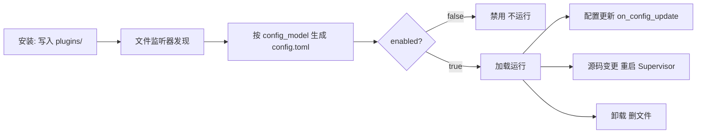

# 管理插件

安装只是第一步。插件写入后，你需要在 WebUI 的「插件管理」里**启用、配置、更新或卸载**它。本章讲清这些操作，以及背后的运行时机。

## 查看插件

插件列表会显示：

- 📋 **名称**与简介
- 🔧 **版本号**与作者
- ✅ **启用状态**（绿色=启用，灰色=禁用）
- 📖 **使用说明**（点击展开）

## 启用 / 禁用

- 开关打开 → 运行时加载该插件
- 开关关闭 → 调用卸载生命周期并停用插件
- 正常情况下**立即生效，无需重启整个 MaiBot**

## 配置插件

部分插件支持自定义设置：

1. 点击插件的「设置」按钮；
2. 修改配置项（如 API Key、触发词、功能开关）；
3. 保存后，运行时调用插件的 `on_config_update`。

## 更新插件

有新版本时页面会提示：

1. 点击「更新」；
2. 等待下载安装；
3. 源码变化会触发插件 Supervisor 重启并重载。

同一个插件不能同时执行安装 / 更新 / 卸载；不同插件之间可并行处理。

## 卸载插件

1. 点击「卸载」并确认；
2. 插件文件被删除。

⚠️ 卸载前确认插件是否把用户数据放在自身目录——卸载后这些数据可能丢失。

## 生命周期与重启边界

- **安装** — 文件写入 `plugins/` 后被监听器发现；Runner 按 `config_model` 默认值生成 `config.toml`；`enabled=false` 需手动启用
- **启用 / 禁用** — 运行时加载或卸载插件，**无需重启 MaiBot**
- **修改配置** — 已加载插件收到 `on_config_update`；设为禁用则卸载，设为启用则加载
- **更新源码** — `.py` / `plugin.py` / `_manifest.json` 变化重启插件 Supervisor，期间短暂不可用，核心无需重启
- **卸载** — 先禁用卸载再删文件

::: warning 重启只是故障兜底
只有当日志明确显示文件监听、加载、卸载或配置回调失败时，才完整重启 MaiBot。正常插件管理不应把重启核心当作必需步骤。
:::

## 使用技巧

**冲突** — 功能重复的插件只启用需要的，必要时联系作者更新。
**性能** — 插件过多可能影响性能，及时卸载不用的。
**安全** — 只装可信源、查看权限要求、定期更新。

## 常见问题

**Q: 安装失败？** 检查网络与地址是否正确，查看错误提示。
**Q: 装了没反应？** 确认已启用、配置正确、看 MaiBot 日志。
**Q: 能自己开发吗？** 能！参见[插件开发文档](/plugin/)。
